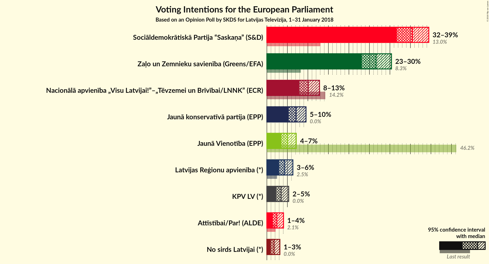
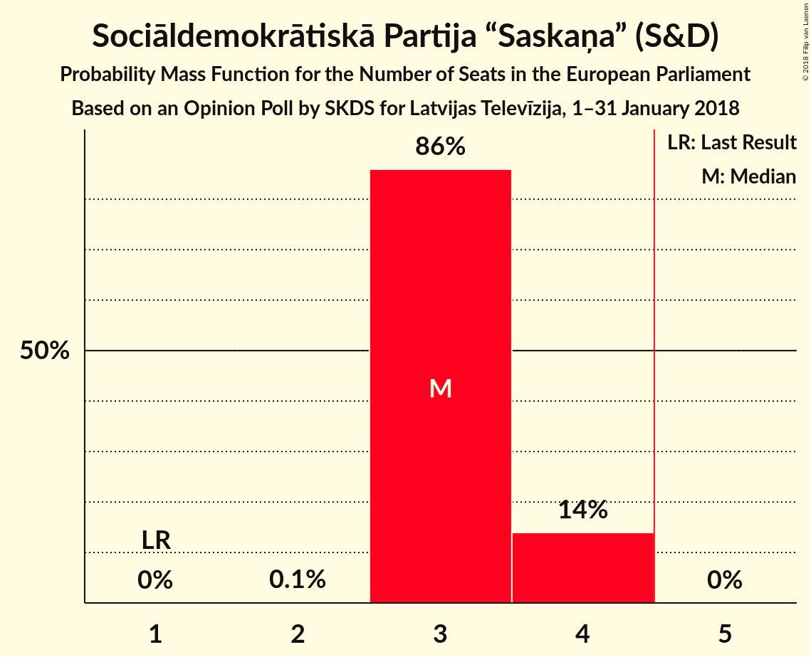
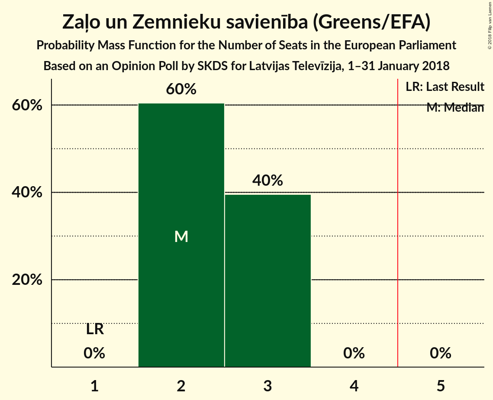
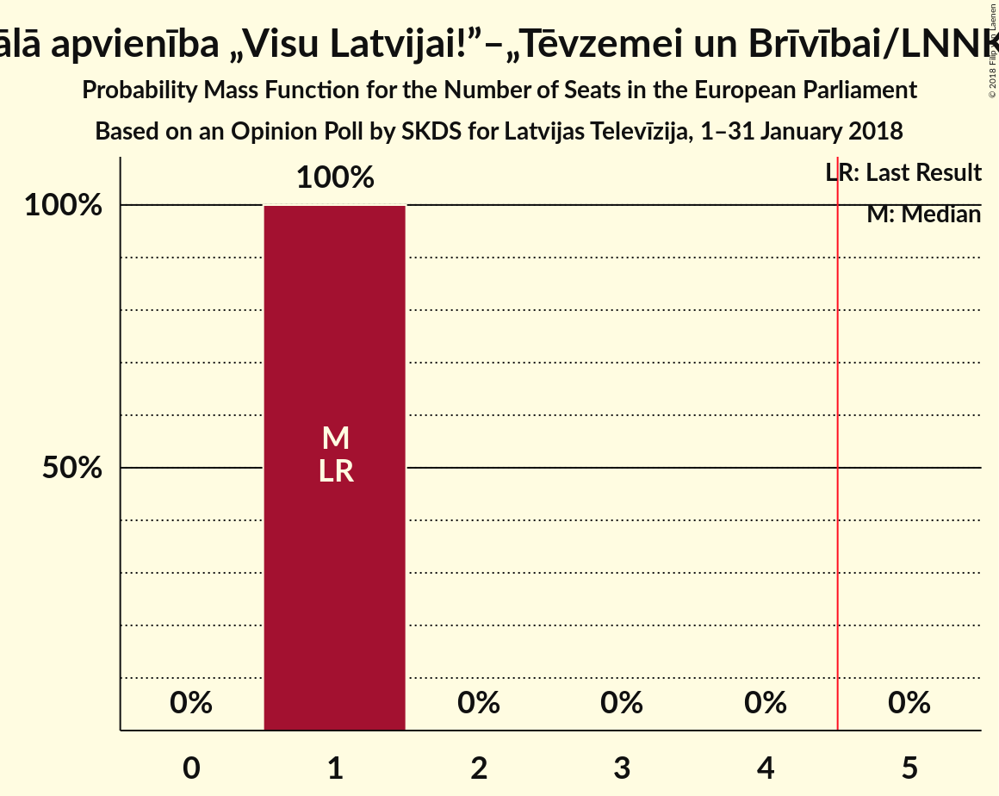
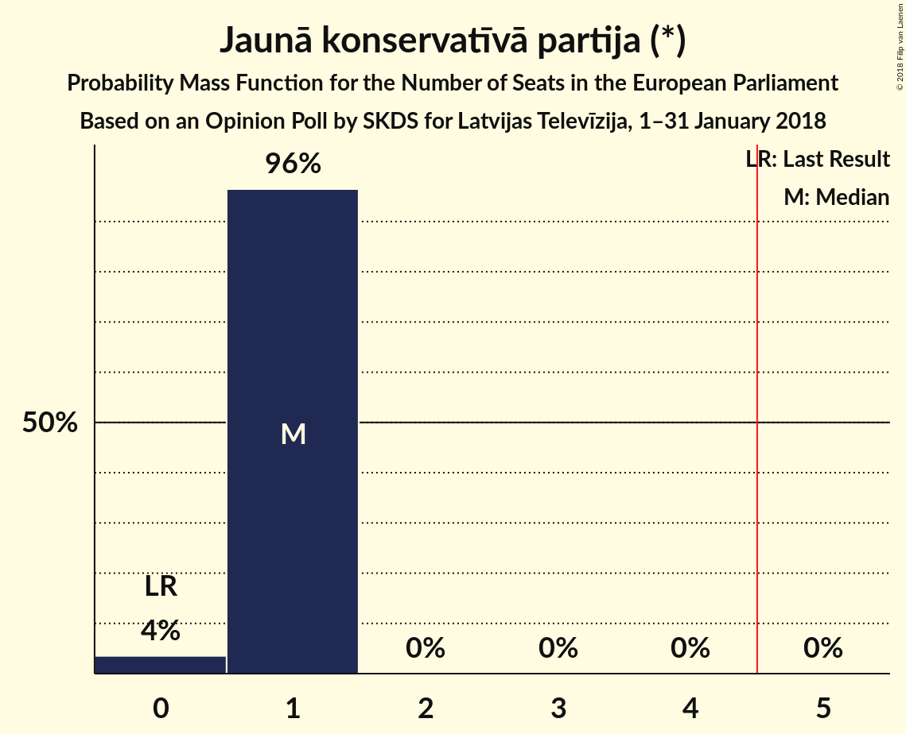
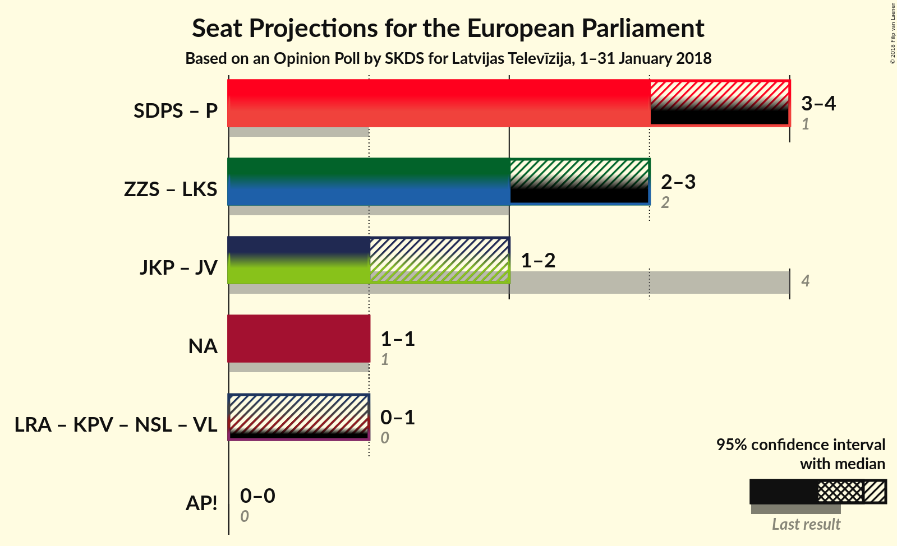

# Opinion Poll by SKDS for Latvijas Televīzija, 1–31 January 2018

<a href="#voting-intentions">Voting Intentions</a> | <a href="#seats">Seats</a> | <a href="#coalitions">Coalitions</a> | <a href="#technical-information">Technical Information</a>

## Voting Intentions

### Confidence Intervals

| Party | Last Result | Poll Result | 80% Confidence Interval | 90% Confidence Interval | 95% Confidence Interval | 99% Confidence Interval |
|:-----:|:-----------:|:-----------:|:-----------------------:|:-----------------------:|:-----------------------:|:-----------------------:|
| Sociāldemokrātiskā Partija “Saskaņa” (S&D) | 13.0% | 35.5% | 33.0–38.1% |32.3–38.8% |31.7–39.5% |30.5–40.7% |
| Zaļo un Zemnieku savienība (Greens/EFA) | 8.3% | 26.6% | 24.3–29.1% |23.7–29.8% |23.2–30.4% |22.1–31.6% |
| Nacionālā apvienība „Visu Latvijai!”–„Tēvzemei un Brīvībai/LNNK” (ECR) | 14.2% | 10.1% | 8.6–11.9% |8.2–12.4% |7.9–12.8% |7.2–13.7% |
| Jaunā konservatīvā partija (*) | 0.0% | 7.1% | 5.9–8.7% |5.6–9.1% |5.3–9.5% |4.8–10.3% |
| Vienotība (EPP) | 46.2% | 5.0% | 4.0–6.4% |3.8–6.8% |3.5–7.2% |3.1–7.9% |
| Latvijas Reģionu apvienība (*) | 2.5% | 4.3% | 3.4–5.7% |3.2–6.0% |3.0–6.3% |2.6–7.0% |
| KPV LV (*) | 0.0% | 3.5% | 2.7–4.7% |2.5–5.0% |2.3–5.3% |1.9–5.9% |
| Kustība Par! (*) | 0.0% | 2.4% | 1.8–3.5% |1.6–3.8% |1.5–4.1% |1.2–4.6% |
| No sirds Latvijai (*) | 0.0% | 1.7% | 1.2–2.7% |1.1–2.9% |0.9–3.2% |0.7–3.7% |

*Note:* The poll result column reflects the actual value used in the calculations. Published results may vary slightly, and in addition be rounded to fewer digits.

## Seats

### Confidence Intervals

| Party | Last Result | Median | 80% Confidence Interval | 90% Confidence Interval | 95% Confidence Interval | 99% Confidence Interval |
|:-----:|:-----------:|:------:|:-----------------------:|:-----------------------:|:-----------------------:|:-----------------------:|
| <a href="#sociāldemokrātiskā-partija-“saskaņa”-(s&d)">Sociāldemokrātiskā Partija “Saskaņa” (S&D)</a> | 1 | 3 | 3–4 |3–4 |3–4 |3–4 |
| <a href="#zaļo-un-zemnieku-savienība-(greens/efa)">Zaļo un Zemnieku savienība (Greens/EFA)</a> | 1 | 2 | 2–3 |2–3 |2–3 |2–3 |
| <a href="#nacionālā-apvienība-„visu-latvijai!”–„tēvzemei-un-brīvībai/lnnk”-(ecr)">Nacionālā apvienība „Visu Latvijai!”–„Tēvzemei un Brīvībai/LNNK” (ECR)</a> | 1 | 1 | 1 |1 |1 |1 |
| <a href="#jaunā-konservatīvā-partija-(*)">Jaunā konservatīvā partija (*)</a> | 0 | 1 | 1 |1 |0–1 |0–1 |
| <a href="#vienotība-(epp)">Vienotība (EPP)</a> | 4 | 0 | 0–1 |0–1 |0–1 |0–1 |
| <a href="#latvijas-reģionu-apvienība-(*)">Latvijas Reģionu apvienība (*)</a> | 0 | 0 | 0 |0–1 |0–1 |0–1 |
| <a href="#kpv-lv-(*)">KPV LV (*)</a> | 0 | 0 | 0 |0 |0 |0–1 |
| <a href="#kustība-par!-(*)">Kustība Par! (*)</a> | 0 | 0 | 0 |0 |0 |0 |
| <a href="#no-sirds-latvijai-(*)">No sirds Latvijai (*)</a> | 0 | 0 | 0 |0 |0 |0 |

### Sociāldemokrātiskā Partija “Saskaņa” (S&D)

*For a full overview of the results for this party, see the [Sociāldemokrātiskā Partija “Saskaņa” (S&D)](party-sociāldemokrātiskāpartija“saskaņa”sd.html) page.*

| Number of Seats | Probability | Accumulated | Special Marks |
|:---------------:|:-----------:|:-----------:|:-------------:|
| 1 | 0% | 100% | Last Result |
| 2 | 0.1% | 100% |  |
| 3 | 86% | 99.9% | Median |
| 4 | 14% | 14% |  |
| 5 | 0% | 0% | Majority |

### Zaļo un Zemnieku savienība (Greens/EFA)

*For a full overview of the results for this party, see the [Zaļo un Zemnieku savienība (Greens/EFA)](party-zaļounzemniekusavienībagreensefa.html) page.*

| Number of Seats | Probability | Accumulated | Special Marks |
|:---------------:|:-----------:|:-----------:|:-------------:|
| 1 | 0% | 100% | Last Result |
| 2 | 60% | 100% | Median |
| 3 | 40% | 40% |  |
| 4 | 0% | 0% |  |

### Nacionālā apvienība „Visu Latvijai!”–„Tēvzemei un Brīvībai/LNNK” (ECR)

*For a full overview of the results for this party, see the [Nacionālā apvienība „Visu Latvijai!”–„Tēvzemei un Brīvībai/LNNK” (ECR)](party-nacionālāapvienība„visulatvijai”–„tēvzemeiunbrīvībailnnk”ecr.html) page.*

| Number of Seats | Probability | Accumulated | Special Marks |
|:---------------:|:-----------:|:-----------:|:-------------:|
| 1 | 100% | 100% | Last Result, Median |

### Jaunā konservatīvā partija (*)

*For a full overview of the results for this party, see the [Jaunā konservatīvā partija (*)](party-jaunākonservatīvāpartija.html) page.*

| Number of Seats | Probability | Accumulated | Special Marks |
|:---------------:|:-----------:|:-----------:|:-------------:|
| 0 | 4% | 100% | Last Result |
| 1 | 96% | 96% | Median |
| 2 | 0% | 0% |  |

### Vienotība (EPP)

*For a full overview of the results for this party, see the [Vienotība (EPP)](party-vienotībaepp.html) page.*

| Number of Seats | Probability | Accumulated | Special Marks |
|:---------------:|:-----------:|:-----------:|:-------------:|
| 0 | 64% | 100% | Median |
| 1 | 36% | 36% |  |
| 2 | 0% | 0% |  |
| 3 | 0% | 0% |  |
| 4 | 0% | 0% | Last Result |

### Latvijas Reģionu apvienība (*)

*For a full overview of the results for this party, see the [Latvijas Reģionu apvienība (*)](party-latvijasreģionuapvienība.html) page.*

| Number of Seats | Probability | Accumulated | Special Marks |
|:---------------:|:-----------:|:-----------:|:-------------:|
| 0 | 90% | 100% | Last Result, Median |
| 1 | 10% | 10% |  |
| 2 | 0% | 0% |  |

### KPV LV (*)

*For a full overview of the results for this party, see the [KPV LV (*)](party-kpvlv.html) page.*

| Number of Seats | Probability | Accumulated | Special Marks |
|:---------------:|:-----------:|:-----------:|:-------------:|
| 0 | 98.8% | 100% | Last Result, Median |
| 1 | 1.2% | 1.2% |  |
| 2 | 0% | 0% |  |

### Kustība Par! (*)

*For a full overview of the results for this party, see the [Kustība Par! (*)](party-kustībapar.html) page.*

| Number of Seats | Probability | Accumulated | Special Marks |
|:---------------:|:-----------:|:-----------:|:-------------:|
| 0 | 100% | 100% | Last Result, Median |

### No sirds Latvijai (*)

*For a full overview of the results for this party, see the [No sirds Latvijai (*)](party-nosirdslatvijai.html) page.*

| Number of Seats | Probability | Accumulated | Special Marks |
|:---------------:|:-----------:|:-----------:|:-------------:|
| 0 | 100% | 100% | Last Result, Median |

## Coalitions

### Confidence Intervals

| Coalition | Last Result | Median | Majority? | 80% Confidence Interval | 90% Confidence Interval | 95% Confidence Interval | 99% Confidence Interval |
|:---------:|:-----------:|:------:|:---------:|:-----------------------:|:-----------------------:|:-----------------------:|:-----------------------:|
| Sociāldemokrātiskā Partija “Saskaņa” (S&D) | 1 | 3 | 0% | 3–4 | 3–4 | 3–4 | 3–4 |
| Nacionālā apvienība „Visu Latvijai!”–„Tēvzemei un Brīvībai/LNNK” (ECR) | 1 | 1 | 0% | 1 | 1 | 1 | 1 |
| Vienotība (EPP) | 4 | 0 | 0% | 0–1 | 0–1 | 0–1 | 0–1 |

### Sociāldemokrātiskā Partija “Saskaņa” (S&D)

| Number of Seats | Probability | Accumulated | Special Marks |
|:---------------:|:-----------:|:-----------:|:-------------:|
| 1 | 0% | 100% | Last Result |
| 2 | 0.1% | 100% |  |
| 3 | 86% | 99.9% | Median |
| 4 | 14% | 14% |  |
| 5 | 0% | 0% | Majority |

### Nacionālā apvienība „Visu Latvijai!”–„Tēvzemei un Brīvībai/LNNK” (ECR)

| Number of Seats | Probability | Accumulated | Special Marks |
|:---------------:|:-----------:|:-----------:|:-------------:|
| 1 | 100% | 100% | Last Result, Median |

### Vienotība (EPP)

| Number of Seats | Probability | Accumulated | Special Marks |
|:---------------:|:-----------:|:-----------:|:-------------:|
| 0 | 64% | 100% | Median |
| 1 | 36% | 36% |  |
| 2 | 0% | 0% |  |
| 3 | 0% | 0% |  |
| 4 | 0% | 0% | Last Result |

## Technical Information

### Opinion Poll

+ **Polling firm:** SKDS
+ **Commissioner(s):** Latvijas Televīzija
+ **Fieldwork period:** 1–31 January 2018

### Calculations

+ **Sample size:** 575
+ **Simulations done:** 1,048,576
+ **Error estimate:** 1.39%

