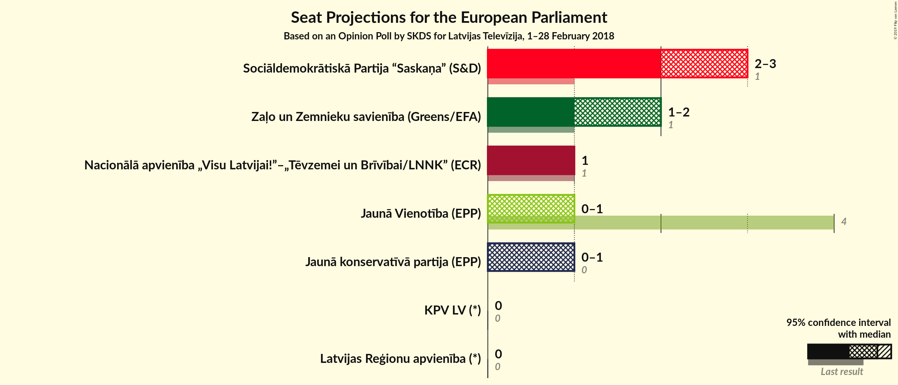
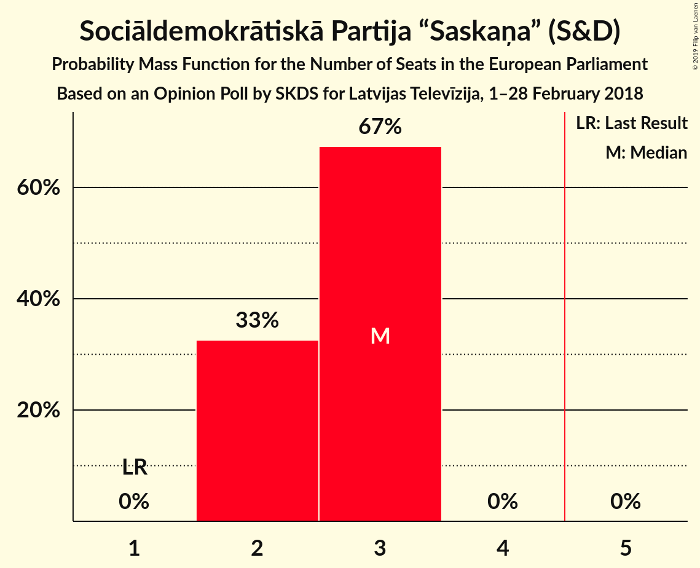
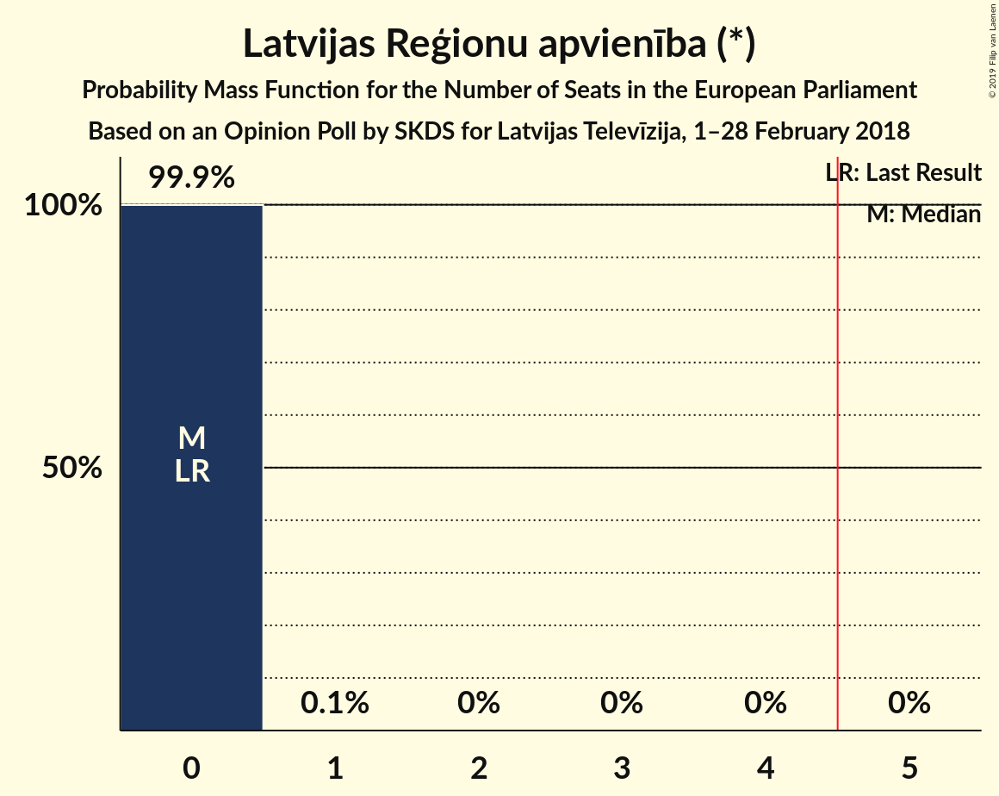
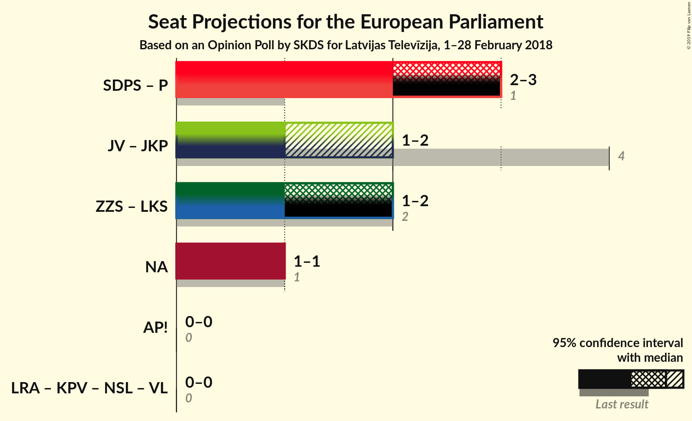

# Opinion Poll by SKDS for Latvijas Televīzija, 1–28 February 2018

<a href="#voting-intentions">Voting Intentions</a> | <a href="#seats">Seats</a> | <a href="#coalitions">Coalitions</a> | <a href="#technical-information">Technical Information</a>

## Voting Intentions

### Confidence Intervals

| Party | Last Result | Poll Result | 80% Confidence Interval | 90% Confidence Interval | 95% Confidence Interval | 99% Confidence Interval |
|:-----:|:-----------:|:-----------:|:-----------------------:|:-----------------------:|:-----------------------:|:-----------------------:|
| Sociāldemokrātiskā Partija “Saskaņa” (S&D) | 13.0% | 34.2% | 31.9–36.8% |31.2–37.5% |30.6–38.1% |29.5–39.3% |
| Zaļo un Zemnieku savienība (Greens/EFA) | 8.3% | 23.4% | 21.3–25.7% |20.8–26.4% |20.3–26.9% |19.3–28.0% |
| Nacionālā apvienība „Visu Latvijai!”–„Tēvzemei un Brīvībai/LNNK” (ECR) | 14.2% | 12.6% | 11.0–14.5% |10.6–15.0% |10.2–15.5% |9.5–16.4% |
| Jaunā Vienotība (EPP) | 46.2% | 7.4% | 6.2–9.0% |5.9–9.4% |5.6–9.8% |5.1–10.6% |
| Jaunā konservatīvā partija (EPP) | 0.0% | 6.6% | 5.5–8.1% |5.2–8.5% |4.9–8.9% |4.4–9.6% |
| Latvijas Reģionu apvienība (*) | 2.5% | 3.4% | 2.6–4.5% |2.4–4.8% |2.2–5.1% |1.9–5.7% |
| KPV LV (*) | 0.0% | 3.1% | 2.3–4.2% |2.1–4.5% |2.0–4.8% |1.7–5.3% |

*Note:* The poll result column reflects the actual value used in the calculations. Published results may vary slightly, and in addition be rounded to fewer digits.

## Seats

### Confidence Intervals

| Party | Last Result | Median | 80% Confidence Interval | 90% Confidence Interval | 95% Confidence Interval | 99% Confidence Interval |
|:-----:|:-----------:|:------:|:-----------------------:|:-----------------------:|:-----------------------:|:-----------------------:|
| <a href="#sociāldemokrātiskā-partija-“saskaņa”-(s&d)">Sociāldemokrātiskā Partija “Saskaņa” (S&D)</a> | 1 | 3 | 2–3 |2–3 |2–3 |2–3 |
| <a href="#zaļo-un-zemnieku-savienība-(greens/efa)">Zaļo un Zemnieku savienība (Greens/EFA)</a> | 1 | 2 | 2 |2 |1–2 |1–2 |
| <a href="#nacionālā-apvienība-„visu-latvijai!”–„tēvzemei-un-brīvībai/lnnk”-(ecr)">Nacionālā apvienība „Visu Latvijai!”–„Tēvzemei un Brīvībai/LNNK” (ECR)</a> | 1 | 1 | 1 |1 |1 |1 |
| <a href="#jaunā-vienotība-(epp)">Jaunā Vienotība (EPP)</a> | 4 | 1 | 0–1 |0–1 |0–1 |0–1 |
| <a href="#jaunā-konservatīvā-partija-(epp)">Jaunā konservatīvā partija (EPP)</a> | 0 | 1 | 0–1 |0–1 |0–1 |0–1 |
| <a href="#latvijas-reģionu-apvienība-(*)">Latvijas Reģionu apvienība (*)</a> | 0 | 0 | 0 |0 |0 |0 |
| <a href="#kpv-lv-(*)">KPV LV (*)</a> | 0 | 0 | 0 |0 |0 |0 |

### Sociāldemokrātiskā Partija “Saskaņa” (S&D)

*For a full overview of the results for this party, see the [Sociāldemokrātiskā Partija “Saskaņa” (S&D)](party-sociāldemokrātiskāpartija“saskaņa”sd.html) page.*

| Number of Seats | Probability | Accumulated | Special Marks |
|:---------------:|:-----------:|:-----------:|:-------------:|
| 1 | 0% | 100% | Last Result |
| 2 | 33% | 100% |  |
| 3 | 67% | 67% | Median |
| 4 | 0% | 0% |  |

### Zaļo un Zemnieku savienība (Greens/EFA)

*For a full overview of the results for this party, see the [Zaļo un Zemnieku savienība (Greens/EFA)](party-zaļounzemniekusavienībagreensefa.html) page.*

| Number of Seats | Probability | Accumulated | Special Marks |
|:---------------:|:-----------:|:-----------:|:-------------:|
| 1 | 3% | 100% | Last Result |
| 2 | 97% | 97% | Median |
| 3 | 0% | 0% |  |

### Nacionālā apvienība „Visu Latvijai!”–„Tēvzemei un Brīvībai/LNNK” (ECR)

*For a full overview of the results for this party, see the [Nacionālā apvienība „Visu Latvijai!”–„Tēvzemei un Brīvībai/LNNK” (ECR)](party-nacionālāapvienība„visulatvijai”–„tēvzemeiunbrīvībailnnk”ecr.html) page.*

| Number of Seats | Probability | Accumulated | Special Marks |
|:---------------:|:-----------:|:-----------:|:-------------:|
| 1 | 100% | 100% | Last Result, Median |

### Jaunā Vienotība (EPP)

*For a full overview of the results for this party, see the [Jaunā Vienotība (EPP)](party-jaunāvienotībaepp.html) page.*

| Number of Seats | Probability | Accumulated | Special Marks |
|:---------------:|:-----------:|:-----------:|:-------------:|
| 0 | 16% | 100% |  |
| 1 | 84% | 84% | Median |
| 2 | 0% | 0% |  |
| 3 | 0% | 0% |  |
| 4 | 0% | 0% | Last Result |

### Jaunā konservatīvā partija (EPP)

*For a full overview of the results for this party, see the [Jaunā konservatīvā partija (EPP)](party-jaunākonservatīvāpartijaepp.html) page.*

| Number of Seats | Probability | Accumulated | Special Marks |
|:---------------:|:-----------:|:-----------:|:-------------:|
| 0 | 48% | 100% | Last Result |
| 1 | 52% | 52% | Median |
| 2 | 0% | 0% |  |

### Latvijas Reģionu apvienība (*)

*For a full overview of the results for this party, see the [Latvijas Reģionu apvienība (*)](party-latvijasreģionuapvienība.html) page.*

| Number of Seats | Probability | Accumulated | Special Marks |
|:---------------:|:-----------:|:-----------:|:-------------:|
| 0 | 99.9% | 100% | Last Result, Median |
| 1 | 0.1% | 0.1% |  |
| 2 | 0% | 0% |  |

### KPV LV (*)

*For a full overview of the results for this party, see the [KPV LV (*)](party-kpvlv.html) page.*

| Number of Seats | Probability | Accumulated | Special Marks |
|:---------------:|:-----------:|:-----------:|:-------------:|
| 0 | 100% | 100% | Last Result, Median |

## Coalitions

### Confidence Intervals

| Coalition | Last Result | Median | Majority? | 80% Confidence Interval | 90% Confidence Interval | 95% Confidence Interval | 99% Confidence Interval |
|:---------:|:-----------:|:------:|:---------:|:-----------------------:|:-----------------------:|:-----------------------:|:-----------------------:|
| Jaunā Vienotība (EPP) – Jaunā konservatīvā partija (EPP) | 4 | 1 | 0% | 1–2 | 1–2 | 1–2 | 1–2 |
| Nacionālā apvienība „Visu Latvijai!”–„Tēvzemei un Brīvībai/LNNK” (ECR) | 1 | 1 | 0% | 1 | 1 | 1 | 1 |

### Jaunā Vienotība (EPP) – Jaunā konservatīvā partija (EPP)

| Number of Seats | Probability | Accumulated | Special Marks |
|:---------------:|:-----------:|:-----------:|:-------------:|
| 0 | 0.1% | 100% |  |
| 1 | 64% | 99.9% |  |
| 2 | 36% | 36% | Median |
| 3 | 0% | 0% |  |
| 4 | 0% | 0% | Last Result |

### Nacionālā apvienība „Visu Latvijai!”–„Tēvzemei un Brīvībai/LNNK” (ECR)

| Number of Seats | Probability | Accumulated | Special Marks |
|:---------------:|:-----------:|:-----------:|:-------------:|
| 1 | 100% | 100% | Last Result, Median |

## Technical Information

### Opinion Poll

+ **Polling firm:** SKDS
+ **Commissioner(s):** Latvijas Televīzija
+ **Fieldwork period:** 1–28 February 2018

### Calculations

+ **Sample size:** 619
+ **Simulations done:** 1,048,576
+ **Error estimate:** 1.23%

