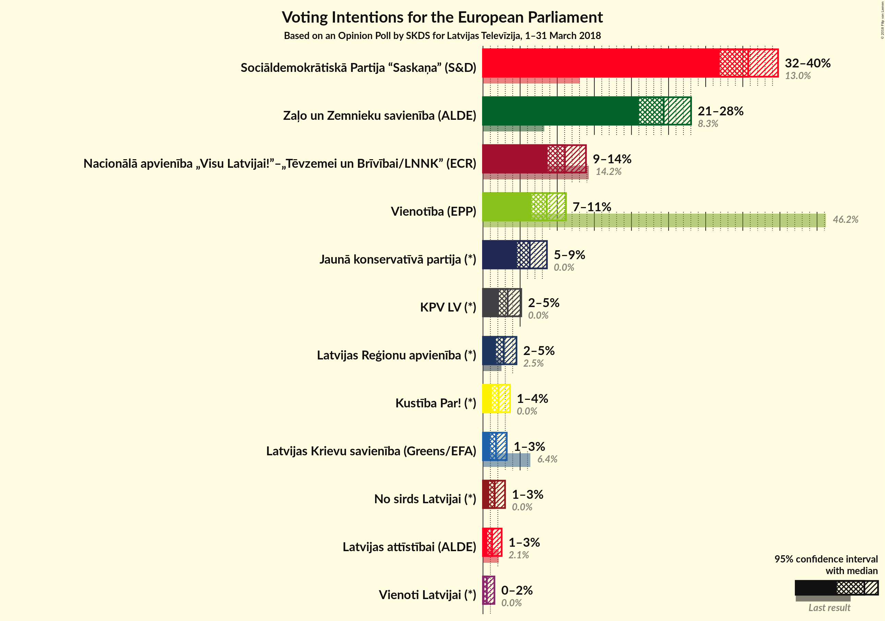
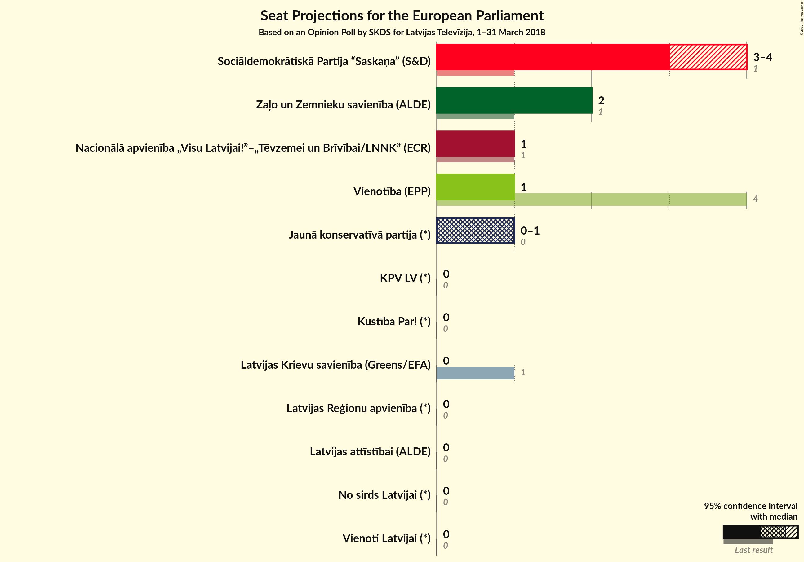

# Opinion Poll by SKDS for Latvijas Televīzija, 1–31 March 2018

<a href="#voting-intentions">Voting Intentions</a> | <a href="#seats">Seats</a> | <a href="#coalitions">Coalitions</a> | <a href="#technical-information">Technical Information</a>

## Voting Intentions

### Confidence Intervals

| Party | Last Result | Poll Result | 80% Confidence Interval | 90% Confidence Interval | 95% Confidence Interval | 99% Confidence Interval |
|:-----:|:-----------:|:-----------:|:-----------------------:|:-----------------------:|:-----------------------:|:-----------------------:|
| Sociāldemokrātiskā Partija “Saskaņa” (S&D) | 13.0% | 35.7% | 33.2–38.4% |32.5–39.1% |31.9–39.7% |30.7–41.0% |
| Zaļo un Zemnieku savienība (Greens/EFA) | N/A | 24.3% | N/A |N/A |N/A |N/A |
| Nacionālā apvienība „Visu Latvijai!”–„Tēvzemei un Brīvībai/LNNK” (ECR) | 14.2% | 11.0% | 9.5–12.9% |9.1–13.4% |8.7–13.9% |8.0–14.8% |
| Vienotība (EPP) | 46.2% | 8.6% | 7.2–10.3% |6.9–10.7% |6.6–11.2% |6.0–12.0% |
| Jaunā konservatīvā partija (*) | 0.0% | 6.3% | 5.2–7.8% |4.8–8.2% |4.6–8.6% |4.1–9.4% |
| KPV LV (*) | 0.0% | 3.3% | 2.5–4.5% |2.3–4.8% |2.1–5.2% |1.8–5.8% |
| Latvijas Reģionu apvienība (*) | 2.5% | 2.8% | 2.1–3.9% |1.9–4.2% |1.7–4.5% |1.4–5.1% |
| Kustība Par! (*) | 0.0% | 2.1% | 1.5–3.1% |1.3–3.4% |1.2–3.6% |1.0–4.2% |
| Latvijas Krievu savienība (Greens/EFA) | 6.4% | 1.8% | 1.2–2.7% |1.1–3.0% |1.0–3.2% |0.7–3.7% |
| No sirds Latvijai (*) | 0.0% | 1.6% | 1.1–2.5% |0.9–2.7% |0.8–3.0% |0.6–3.5% |
| Latvijas attīstībai (ALDE) | 2.1% | 1.2% | 0.8–2.1% |0.7–2.3% |0.6–2.5% |0.4–3.0% |
| Vienoti Latvijai (*) | 0.0% | 0.5% | 0.3–1.2% |0.2–1.4% |0.2–1.5% |0.1–1.9% |

*Note:* The poll result column reflects the actual value used in the calculations. Published results may vary slightly, and in addition be rounded to fewer digits.

## Seats

### Confidence Intervals

| Party | Last Result | Median | 80% Confidence Interval | 90% Confidence Interval | 95% Confidence Interval | 99% Confidence Interval |
|:-----:|:-----------:|:------:|:-----------------------:|:-----------------------:|:-----------------------:|:-----------------------:|
| <a href="#sociāldemokrātiskā-partija-“saskaņa”-(s&d)">Sociāldemokrātiskā Partija “Saskaņa” (S&D)</a> | 1 | 3 | 3 |3 |3–4 |3–4 |
| <a href="#zaļo-un-zemnieku-savienība-(greens/efa)">Zaļo un Zemnieku savienība (Greens/EFA)</a> | N/A | N/A | N/A |N/A |N/A |N/A |
| <a href="#nacionālā-apvienība-„visu-latvijai!”–„tēvzemei-un-brīvībai/lnnk”-(ecr)">Nacionālā apvienība „Visu Latvijai!”–„Tēvzemei un Brīvībai/LNNK” (ECR)</a> | 1 | 1 | 1 |1 |1 |1 |
| <a href="#vienotība-(epp)">Vienotība (EPP)</a> | 4 | 1 | 1 |1 |1 |1 |
| <a href="#jaunā-konservatīvā-partija-(*)">Jaunā konservatīvā partija (*)</a> | 0 | 1 | 1 |0–1 |0–1 |0–1 |
| <a href="#kpv-lv-(*)">KPV LV (*)</a> | 0 | 0 | 0 |0 |0 |0 |
| <a href="#latvijas-reģionu-apvienība-(*)">Latvijas Reģionu apvienība (*)</a> | 0 | 0 | 0 |0 |0 |0 |
| <a href="#kustība-par!-(*)">Kustība Par! (*)</a> | 0 | 0 | 0 |0 |0 |0 |
| <a href="#latvijas-krievu-savienība-(greens/efa)">Latvijas Krievu savienība (Greens/EFA)</a> | 1 | 0 | 0 |0 |0 |0 |
| <a href="#no-sirds-latvijai-(*)">No sirds Latvijai (*)</a> | 0 | 0 | 0 |0 |0 |0 |
| <a href="#latvijas-attīstībai-(alde)">Latvijas attīstībai (ALDE)</a> | 0 | 0 | 0 |0 |0 |0 |
| <a href="#vienoti-latvijai-(*)">Vienoti Latvijai (*)</a> | 0 | 0 | 0 |0 |0 |0 |

