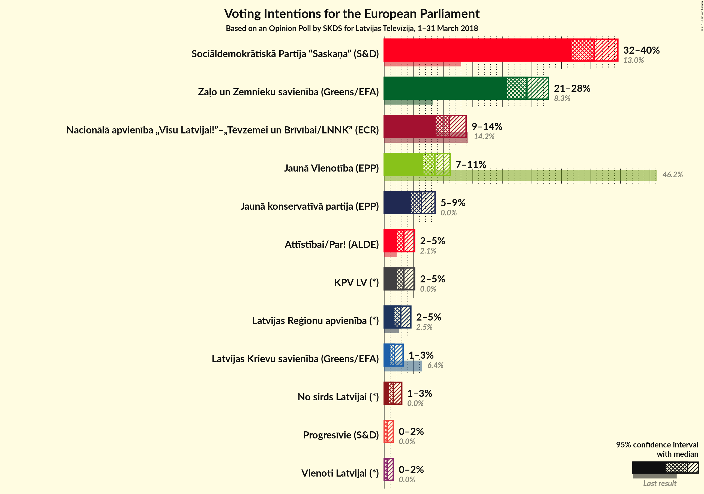
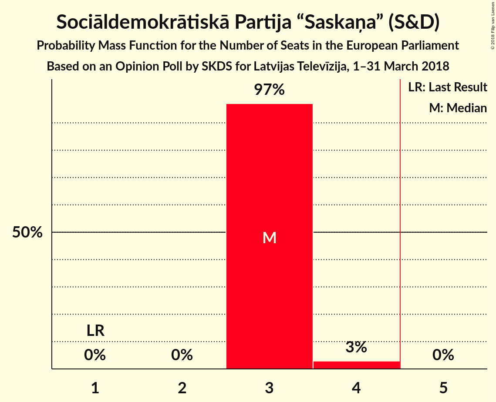
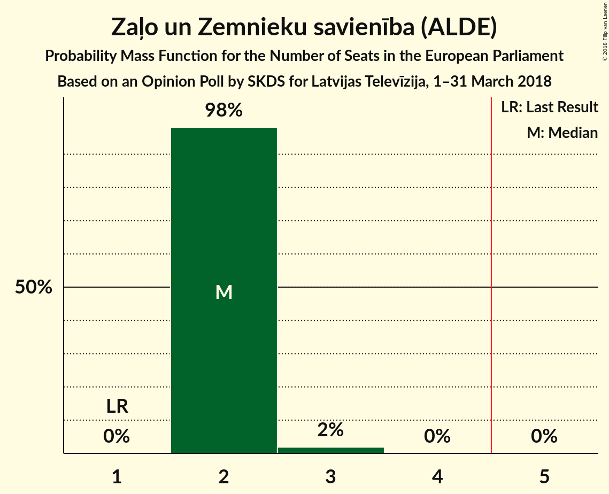
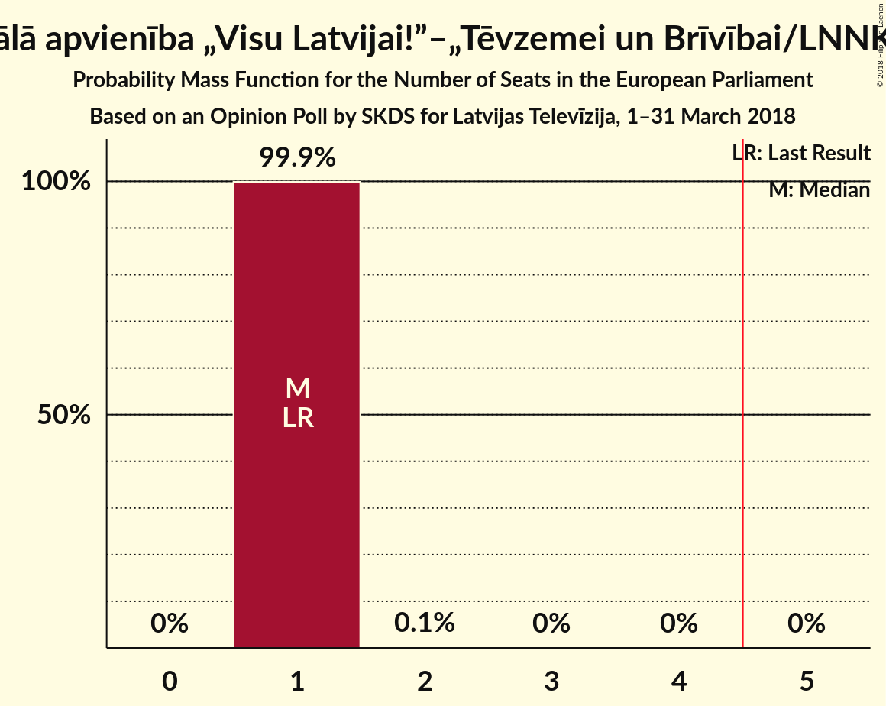
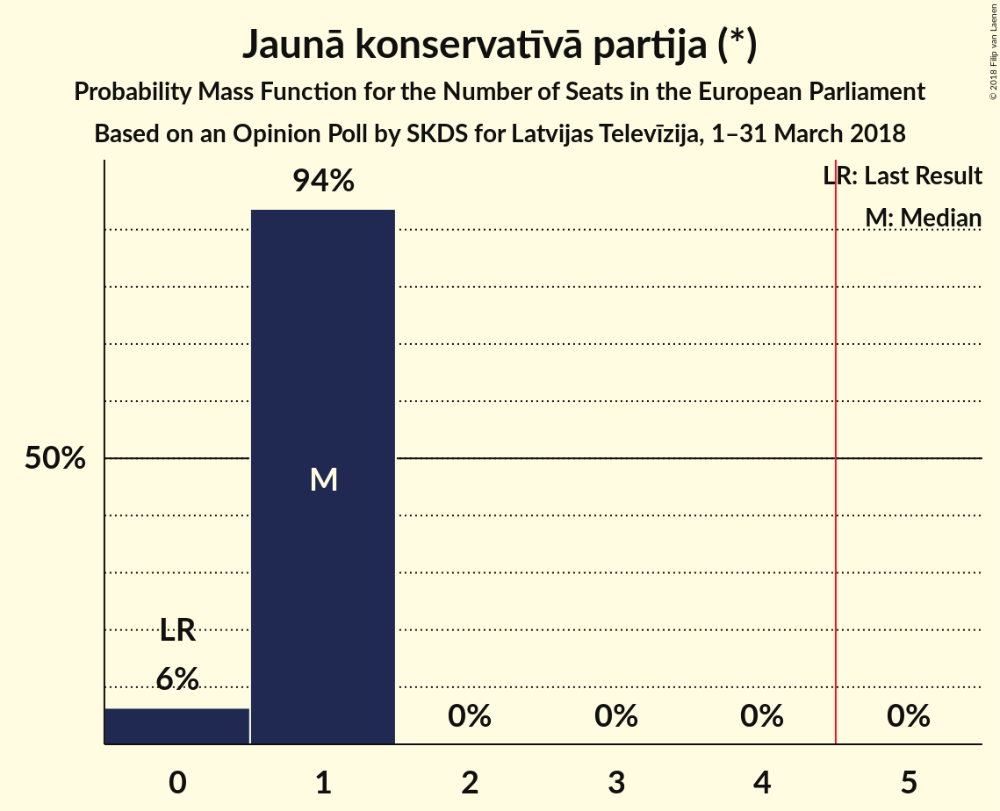
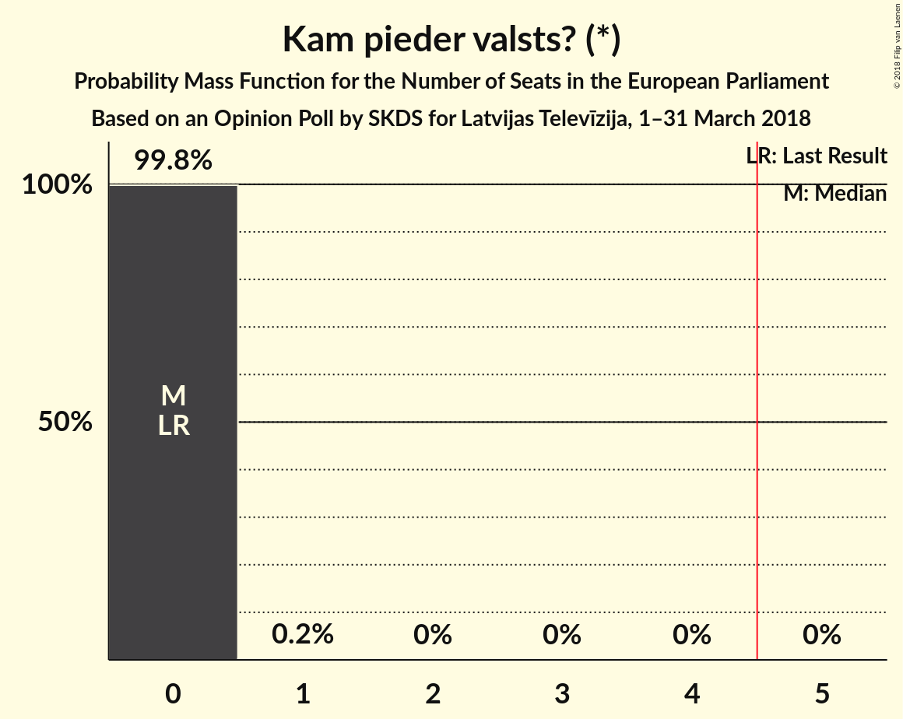
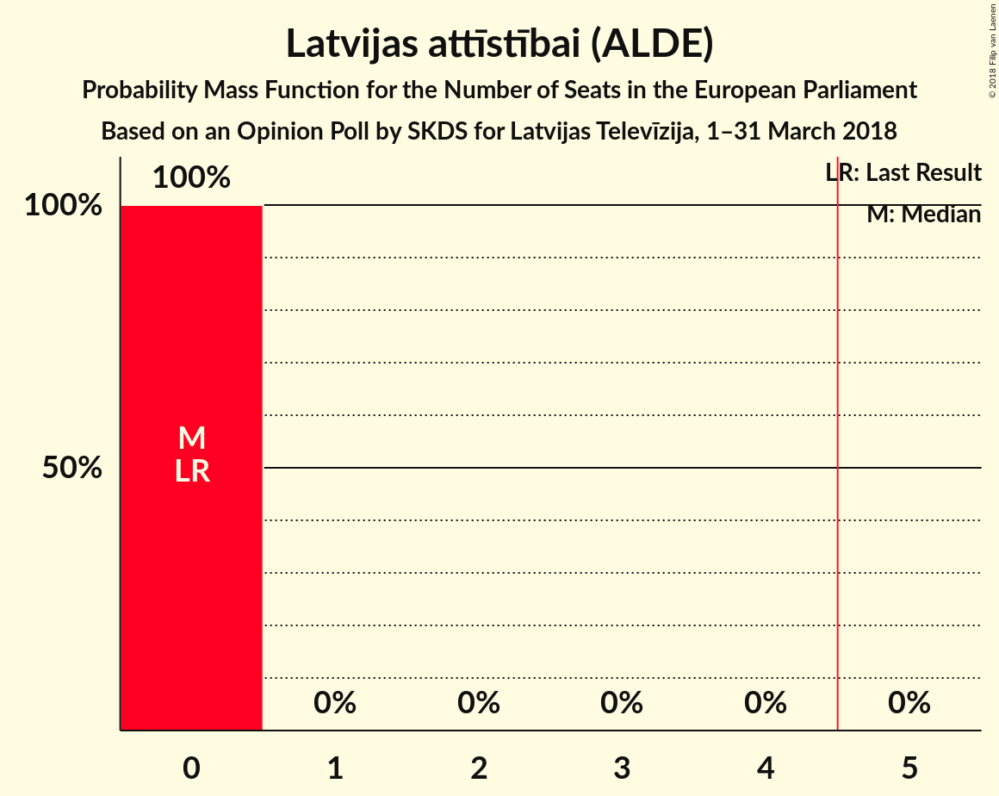
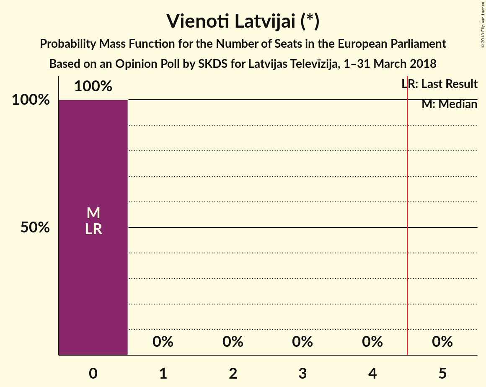
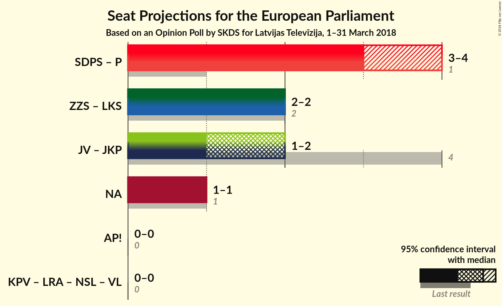

# Opinion Poll by SKDS for Latvijas Televīzija, 1–31 March 2018

<a href="#voting-intentions">Voting Intentions</a> | <a href="#seats">Seats</a> | <a href="#coalitions">Coalitions</a> | <a href="#technical-information">Technical Information</a>

## Voting Intentions

### Confidence Intervals

| Party | Last Result | Poll Result | 80% Confidence Interval | 90% Confidence Interval | 95% Confidence Interval | 99% Confidence Interval |
|:-----:|:-----------:|:-----------:|:-----------------------:|:-----------------------:|:-----------------------:|:-----------------------:|
| Sociāldemokrātiskā Partija “Saskaņa” (S&D) | 13.0% | 35.7% | 32.5–39.1% |31.6–40.1% |30.8–40.9% |29.3–42.5% |
| Zaļo un Zemnieku savienība (ALDE) | 8.3% | 24.3% | 21.5–27.4% |20.7–28.3% |20.0–29.1% |18.7–30.7% |
| Nacionālā apvienība „Visu Latvijai!”–„Tēvzemei un Brīvībai/LNNK” (ECR) | 14.2% | 11.1% | 9.2–13.6% |8.7–14.3% |8.2–14.9% |7.4–16.1% |
| Vienotība (EPP) | 46.2% | 8.5% | 6.8–10.7% |6.4–11.4% |6.0–11.9% |5.3–13.1% |
| Jaunā konservatīvā partija (*) | 0.0% | 6.4% | 5.0–8.5% |4.6–9.0% |4.3–9.6% |3.7–10.6% |
| Kam pieder valsts? (*) | 0.0% | 3.2% | 2.3–4.8% |2.0–5.3% |1.8–5.7% |1.4–6.5% |
| Latvijas Reģionu apvienība (*) | 2.5% | 2.9% | 2.0–4.5% |1.8–4.9% |1.6–5.3% |1.3–6.1% |
| Kustība Par! (*) | 0.0% | 2.0% | 1.4–3.4% |1.2–3.8% |1.0–4.2% |0.7–4.9% |
| Latvijas Krievu savienība (Greens/EFA) | 6.4% | 1.8% | 1.1–3.1% |1.0–3.4% |0.8–3.8% |0.6–4.5% |
| No sirds Latvijai (*) | 0.0% | 1.5% | 0.9–2.7% |0.8–3.0% |0.6–3.4% |0.4–4.1% |
| Latvijas attīstībai (ALDE) | 2.1% | 1.2% | 0.7–2.3% |0.6–2.7% |0.5–3.0% |0.3–3.6% |
| Vienoti Latvijai (*) | 0.0% | 0.6% | 0.3–1.6% |0.2–1.8% |0.2–2.1% |0.1–2.7% |

*Note:* The poll result column reflects the actual value used in the calculations. Published results may vary slightly, and in addition be rounded to fewer digits.

## Seats

### Confidence Intervals

| Party | Last Result | Median | 80% Confidence Interval | 90% Confidence Interval | 95% Confidence Interval | 99% Confidence Interval |
|:-----:|:-----------:|:------:|:-----------------------:|:-----------------------:|:-----------------------:|:-----------------------:|
| <a href="#sociāldemokrātiskā-partija-“saskaņa”-(s&d)">Sociāldemokrātiskā Partija “Saskaņa” (S&D)</a> | 1 | 3 | 3 |3 |3–4 |3–4 |
| <a href="#zaļo-un-zemnieku-savienība-(alde)">Zaļo un Zemnieku savienība (ALDE)</a> | 1 | 2 | 2 |2 |2 |2–3 |
| <a href="#nacionālā-apvienība-„visu-latvijai!”–„tēvzemei-un-brīvībai/lnnk”-(ecr)">Nacionālā apvienība „Visu Latvijai!”–„Tēvzemei un Brīvībai/LNNK” (ECR)</a> | 1 | 1 | 1 |1 |1 |1 |
| <a href="#vienotība-(epp)">Vienotība (EPP)</a> | 4 | 1 | 1 |1 |1 |1 |
| <a href="#jaunā-konservatīvā-partija-(*)">Jaunā konservatīvā partija (*)</a> | 0 | 1 | 1 |0–1 |0–1 |0–1 |
| <a href="#kam-pieder-valsts?-(*)">Kam pieder valsts? (*)</a> | 0 | 0 | 0 |0 |0–1 |0–1 |
| <a href="#latvijas-reģionu-apvienība-(*)">Latvijas Reģionu apvienība (*)</a> | 0 | 0 | 0 |0 |0 |0–1 |
| <a href="#kustība-par!-(*)">Kustība Par! (*)</a> | 0 | 0 | 0 |0 |0 |0 |
| <a href="#latvijas-krievu-savienība-(greens/efa)">Latvijas Krievu savienība (Greens/EFA)</a> | 1 | 0 | 0 |0 |0 |0 |
| <a href="#no-sirds-latvijai-(*)">No sirds Latvijai (*)</a> | 0 | 0 | 0 |0 |0 |0 |
| <a href="#latvijas-attīstībai-(alde)">Latvijas attīstībai (ALDE)</a> | 0 | 0 | 0 |0 |0 |0 |
| <a href="#vienoti-latvijai-(*)">Vienoti Latvijai (*)</a> | 0 | 0 | 0 |0 |0 |0 |

### Sociāldemokrātiskā Partija “Saskaņa” (S&D)

*For a full overview of the results for this party, see the [Sociāldemokrātiskā Partija “Saskaņa” (S&D)](party-sociāldemokrātiskāpartija“saskaņa”sd.html) page.*

| Number of Seats | Probability | Accumulated | Special Marks |
|:---------------:|:-----------:|:-----------:|:-------------:|
| 1 | 0% | 100% | Last Result |
| 2 | 0.1% | 100% |  |
| 3 | 96% | 99.9% | Median |
| 4 | 4% | 4% |  |
| 5 | 0% | 0% | Majority |

### Zaļo un Zemnieku savienība (ALDE)

*For a full overview of the results for this party, see the [Zaļo un Zemnieku savienība (ALDE)](party-zaļounzemniekusavienībaalde.html) page.*

| Number of Seats | Probability | Accumulated | Special Marks |
|:---------------:|:-----------:|:-----------:|:-------------:|
| 1 | 0.1% | 100% | Last Result |
| 2 | 98% | 99.9% | Median |
| 3 | 2% | 2% |  |
| 4 | 0% | 0% |  |

### Nacionālā apvienība „Visu Latvijai!”–„Tēvzemei un Brīvībai/LNNK” (ECR)

*For a full overview of the results for this party, see the [Nacionālā apvienība „Visu Latvijai!”–„Tēvzemei un Brīvībai/LNNK” (ECR)](party-nacionālāapvienība„visulatvijai”–„tēvzemeiunbrīvībailnnk”ecr.html) page.*

| Number of Seats | Probability | Accumulated | Special Marks |
|:---------------:|:-----------:|:-----------:|:-------------:|
| 1 | 99.9% | 100% | Last Result, Median |
| 2 | 0.1% | 0.1% |  |
| 3 | 0% | 0% |  |

### Vienotība (EPP)

*For a full overview of the results for this party, see the [Vienotība (EPP)](party-vienotībaepp.html) page.*

| Number of Seats | Probability | Accumulated | Special Marks |
|:---------------:|:-----------:|:-----------:|:-------------:|
| 0 | 0.5% | 100% |  |
| 1 | 99.5% | 99.5% | Median |
| 2 | 0% | 0% |  |
| 3 | 0% | 0% |  |
| 4 | 0% | 0% | Last Result |

### Jaunā konservatīvā partija (*)

*For a full overview of the results for this party, see the [Jaunā konservatīvā partija (*)](party-jaunākonservatīvāpartija.html) page.*

| Number of Seats | Probability | Accumulated | Special Marks |
|:---------------:|:-----------:|:-----------:|:-------------:|
| 0 | 9% | 100% | Last Result |
| 1 | 91% | 91% | Median |
| 2 | 0% | 0% |  |

### Kam pieder valsts? (*)

*For a full overview of the results for this party, see the [Kam pieder valsts? (*)](party-kampiedervalsts.html) page.*

| Number of Seats | Probability | Accumulated | Special Marks |
|:---------------:|:-----------:|:-----------:|:-------------:|
| 0 | 96% | 100% | Last Result, Median |
| 1 | 4% | 4% |  |
| 2 | 0% | 0% |  |

### Latvijas Reģionu apvienība (*)

*For a full overview of the results for this party, see the [Latvijas Reģionu apvienība (*)](party-latvijasreģionuapvienība.html) page.*

| Number of Seats | Probability | Accumulated | Special Marks |
|:---------------:|:-----------:|:-----------:|:-------------:|
| 0 | 99.2% | 100% | Last Result, Median |
| 1 | 0.8% | 0.8% |  |
| 2 | 0% | 0% |  |

### Kustība Par! (*)

*For a full overview of the results for this party, see the [Kustība Par! (*)](party-kustībapar.html) page.*

| Number of Seats | Probability | Accumulated | Special Marks |
|:---------------:|:-----------:|:-----------:|:-------------:|
| 0 | 100% | 100% | Last Result, Median |

### Latvijas Krievu savienība (Greens/EFA)

*For a full overview of the results for this party, see the [Latvijas Krievu savienība (Greens/EFA)](party-latvijaskrievusavienībagreensefa.html) page.*

| Number of Seats | Probability | Accumulated | Special Marks |
|:---------------:|:-----------:|:-----------:|:-------------:|
| 0 | 100% | 100% | Median |
| 1 | 0% | 0% | Last Result |

### No sirds Latvijai (*)

*For a full overview of the results for this party, see the [No sirds Latvijai (*)](party-nosirdslatvijai.html) page.*

| Number of Seats | Probability | Accumulated | Special Marks |
|:---------------:|:-----------:|:-----------:|:-------------:|
| 0 | 100% | 100% | Last Result, Median |

### Latvijas attīstībai (ALDE)

*For a full overview of the results for this party, see the [Latvijas attīstībai (ALDE)](party-latvijasattīstībaialde.html) page.*

| Number of Seats | Probability | Accumulated | Special Marks |
|:---------------:|:-----------:|:-----------:|:-------------:|
| 0 | 100% | 100% | Last Result, Median |

### Vienoti Latvijai (*)

*For a full overview of the results for this party, see the [Vienoti Latvijai (*)](party-vienotilatvijai.html) page.*

| Number of Seats | Probability | Accumulated | Special Marks |
|:---------------:|:-----------:|:-----------:|:-------------:|
| 0 | 100% | 100% | Last Result, Median |

## Coalitions

### Confidence Intervals

| Coalition | Last Result | Median | Majority? | 80% Confidence Interval | 90% Confidence Interval | 95% Confidence Interval | 99% Confidence Interval |
|:---------:|:-----------:|:------:|:---------:|:-----------------------:|:-----------------------:|:-----------------------:|:-----------------------:|
| Sociāldemokrātiskā Partija “Saskaņa” (S&D) | 1 | 3 | 0% | 3 | 3 | 3–4 | 3–4 |
| Zaļo un Zemnieku savienība (ALDE) – Latvijas attīstībai (ALDE) | 1 | 2 | 0% | 2 | 2 | 2 | 2–3 |
| Nacionālā apvienība „Visu Latvijai!”–„Tēvzemei un Brīvībai/LNNK” (ECR) | 1 | 1 | 0% | 1 | 1 | 1 | 1 |
| Vienotība (EPP) | 4 | 1 | 0% | 1 | 1 | 1 | 1 |
| Jaunā konservatīvā partija (*) – Kam pieder valsts? (*) – Latvijas Reģionu apvienība (*) – Kustība Par! (*) – No sirds Latvijai (*) – Vienoti Latvijai (*) | 0 | 1 | 0% | 1 | 0–1 | 0–1 | 0–1 |
| Latvijas Krievu savienība (Greens/EFA) | 1 | 0 | 0% | 0 | 0 | 0 | 0 |

### Sociāldemokrātiskā Partija “Saskaņa” (S&D)

| Number of Seats | Probability | Accumulated | Special Marks |
|:---------------:|:-----------:|:-----------:|:-------------:|
| 1 | 0% | 100% | Last Result |
| 2 | 0.1% | 100% |  |
| 3 | 96% | 99.9% | Median |
| 4 | 4% | 4% |  |
| 5 | 0% | 0% | Majority |

### Zaļo un Zemnieku savienība (ALDE) – Latvijas attīstībai (ALDE)

| Number of Seats | Probability | Accumulated | Special Marks |
|:---------------:|:-----------:|:-----------:|:-------------:|
| 1 | 0.1% | 100% | Last Result |
| 2 | 98% | 99.9% | Median |
| 3 | 2% | 2% |  |
| 4 | 0% | 0% |  |

### Nacionālā apvienība „Visu Latvijai!”–„Tēvzemei un Brīvībai/LNNK” (ECR)

| Number of Seats | Probability | Accumulated | Special Marks |
|:---------------:|:-----------:|:-----------:|:-------------:|
| 1 | 99.9% | 100% | Last Result, Median |
| 2 | 0.1% | 0.1% |  |
| 3 | 0% | 0% |  |

### Vienotība (EPP)

| Number of Seats | Probability | Accumulated | Special Marks |
|:---------------:|:-----------:|:-----------:|:-------------:|
| 0 | 0.5% | 100% |  |
| 1 | 99.5% | 99.5% | Median |
| 2 | 0% | 0% |  |
| 3 | 0% | 0% |  |
| 4 | 0% | 0% | Last Result |

### Jaunā konservatīvā partija (*) – Kam pieder valsts? (*) – Latvijas Reģionu apvienība (*) – Kustība Par! (*) – No sirds Latvijai (*) – Vienoti Latvijai (*)

| Number of Seats | Probability | Accumulated | Special Marks |
|:---------------:|:-----------:|:-----------:|:-------------:|
| 0 | 5% | 100% | Last Result |
| 1 | 95% | 95% | Median |
| 2 | 0.1% | 0.1% |  |
| 3 | 0% | 0% |  |

### Latvijas Krievu savienība (Greens/EFA)

| Number of Seats | Probability | Accumulated | Special Marks |
|:---------------:|:-----------:|:-----------:|:-------------:|
| 0 | 100% | 100% | Median |
| 1 | 0% | 0% | Last Result |

## Technical Information

### Opinion Poll

+ **Polling firm:** SKDS
+ **Commissioner(s):** Latvijas Televīzija
+ **Fieldwork period:** 1–31 March 2018

### Calculations

+ **Sample size:** 342
+ **Simulations done:** 262,144
+ **Error estimate:** 3.60%

