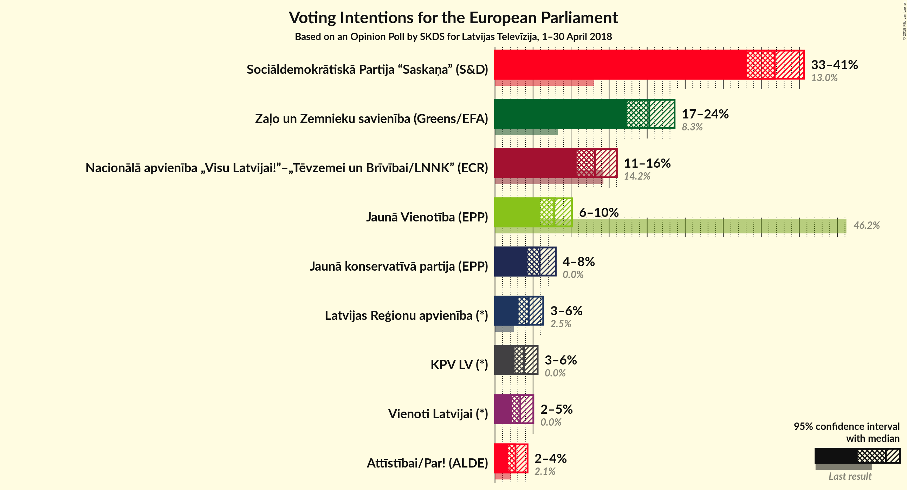

# Opinion Poll by SKDS for Latvijas Televīzija, 1–30 April 2018

<a href="#voting-intentions">Voting Intentions</a> | <a href="#seats">Seats</a> | <a href="#coalitions">Coalitions</a> | <a href="#technical-information">Technical Information</a>

## Voting Intentions

### Confidence Intervals

| Party | Last Result | Poll Result | 80% Confidence Interval | 90% Confidence Interval | 95% Confidence Interval | 99% Confidence Interval |
|:-----:|:-----------:|:-----------:|:-----------------------:|:-----------------------:|:-----------------------:|:-----------------------:|
| Sociāldemokrātiskā Partija “Saskaņa” (S&D) | 13.0% | 36.8% | 34.4–39.3% |33.7–40.0% |33.1–40.6% |32.0–41.8% |
| Zaļo un Zemnieku savienība (Greens/EFA) | N/A | 20.3% | 18.3–22.5% |17.8–23.1% |17.3–23.6% |16.4–24.7% |
| Nacionālā apvienība „Visu Latvijai!”–„Tēvzemei un Brīvībai/LNNK” (ECR) | 14.2% | 13.2% | 11.6–15.0% |11.1–15.6% |10.7–16.0% |10.0–17.0% |
| Vienotība (EPP) | 46.2% | 7.8% | 6.6–9.3% |6.2–9.7% |5.9–10.1% |5.4–10.9% |
| Jaunā konservatīvā partija (*) | 0.0% | 5.9% | 4.8–7.2% |4.5–7.6% |4.3–8.0% |3.8–8.7% |
| Latvijas Reģionu apvienība (*) | 2.5% | 4.4% | 3.6–5.7% |3.3–6.0% |3.1–6.3% |2.7–7.0% |
| KPV LV (*) | 0.0% | 3.8% | 3.0–5.0% |2.8–5.3% |2.6–5.6% |2.2–6.2% |
| Vienoti Latvijai (*) | 0.0% | 3.3% | 2.6–4.4% |2.4–4.8% |2.2–5.0% |1.9–5.6% |
| Kustība Par! (*) | 0.0% | 2.7% | 2.0–3.7% |1.8–4.0% |1.7–4.3% |1.4–4.8% |

*Note:* The poll result column reflects the actual value used in the calculations. Published results may vary slightly, and in addition be rounded to fewer digits.

## Seats

### Confidence Intervals

| Party | Last Result | Median | 80% Confidence Interval | 90% Confidence Interval | 95% Confidence Interval | 99% Confidence Interval |
|:-----:|:-----------:|:------:|:-----------------------:|:-----------------------:|:-----------------------:|:-----------------------:|
| <a href="#sociāldemokrātiskā-partija-“saskaņa”-(s&d)">Sociāldemokrātiskā Partija “Saskaņa” (S&D)</a> | 1 | 3 | 3–4 |3–4 |3–4 |3–4 |
| <a href="#zaļo-un-zemnieku-savienība-(greens/efa)">Zaļo un Zemnieku savienība (Greens/EFA)</a> | N/A | 2 | 2 |2 |2 |1–2 |
| <a href="#nacionālā-apvienība-„visu-latvijai!”–„tēvzemei-un-brīvībai/lnnk”-(ecr)">Nacionālā apvienība „Visu Latvijai!”–„Tēvzemei un Brīvībai/LNNK” (ECR)</a> | 1 | 1 | 1 |1 |1 |1–2 |
| <a href="#vienotība-(epp)">Vienotība (EPP)</a> | 4 | 1 | 1 |1 |1 |0–1 |
| <a href="#jaunā-konservatīvā-partija-(*)">Jaunā konservatīvā partija (*)</a> | 0 | 1 | 0–1 |0–1 |0–1 |0–1 |
| <a href="#latvijas-reģionu-apvienība-(*)">Latvijas Reģionu apvienība (*)</a> | 0 | 0 | 0 |0–1 |0–1 |0–1 |
| <a href="#kpv-lv-(*)">KPV LV (*)</a> | 0 | 0 | 0 |0 |0–1 |0–1 |
| <a href="#vienoti-latvijai-(*)">Vienoti Latvijai (*)</a> | 0 | 0 | 0 |0 |0 |0 |
| <a href="#kustība-par!-(*)">Kustība Par! (*)</a> | 0 | 0 | 0 |0 |0 |0 |

