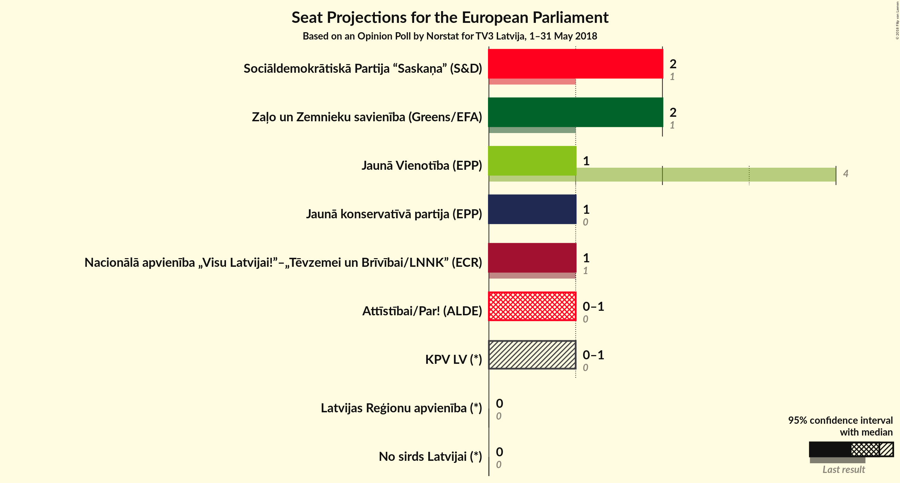

# Opinion Poll by Norstat for TV3 Latvija, 1–31 May 2018

<a href="#voting-intentions">Voting Intentions</a> | <a href="#seats">Seats</a> | <a href="#coalitions">Coalitions</a> | <a href="#technical-information">Technical Information</a>

## Voting Intentions

### Confidence Intervals

| Party | Last Result | Poll Result | 80% Confidence Interval | 90% Confidence Interval | 95% Confidence Interval | 99% Confidence Interval |
|:-----:|:-----------:|:-----------:|:-----------------------:|:-----------------------:|:-----------------------:|:-----------------------:|
| Zaļo un Zemnieku savienība (Greens/EFA) | 8.3% | 23.9% | 22.0–26.0% |21.4–26.7% |20.9–27.2% |20.0–28.2% |
| Sociāldemokrātiskā Partija “Saskaņa” (S&D) | 13.0% | 22.8% | 20.9–24.9% |20.3–25.5% |19.9–26.0% |19.0–27.1% |
| Nacionālā apvienība „Visu Latvijai!”–„Tēvzemei un Brīvībai/LNNK” (ECR) | 14.2% | 12.7% | 11.2–14.5% |10.8–15.0% |10.5–15.4% |9.8–16.2% |
| Jaunā Vienotība (EPP) | 46.2% | 8.7% | 7.5–10.2% |7.1–10.6% |6.8–11.0% |6.3–11.7% |
| Jaunā konservatīvā partija (EPP) | 0.0% | 8.5% | 7.3–10.0% |7.0–10.4% |6.7–10.8% |6.2–11.6% |
| Attīstībai/Par! (ALDE) | 2.1% | 7.6% | 1.9–3.4% |1.7–3.7% |1.6–3.9% |1.3–4.5% |
| KPV LV (*) | 0.0% | 4.9% | 4.0–6.1% |3.7–6.4% |3.5–6.7% |3.2–7.4% |
| Latvijas Reģionu apvienība (*) | 2.5% | 4.5% | 3.6–5.6% |3.4–6.0% |3.2–6.3% |2.8–6.9% |
| No sirds Latvijai (*) | 0.0% | 2.9% | 2.3–3.9% |2.1–4.2% |1.9–4.5% |1.6–5.0% |

*Note:* The poll result column reflects the actual value used in the calculations. Published results may vary slightly, and in addition be rounded to fewer digits.

## Seats

### Confidence Intervals

| Party | Last Result | Median | 80% Confidence Interval | 90% Confidence Interval | 95% Confidence Interval | 99% Confidence Interval |
|:-----:|:-----------:|:------:|:-----------------------:|:-----------------------:|:-----------------------:|:-----------------------:|
| <a href="#zaļo-un-zemnieku-savienība-(greens/efa)">Zaļo un Zemnieku savienība (Greens/EFA)</a> | 1 | 2 | 2 |2–3 |2–3 |2–3 |
| <a href="#sociāldemokrātiskā-partija-“saskaņa”-(s&d)">Sociāldemokrātiskā Partija “Saskaņa” (S&D)</a> | 1 | 2 | 2 |2 |2–3 |2–3 |
| <a href="#nacionālā-apvienība-„visu-latvijai!”–„tēvzemei-un-brīvībai/lnnk”-(ecr)">Nacionālā apvienība „Visu Latvijai!”–„Tēvzemei un Brīvībai/LNNK” (ECR)</a> | 1 | 1 | 1 |1–2 |1–2 |1–2 |
| <a href="#jaunā-vienotība-(epp)">Jaunā Vienotība (EPP)</a> | 4 | 1 | 1 |1 |1 |1 |
| <a href="#jaunā-konservatīvā-partija-(epp)">Jaunā konservatīvā partija (EPP)</a> | 0 | 1 | 1 |1 |1 |1 |
| <a href="#attīstībai/par!-(alde)">Attīstībai/Par! (ALDE)</a> | 0 | 0 | 0 |0 |0 |0 |
| <a href="#kpv-lv-(*)">KPV LV (*)</a> | 0 | 1 | 0–1 |0–1 |0–1 |0–1 |
| <a href="#latvijas-reģionu-apvienība-(*)">Latvijas Reģionu apvienība (*)</a> | 0 | 0 | 0 |0 |0–1 |0–1 |
| <a href="#no-sirds-latvijai-(*)">No sirds Latvijai (*)</a> | 0 | 0 | 0 |0 |0 |0 |

