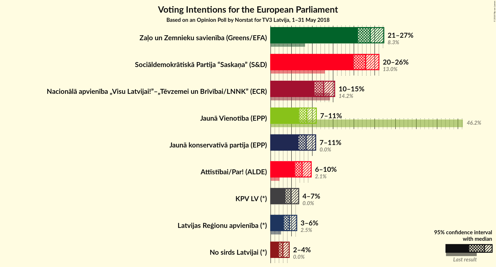
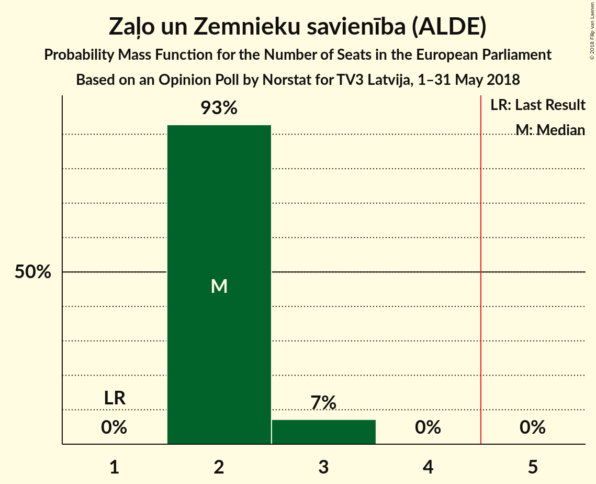
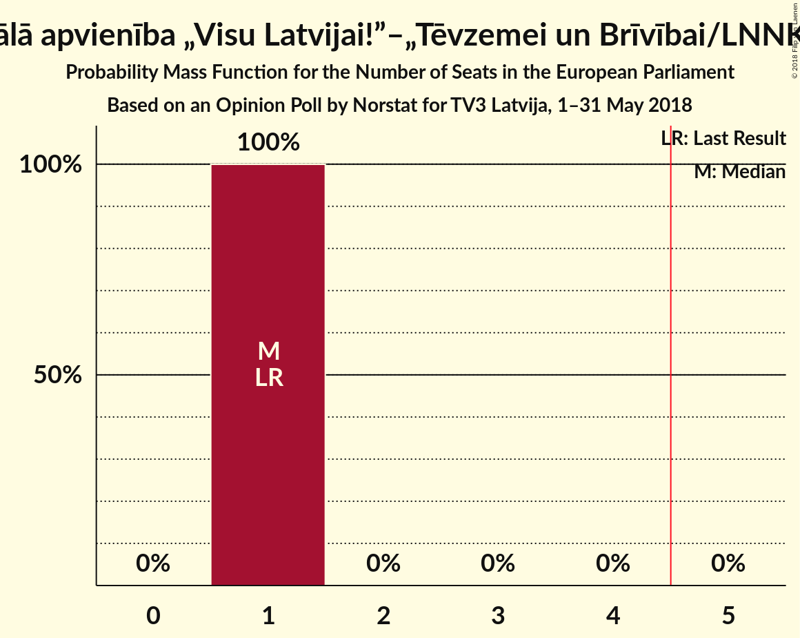
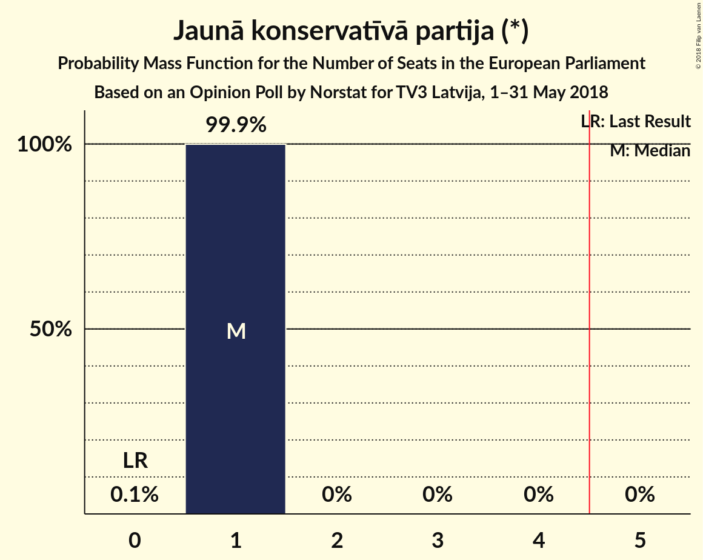
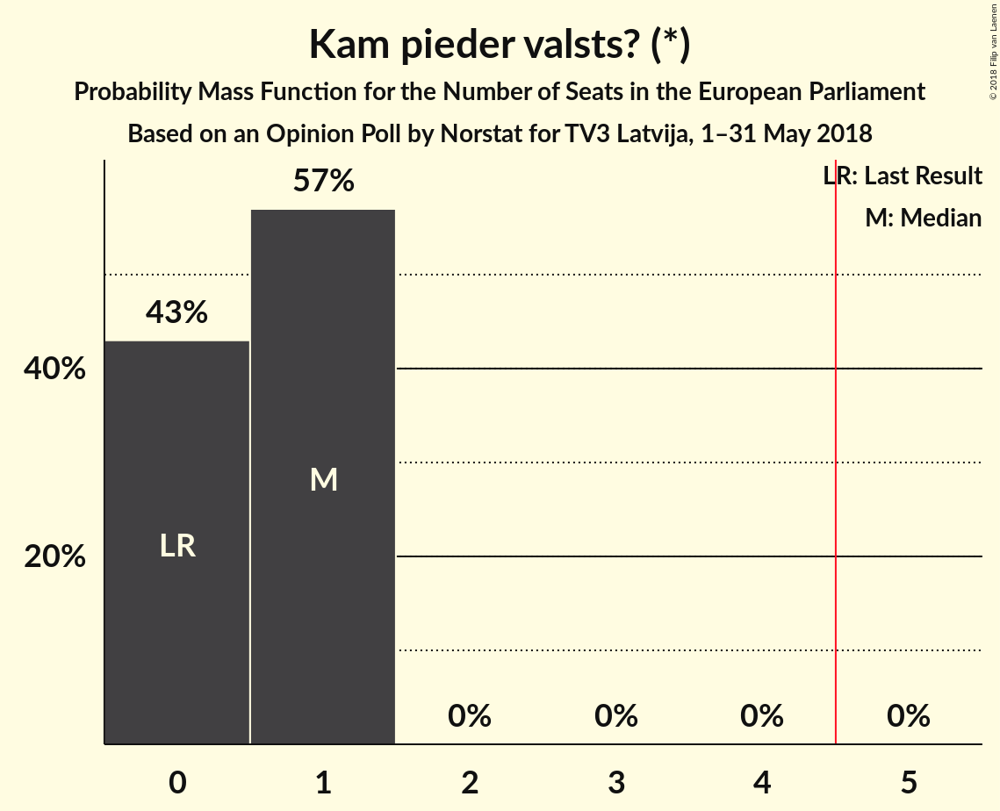
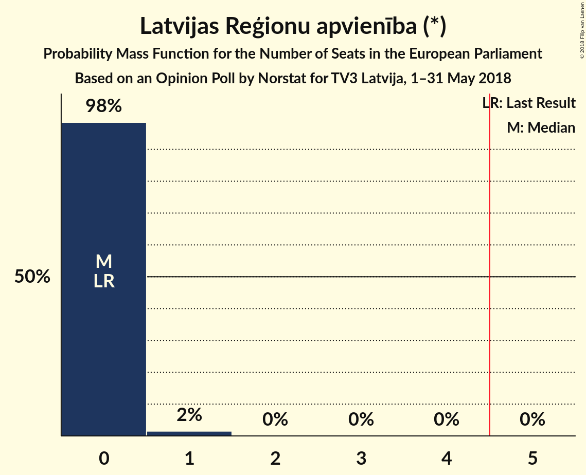
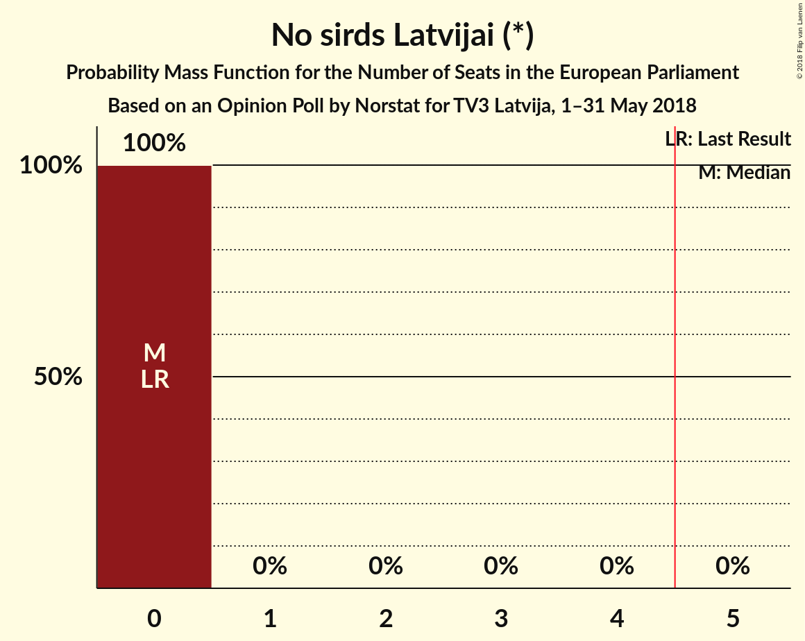
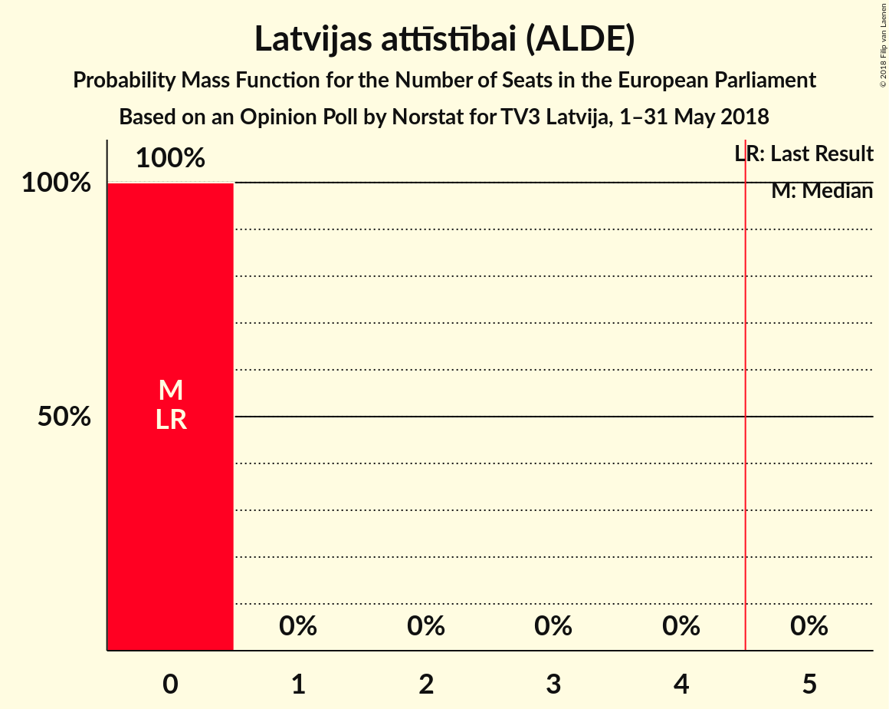
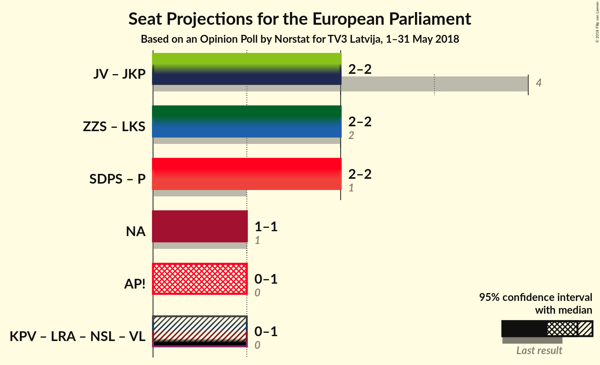

# Opinion Poll by Norstat for TV3 Latvija, 1–31 May 2018

<a href="#voting-intentions">Voting Intentions</a> | <a href="#seats">Seats</a> | <a href="#coalitions">Coalitions</a> | <a href="#technical-information">Technical Information</a>

## Voting Intentions

### Confidence Intervals

| Party | Last Result | Poll Result | 80% Confidence Interval | 90% Confidence Interval | 95% Confidence Interval | 99% Confidence Interval |
|:-----:|:-----------:|:-----------:|:-----------------------:|:-----------------------:|:-----------------------:|:-----------------------:|
| Zaļo un Zemnieku savienība (ALDE) | 8.3% | 23.9% | 22.0–26.0% |21.4–26.7% |20.9–27.2% |20.0–28.2% |
| Sociāldemokrātiskā Partija “Saskaņa” (S&D) | 13.0% | 22.8% | 20.9–24.9% |20.3–25.5% |19.9–26.0% |19.0–27.1% |
| Nacionālā apvienība „Visu Latvijai!”–„Tēvzemei un Brīvībai/LNNK” (ECR) | 14.2% | 12.7% | 11.2–14.5% |10.8–15.0% |10.5–15.4% |9.8–16.2% |
| Vienotība (EPP) | 46.2% | 8.7% | 7.5–10.2% |7.1–10.6% |6.8–11.0% |6.3–11.7% |
| Jaunā konservatīvā partija (*) | 0.0% | 8.5% | 7.3–10.0% |7.0–10.4% |6.7–10.8% |6.2–11.6% |
| Kustība Par! (*) | 0.0% | 5.0% | 4.1–6.2% |3.9–6.6% |3.7–6.9% |3.3–7.5% |
| Kam pieder valsts? (*) | 0.0% | 4.9% | 4.0–6.1% |3.7–6.4% |3.5–6.7% |3.2–7.4% |
| Latvijas Reģionu apvienība (*) | 2.5% | 4.5% | 3.6–5.6% |3.4–6.0% |3.2–6.3% |2.8–6.9% |
| No sirds Latvijai (*) | 0.0% | 2.9% | 2.3–3.9% |2.1–4.2% |1.9–4.5% |1.6–5.0% |
| Latvijas attīstībai (ALDE) | 2.1% | 2.5% | 1.9–3.4% |1.7–3.7% |1.6–3.9% |1.3–4.5% |

*Note:* The poll result column reflects the actual value used in the calculations. Published results may vary slightly, and in addition be rounded to fewer digits.

## Seats

### Confidence Intervals

| Party | Last Result | Median | 80% Confidence Interval | 90% Confidence Interval | 95% Confidence Interval | 99% Confidence Interval |
|:-----:|:-----------:|:------:|:-----------------------:|:-----------------------:|:-----------------------:|:-----------------------:|
| <a href="#zaļo-un-zemnieku-savienība-(alde)">Zaļo un Zemnieku savienība (ALDE)</a> | 1 | 2 | 2 |2 |2–3 |2–3 |
| <a href="#sociāldemokrātiskā-partija-“saskaņa”-(s&d)">Sociāldemokrātiskā Partija “Saskaņa” (S&D)</a> | 1 | 2 | 2 |2 |2 |2 |
| <a href="#nacionālā-apvienība-„visu-latvijai!”–„tēvzemei-un-brīvībai/lnnk”-(ecr)">Nacionālā apvienība „Visu Latvijai!”–„Tēvzemei un Brīvībai/LNNK” (ECR)</a> | 1 | 1 | 1 |1 |1–2 |1–2 |
| <a href="#vienotība-(epp)">Vienotība (EPP)</a> | 4 | 1 | 1 |1 |1 |1 |
| <a href="#jaunā-konservatīvā-partija-(*)">Jaunā konservatīvā partija (*)</a> | 0 | 1 | 1 |1 |1 |1 |
| <a href="#kustība-par!-(*)">Kustība Par! (*)</a> | 0 | 0 | 0–1 |0–1 |0–1 |0–1 |
| <a href="#kam-pieder-valsts?-(*)">Kam pieder valsts? (*)</a> | 0 | 1 | 0–1 |0–1 |0–1 |0–1 |
| <a href="#latvijas-reģionu-apvienība-(*)">Latvijas Reģionu apvienība (*)</a> | 0 | 0 | 0 |0 |0–1 |0–1 |
| <a href="#no-sirds-latvijai-(*)">No sirds Latvijai (*)</a> | 0 | 0 | 0 |0 |0 |0 |
| <a href="#latvijas-attīstībai-(alde)">Latvijas attīstībai (ALDE)</a> | 0 | 0 | 0 |0 |0 |0 |

### Zaļo un Zemnieku savienība (ALDE)

*For a full overview of the results for this party, see the [Zaļo un Zemnieku savienība (ALDE)](party-zaļounzemniekusavienībaalde.html) page.*

| Number of Seats | Probability | Accumulated | Special Marks |
|:---------------:|:-----------:|:-----------:|:-------------:|
| 1 | 0% | 100% | Last Result |
| 2 | 97% | 100% | Median |
| 3 | 3% | 3% |  |
| 4 | 0% | 0% |  |

### Sociāldemokrātiskā Partija “Saskaņa” (S&D)

*For a full overview of the results for this party, see the [Sociāldemokrātiskā Partija “Saskaņa” (S&D)](party-sociāldemokrātiskāpartija“saskaņa”sd.html) page.*

| Number of Seats | Probability | Accumulated | Special Marks |
|:---------------:|:-----------:|:-----------:|:-------------:|
| 1 | 0.1% | 100% | Last Result |
| 2 | 99.5% | 99.9% | Median |
| 3 | 0.4% | 0.4% |  |
| 4 | 0% | 0% |  |

### Nacionālā apvienība „Visu Latvijai!”–„Tēvzemei un Brīvībai/LNNK” (ECR)

*For a full overview of the results for this party, see the [Nacionālā apvienība „Visu Latvijai!”–„Tēvzemei un Brīvībai/LNNK” (ECR)](party-nacionālāapvienība„visulatvijai”–„tēvzemeiunbrīvībailnnk”ecr.html) page.*

| Number of Seats | Probability | Accumulated | Special Marks |
|:---------------:|:-----------:|:-----------:|:-------------:|
| 1 | 97% | 100% | Last Result, Median |
| 2 | 3% | 3% |  |
| 3 | 0% | 0% |  |

### Vienotība (EPP)

*For a full overview of the results for this party, see the [Vienotība (EPP)](party-vienotībaepp.html) page.*

| Number of Seats | Probability | Accumulated | Special Marks |
|:---------------:|:-----------:|:-----------:|:-------------:|
| 0 | 0.1% | 100% |  |
| 1 | 99.9% | 99.9% | Median |
| 2 | 0% | 0% |  |
| 3 | 0% | 0% |  |
| 4 | 0% | 0% | Last Result |

### Jaunā konservatīvā partija (*)

*For a full overview of the results for this party, see the [Jaunā konservatīvā partija (*)](party-jaunākonservatīvāpartija.html) page.*

| Number of Seats | Probability | Accumulated | Special Marks |
|:---------------:|:-----------:|:-----------:|:-------------:|
| 0 | 0.1% | 100% | Last Result |
| 1 | 99.9% | 99.9% | Median |
| 2 | 0% | 0% |  |

### Kustība Par! (*)

*For a full overview of the results for this party, see the [Kustība Par! (*)](party-kustībapar.html) page.*

| Number of Seats | Probability | Accumulated | Special Marks |
|:---------------:|:-----------:|:-----------:|:-------------:|
| 0 | 90% | 100% | Last Result, Median |
| 1 | 10% | 10% |  |
| 2 | 0% | 0% |  |

### Kam pieder valsts? (*)

*For a full overview of the results for this party, see the [Kam pieder valsts? (*)](party-kampiedervalsts.html) page.*

| Number of Seats | Probability | Accumulated | Special Marks |
|:---------------:|:-----------:|:-----------:|:-------------:|
| 0 | 20% | 100% | Last Result |
| 1 | 80% | 80% | Median |
| 2 | 0% | 0% |  |

### Latvijas Reģionu apvienība (*)

*For a full overview of the results for this party, see the [Latvijas Reģionu apvienība (*)](party-latvijasreģionuapvienība.html) page.*

| Number of Seats | Probability | Accumulated | Special Marks |
|:---------------:|:-----------:|:-----------:|:-------------:|
| 0 | 97% | 100% | Last Result, Median |
| 1 | 3% | 3% |  |
| 2 | 0% | 0% |  |

### No sirds Latvijai (*)

*For a full overview of the results for this party, see the [No sirds Latvijai (*)](party-nosirdslatvijai.html) page.*

| Number of Seats | Probability | Accumulated | Special Marks |
|:---------------:|:-----------:|:-----------:|:-------------:|
| 0 | 99.8% | 100% | Last Result, Median |
| 1 | 0.2% | 0.2% |  |
| 2 | 0% | 0% |  |

### Latvijas attīstībai (ALDE)

*For a full overview of the results for this party, see the [Latvijas attīstībai (ALDE)](party-latvijasattīstībaialde.html) page.*

| Number of Seats | Probability | Accumulated | Special Marks |
|:---------------:|:-----------:|:-----------:|:-------------:|
| 0 | 100% | 100% | Last Result, Median |

## Coalitions

### Confidence Intervals

| Coalition | Last Result | Median | Majority? | 80% Confidence Interval | 90% Confidence Interval | 95% Confidence Interval | 99% Confidence Interval |
|:---------:|:-----------:|:------:|:---------:|:-----------------------:|:-----------------------:|:-----------------------:|:-----------------------:|
| Zaļo un Zemnieku savienība (ALDE) – Latvijas attīstībai (ALDE) | 1 | 2 | 0% | 2 | 2 | 2–3 | 2–3 |
| Sociāldemokrātiskā Partija “Saskaņa” (S&D) | 1 | 2 | 0% | 2 | 2 | 2 | 2 |
| Nacionālā apvienība „Visu Latvijai!”–„Tēvzemei un Brīvībai/LNNK” (ECR) | 1 | 1 | 0% | 1 | 1 | 1–2 | 1–2 |
| Vienotība (EPP) | 4 | 1 | 0% | 1 | 1 | 1 | 1 |

### Zaļo un Zemnieku savienība (ALDE) – Latvijas attīstībai (ALDE)

| Number of Seats | Probability | Accumulated | Special Marks |
|:---------------:|:-----------:|:-----------:|:-------------:|
| 1 | 0% | 100% | Last Result |
| 2 | 97% | 100% | Median |
| 3 | 3% | 3% |  |
| 4 | 0% | 0% |  |

### Sociāldemokrātiskā Partija “Saskaņa” (S&D)

| Number of Seats | Probability | Accumulated | Special Marks |
|:---------------:|:-----------:|:-----------:|:-------------:|
| 1 | 0.1% | 100% | Last Result |
| 2 | 99.5% | 99.9% | Median |
| 3 | 0.4% | 0.4% |  |
| 4 | 0% | 0% |  |

### Nacionālā apvienība „Visu Latvijai!”–„Tēvzemei un Brīvībai/LNNK” (ECR)

| Number of Seats | Probability | Accumulated | Special Marks |
|:---------------:|:-----------:|:-----------:|:-------------:|
| 1 | 97% | 100% | Last Result, Median |
| 2 | 3% | 3% |  |
| 3 | 0% | 0% |  |

### Vienotība (EPP)

| Number of Seats | Probability | Accumulated | Special Marks |
|:---------------:|:-----------:|:-----------:|:-------------:|
| 0 | 0.1% | 100% |  |
| 1 | 99.9% | 99.9% | Median |
| 2 | 0% | 0% |  |
| 3 | 0% | 0% |  |
| 4 | 0% | 0% | Last Result |

## Technical Information

### Opinion Poll

+ **Polling firm:** Norstat
+ **Commissioner(s):** TV3 Latvija
+ **Fieldwork period:** 1–31 May 2018

### Calculations

+ **Sample size:** 715
+ **Simulations done:** 131,072
+ **Error estimate:** 3.03%

