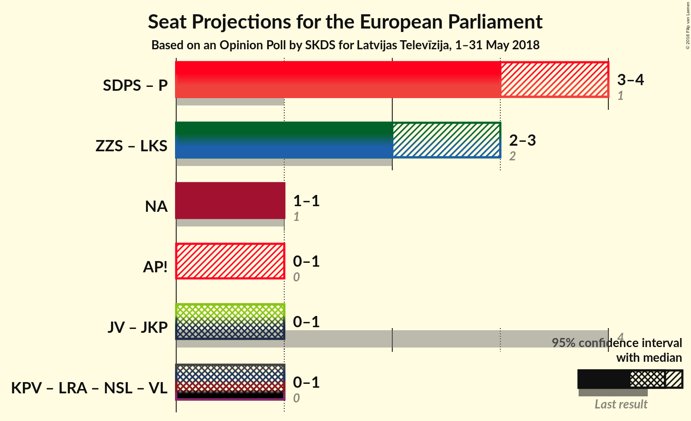

# Opinion Poll by SKDS for Latvijas Televīzija, 1–31 May 2018

<a href="#voting-intentions">Voting Intentions</a> | <a href="#seats">Seats</a> | <a href="#coalitions">Coalitions</a> | <a href="#technical-information">Technical Information</a>

## Voting Intentions

### Confidence Intervals

| Party | Last Result | Poll Result | 80% Confidence Interval | 90% Confidence Interval | 95% Confidence Interval | 99% Confidence Interval |
|:-----:|:-----------:|:-----------:|:-----------------------:|:-----------------------:|:-----------------------:|:-----------------------:|
| Sociāldemokrātiskā Partija “Saskaņa” (S&D) | 13.0% | 32.5% | N/A |N/A |N/A |N/A |
| Zaļo un Zemnieku savienība (ALDE) | 8.3% | 24.8% | N/A |N/A |N/A |N/A |
| Nacionālā apvienība „Visu Latvijai!”–„Tēvzemei un Brīvībai/LNNK” (ECR) | 14.2% | 11.9% | N/A |N/A |N/A |N/A |
| Vienotība (EPP) | 46.2% | 6.3% | N/A |N/A |N/A |N/A |
| Kam pieder valsts? (*) | 0.0% | 5.1% | N/A |N/A |N/A |N/A |
| Kustība Par! (*) | 0.0% | 5.1% | N/A |N/A |N/A |N/A |
| Jaunā konservatīvā partija (*) | 0.0% | 4.1% | N/A |N/A |N/A |N/A |
| Latvijas Reģionu apvienība (*) | 2.5% | 2.9% | N/A |N/A |N/A |N/A |
| No sirds Latvijai (*) | 0.0% | 2.7% | N/A |N/A |N/A |N/A |
| Latvijas Krievu savienība (Greens/EFA) | 6.4% | 2.2% | N/A |N/A |N/A |N/A |

*Note:* The poll result column reflects the actual value used in the calculations. Published results may vary slightly, and in addition be rounded to fewer digits.

## Seats

### Confidence Intervals

| Party | Last Result | Median | 80% Confidence Interval | 90% Confidence Interval | 95% Confidence Interval | 99% Confidence Interval |
|:-----:|:-----------:|:------:|:-----------------------:|:-----------------------:|:-----------------------:|:-----------------------:|
| <a href="#sociāldemokrātiskā-partija-“saskaņa”-(s&d)">Sociāldemokrātiskā Partija “Saskaņa” (S&D)</a> | 1 | N/A | N/A |N/A |N/A |N/A |
| <a href="#zaļo-un-zemnieku-savienība-(alde)">Zaļo un Zemnieku savienība (ALDE)</a> | 1 | N/A | N/A |N/A |N/A |N/A |
| <a href="#nacionālā-apvienība-„visu-latvijai!”–„tēvzemei-un-brīvībai/lnnk”-(ecr)">Nacionālā apvienība „Visu Latvijai!”–„Tēvzemei un Brīvībai/LNNK” (ECR)</a> | 1 | N/A | N/A |N/A |N/A |N/A |
| <a href="#vienotība-(epp)">Vienotība (EPP)</a> | 4 | N/A | N/A |N/A |N/A |N/A |
| <a href="#kam-pieder-valsts?-(*)">Kam pieder valsts? (*)</a> | 0 | N/A | N/A |N/A |N/A |N/A |
| <a href="#kustība-par!-(*)">Kustība Par! (*)</a> | 0 | N/A | N/A |N/A |N/A |N/A |
| <a href="#jaunā-konservatīvā-partija-(*)">Jaunā konservatīvā partija (*)</a> | 0 | N/A | N/A |N/A |N/A |N/A |
| <a href="#latvijas-reģionu-apvienība-(*)">Latvijas Reģionu apvienība (*)</a> | 0 | N/A | N/A |N/A |N/A |N/A |
| <a href="#no-sirds-latvijai-(*)">No sirds Latvijai (*)</a> | 0 | N/A | N/A |N/A |N/A |N/A |
| <a href="#latvijas-krievu-savienība-(greens/efa)">Latvijas Krievu savienība (Greens/EFA)</a> | 1 | N/A | N/A |N/A |N/A |N/A |

## Coalitions

## Technical Information

### Opinion Poll

+ **Polling firm:** SKDS
+ **Commissioner(s):** Latvijas Televīzija
+ **Fieldwork period:** 1–31 May 2018

### Calculations

+ **Sample size:** 588
+ **Simulations done:** 0
+ **Error estimate:** 100.00%

