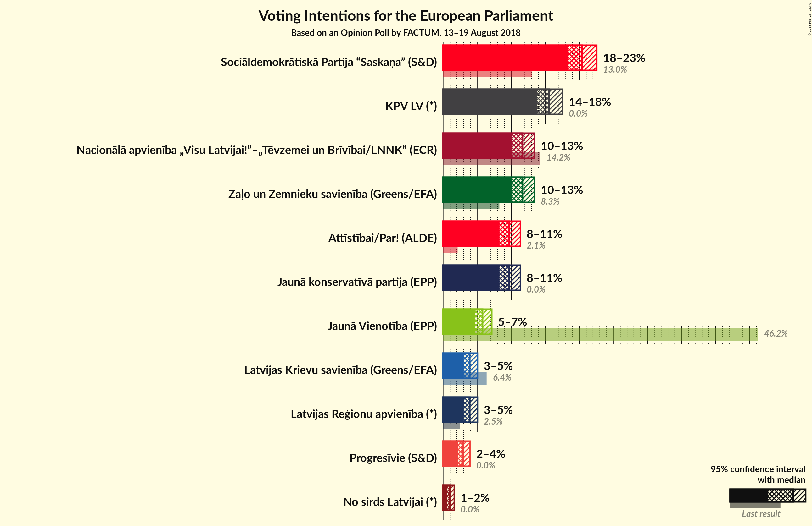
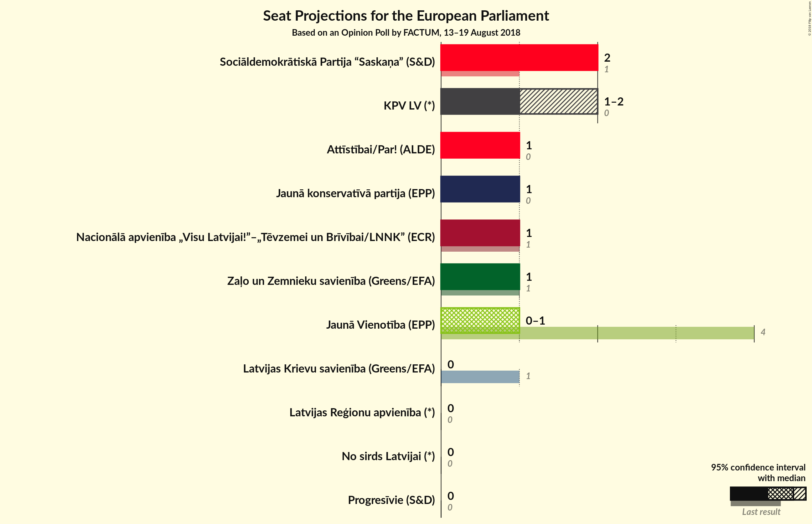

# Opinion Poll by FACTUM, 13–19 August 2018

<a href="#voting-intentions">Voting Intentions</a> | <a href="#seats">Seats</a> | <a href="#coalitions">Coalitions</a> | <a href="#technical-information">Technical Information</a>

## Voting Intentions

### Confidence Intervals

| Party | Last Result | Poll Result | 80% Confidence Interval | 90% Confidence Interval | 95% Confidence Interval | 99% Confidence Interval |
|:-----:|:-----------:|:-----------:|:-----------------------:|:-----------------------:|:-----------------------:|:-----------------------:|
| Sociāldemokrātiskā Partija “Saskaņa” (S&D) | 13.0% | 20.4% | 19.7–22.4% |19.3–22.8% |19.0–23.2% |18.4–23.9% |
| KPV LV (*) | 0.0% | 15.6% | 14.8–17.3% |14.5–17.6% |14.2–18.0% |13.6–18.6% |
| Zaļo un Zemnieku savienība (Greens/EFA) | N/A | 11.7% | 11.0–13.2% |10.7–13.5% |10.4–13.8% |9.9–14.4% |
| Nacionālā apvienība „Visu Latvijai!”–„Tēvzemei un Brīvībai/LNNK” (ECR) | 14.2% | 11.7% | 11.0–13.2% |10.7–13.5% |10.4–13.8% |9.9–14.4% |
| Jaunā konservatīvā partija (*) | 0.0% | 9.7% | 9.0–11.1% |8.8–11.4% |8.5–11.6% |8.1–12.2% |
| Kustība Par! (*) | 0.0% | 9.7% | 9.0–11.1% |8.8–11.4% |8.5–11.6% |8.1–12.2% |
| Vienotība (EPP) | 46.2% | 5.8% | 5.3–6.9% |5.1–7.1% |4.9–7.4% |4.6–7.8% |
| Latvijas Reģionu apvienība (*) | 2.5% | 3.9% | 3.4–4.7% |3.2–4.9% |3.1–5.1% |2.8–5.5% |
| Latvijas Krievu savienība (Greens/EFA) | 6.4% | 3.9% | 3.4–4.7% |3.2–4.9% |3.1–5.1% |2.8–5.5% |
| Progresīvie (*) | 0.0% | 2.9% | N/A |N/A |N/A |N/A |
| No sirds Latvijai (*) | 0.0% | 1.0% | 0.7–1.4% |0.6–1.5% |0.6–1.6% |0.5–1.9% |

*Note:* The poll result column reflects the actual value used in the calculations. Published results may vary slightly, and in addition be rounded to fewer digits.

## Seats

### Confidence Intervals

| Party | Last Result | Median | 80% Confidence Interval | 90% Confidence Interval | 95% Confidence Interval | 99% Confidence Interval |
|:-----:|:-----------:|:------:|:-----------------------:|:-----------------------:|:-----------------------:|:-----------------------:|
| <a href="#sociāldemokrātiskā-partija-“saskaņa”-(s&d)">Sociāldemokrātiskā Partija “Saskaņa” (S&D)</a> | 1 | 2 | 2 |2 |2 |2 |
| <a href="#kpv-lv-(*)">KPV LV (*)</a> | 0 | 1 | 1–2 |1–2 |1–2 |1–2 |
| <a href="#zaļo-un-zemnieku-savienība-(greens/efa)">Zaļo un Zemnieku savienība (Greens/EFA)</a> | N/A | 1 | 1 |1 |1 |1 |
| <a href="#nacionālā-apvienība-„visu-latvijai!”–„tēvzemei-un-brīvībai/lnnk”-(ecr)">Nacionālā apvienība „Visu Latvijai!”–„Tēvzemei un Brīvībai/LNNK” (ECR)</a> | 1 | 1 | 1 |1 |1 |1 |
| <a href="#jaunā-konservatīvā-partija-(*)">Jaunā konservatīvā partija (*)</a> | 0 | 1 | 1 |1 |1 |1 |
| <a href="#kustība-par!-(*)">Kustība Par! (*)</a> | 0 | 1 | 1 |1 |1 |1 |
| <a href="#vienotība-(epp)">Vienotība (EPP)</a> | 4 | 1 | 0–1 |0–1 |0–1 |0–1 |
| <a href="#latvijas-reģionu-apvienība-(*)">Latvijas Reģionu apvienība (*)</a> | 0 | 0 | 0 |0 |0 |0 |
| <a href="#latvijas-krievu-savienība-(greens/efa)">Latvijas Krievu savienība (Greens/EFA)</a> | 1 | 0 | 0 |0 |0 |0 |
| <a href="#progresīvie-(*)">Progresīvie (*)</a> | 0 | N/A | N/A |N/A |N/A |N/A |
| <a href="#no-sirds-latvijai-(*)">No sirds Latvijai (*)</a> | 0 | 0 | 0 |0 |0 |0 |

