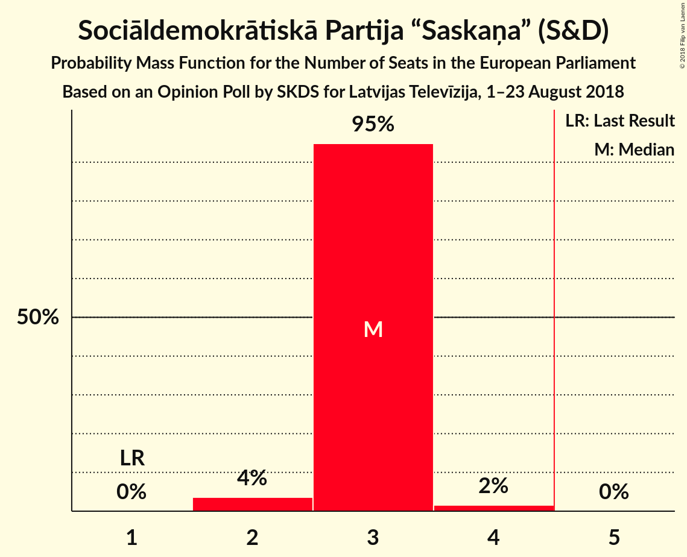
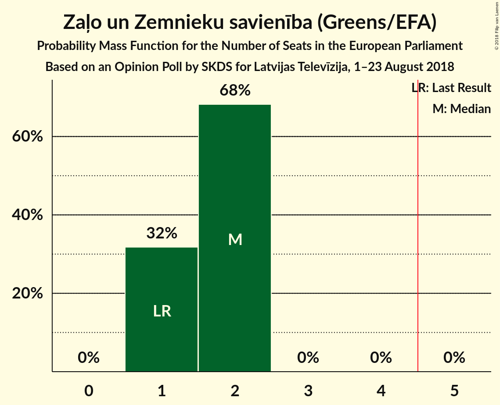
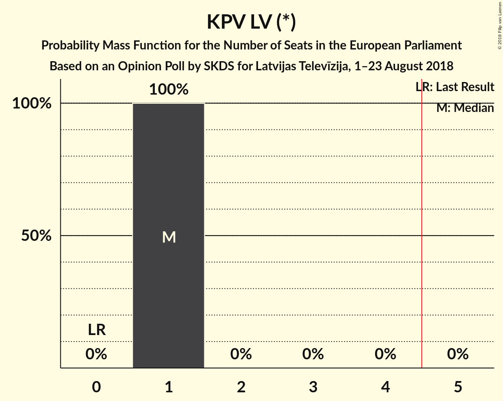
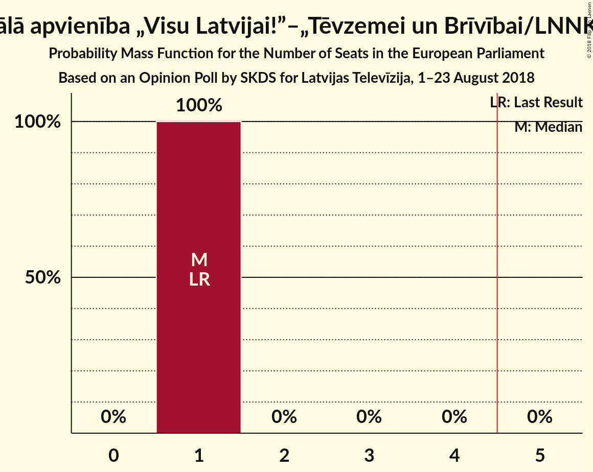
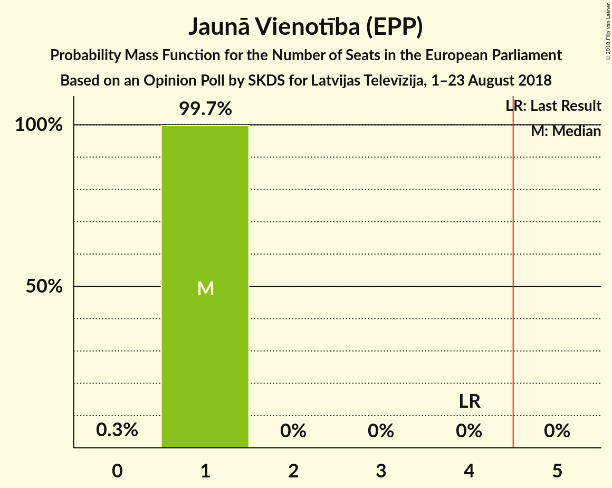
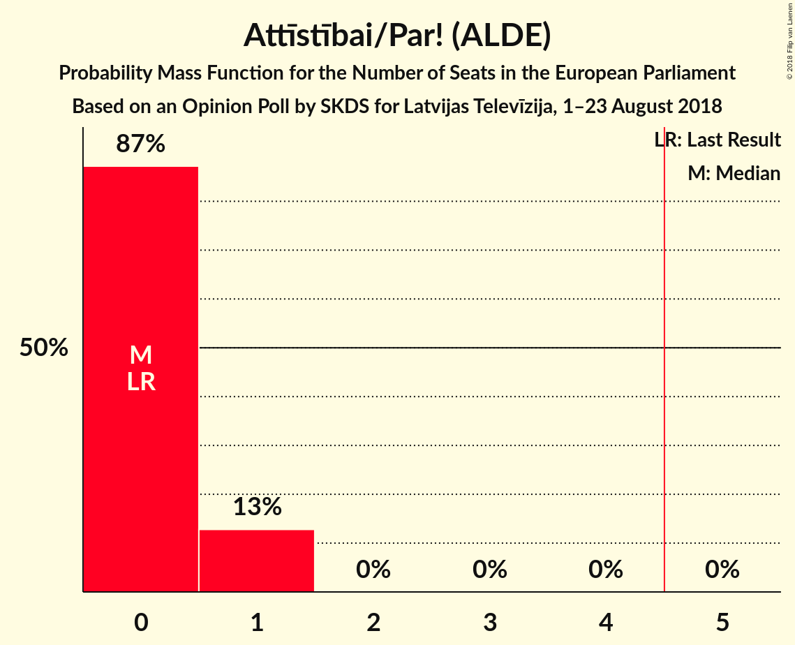
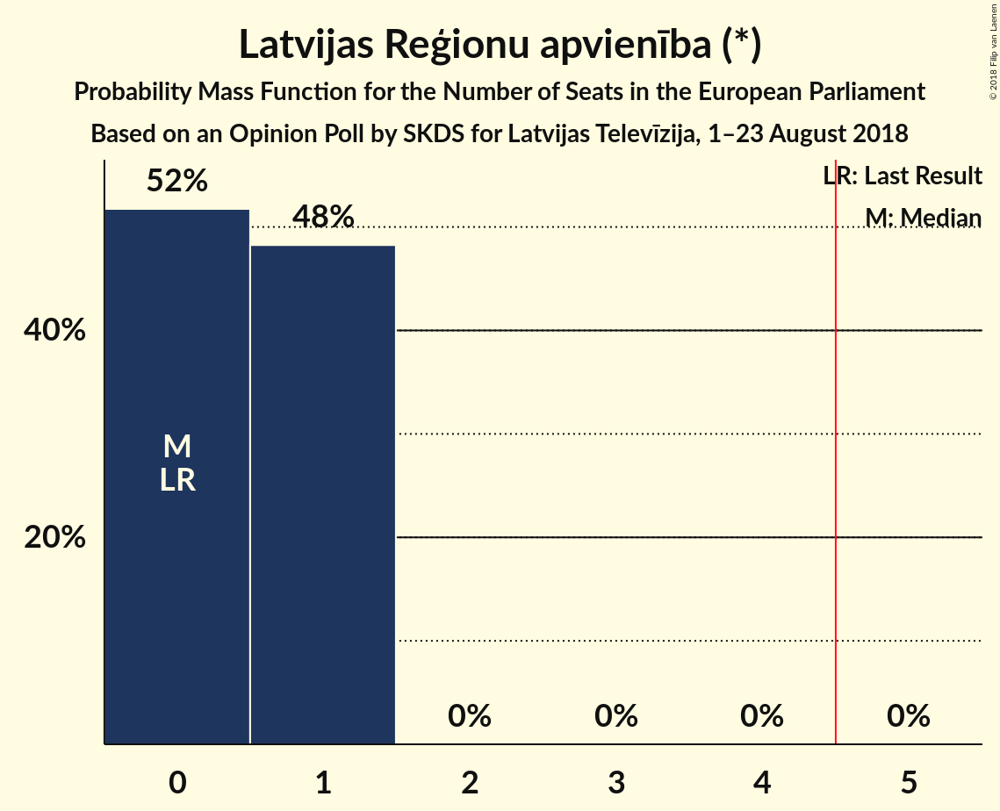
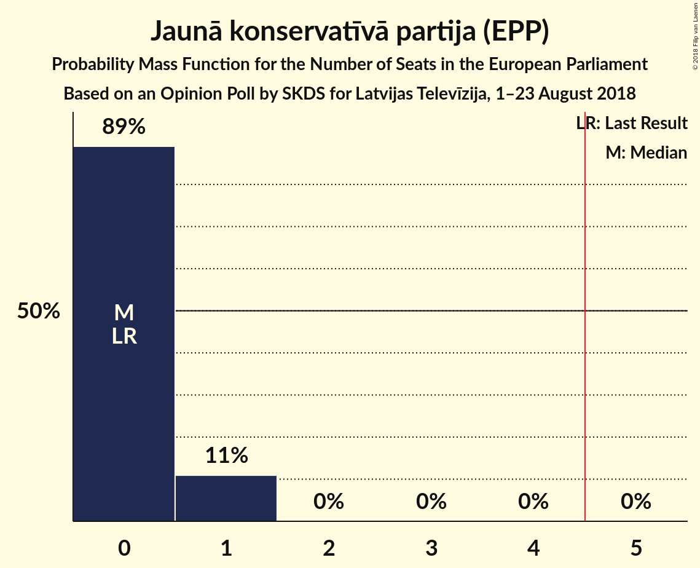
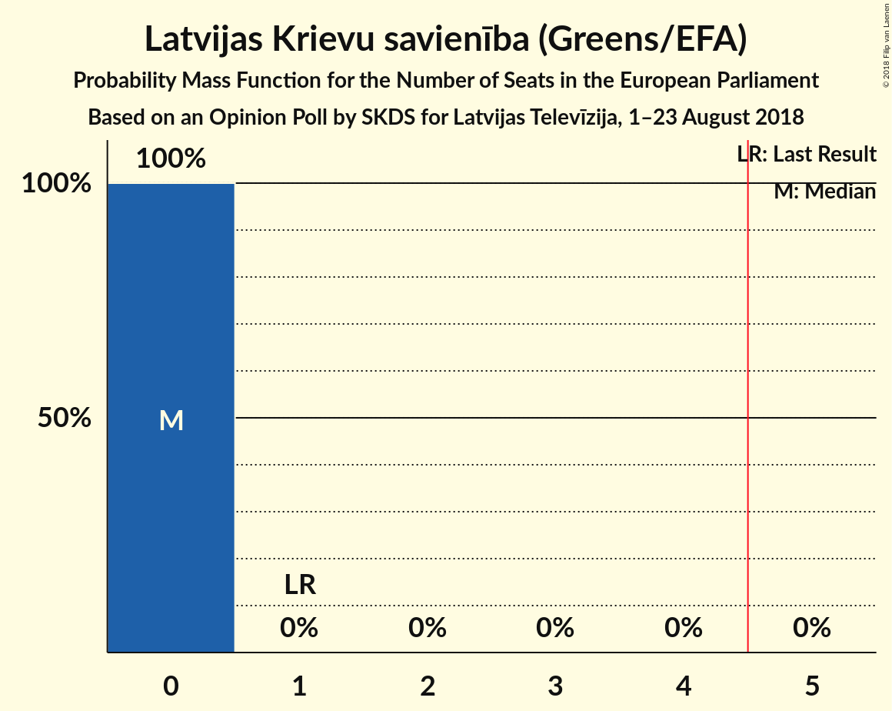
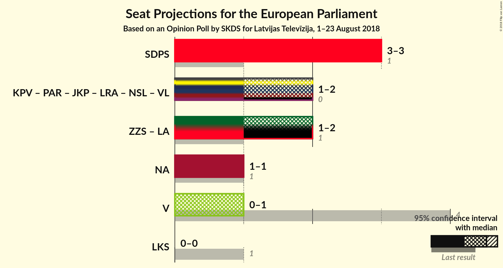

# Opinion Poll by SKDS for Latvijas Televīzija, 1–23 August 2018

<a href="#voting-intentions">Voting Intentions</a> | <a href="#seats">Seats</a> | <a href="#coalitions">Coalitions</a> | <a href="#technical-information">Technical Information</a>

## Voting Intentions

### Confidence Intervals

| Party | Last Result | Poll Result | 80% Confidence Interval | 90% Confidence Interval | 95% Confidence Interval | 99% Confidence Interval |
|:-----:|:-----------:|:-----------:|:-----------------------:|:-----------------------:|:-----------------------:|:-----------------------:|
| Sociāldemokrātiskā Partija “Saskaņa” (S&D) | 13.0% | 33.0% | 30.6–35.6% |29.9–36.3% |29.3–36.9% |28.2–38.1% |
| Zaļo un Zemnieku savienība (Greens/EFA) | 8.3% | 17.6% | 15.7–19.8% |15.2–20.4% |14.7–20.9% |13.9–22.0% |
| KPV LV (*) | 0.0% | 11.5% | 9.9–13.3% |9.5–13.8% |9.1–14.3% |8.4–15.2% |
| Nacionālā apvienība „Visu Latvijai!”–„Tēvzemei un Brīvībai/LNNK” (ECR) | 14.2% | 9.4% | 8.0–11.1% |7.6–11.6% |7.3–12.0% |6.7–12.9% |
| Jaunā Vienotība (EPP) | 46.2% | 7.9% | 6.6–9.5% |6.2–9.9% |5.9–10.3% |5.4–11.2% |
| Attīstībai/Par! (ALDE) | 2.1% | 4.8% | 3.8–6.1% |3.6–6.5% |3.3–6.8% |2.9–7.5% |
| Latvijas Reģionu apvienība (*) | 2.5% | 4.4% | 3.5–5.7% |3.3–6.1% |3.0–6.4% |2.7–7.1% |
| Jaunā konservatīvā partija (EPP) | 0.0% | 4.4% | 3.5–5.7% |3.3–6.1% |3.0–6.4% |2.7–7.1% |
| No sirds Latvijai (*) | 0.0% | 2.7% | 2.0–3.8% |1.8–4.1% |1.7–4.4% |1.4–5.0% |
| Progresīvie (S&D) | 0.0% | 2.2% | 1.6–3.2% |1.4–3.5% |1.3–3.8% |1.1–4.3% |
| Latvijas Krievu savienība (Greens/EFA) | 6.4% | 1.9% | 1.3–2.8% |1.2–3.1% |1.1–3.3% |0.8–3.9% |

*Note:* The poll result column reflects the actual value used in the calculations. Published results may vary slightly, and in addition be rounded to fewer digits.

## Seats

### Confidence Intervals

| Party | Last Result | Median | 80% Confidence Interval | 90% Confidence Interval | 95% Confidence Interval | 99% Confidence Interval |
|:-----:|:-----------:|:------:|:-----------------------:|:-----------------------:|:-----------------------:|:-----------------------:|
| <a href="#sociāldemokrātiskā-partija-“saskaņa”-(s&d)">Sociāldemokrātiskā Partija “Saskaņa” (S&D)</a> | 1 | 3 | 3 |3 |2–3 |2–3 |
| <a href="#zaļo-un-zemnieku-savienība-(greens/efa)">Zaļo un Zemnieku savienība (Greens/EFA)</a> | 1 | 2 | 1–2 |1–2 |1–2 |1–2 |
| <a href="#kpv-lv-(*)">KPV LV (*)</a> | 0 | 1 | 1 |1 |1 |1 |
| <a href="#nacionālā-apvienība-„visu-latvijai!”–„tēvzemei-un-brīvībai/lnnk”-(ecr)">Nacionālā apvienība „Visu Latvijai!”–„Tēvzemei un Brīvībai/LNNK” (ECR)</a> | 1 | 1 | 1 |1 |1 |1 |
| <a href="#jaunā-vienotība-(epp)">Jaunā Vienotība (EPP)</a> | 4 | 1 | 1 |1 |1 |1 |
| <a href="#attīstībai/par!-(alde)">Attīstībai/Par! (ALDE)</a> | 0 | 0 | 0–1 |0–1 |0–1 |0–1 |
| <a href="#latvijas-reģionu-apvienība-(*)">Latvijas Reģionu apvienība (*)</a> | 0 | 0 | 0 |0 |0–1 |0–1 |
| <a href="#jaunā-konservatīvā-partija-(epp)">Jaunā konservatīvā partija (EPP)</a> | 0 | 0 | 0 |0–1 |0–1 |0–1 |
| <a href="#no-sirds-latvijai-(*)">No sirds Latvijai (*)</a> | 0 | 0 | 0 |0 |0 |0 |
| <a href="#progresīvie-(s&d)">Progresīvie (S&D)</a> | 0 | 0 | 0 |0 |0 |0 |
| <a href="#latvijas-krievu-savienība-(greens/efa)">Latvijas Krievu savienība (Greens/EFA)</a> | 1 | 0 | 0 |0 |0 |0 |

### Sociāldemokrātiskā Partija “Saskaņa” (S&D)

*For a full overview of the results for this party, see the [Sociāldemokrātiskā Partija “Saskaņa” (S&D)](party-sociāldemokrātiskāpartija“saskaņa”sd.html) page.*

| Number of Seats | Probability | Accumulated | Special Marks |
|:---------------:|:-----------:|:-----------:|:-------------:|
| 1 | 0% | 100% | Last Result |
| 2 | 4% | 100% |  |
| 3 | 95% | 96% | Median |
| 4 | 0.4% | 0.4% |  |
| 5 | 0% | 0% | Majority |

### Zaļo un Zemnieku savienība (Greens/EFA)

*For a full overview of the results for this party, see the [Zaļo un Zemnieku savienība (Greens/EFA)](party-zaļounzemniekusavienībagreensefa.html) page.*

| Number of Seats | Probability | Accumulated | Special Marks |
|:---------------:|:-----------:|:-----------:|:-------------:|
| 1 | 22% | 100% | Last Result |
| 2 | 78% | 78% | Median |
| 3 | 0% | 0% |  |

### KPV LV (*)

*For a full overview of the results for this party, see the [KPV LV (*)](party-kpvlv.html) page.*

| Number of Seats | Probability | Accumulated | Special Marks |
|:---------------:|:-----------:|:-----------:|:-------------:|
| 0 | 0% | 100% | Last Result |
| 1 | 100% | 100% | Median |

### Nacionālā apvienība „Visu Latvijai!”–„Tēvzemei un Brīvībai/LNNK” (ECR)

*For a full overview of the results for this party, see the [Nacionālā apvienība „Visu Latvijai!”–„Tēvzemei un Brīvībai/LNNK” (ECR)](party-nacionālāapvienība„visulatvijai”–„tēvzemeiunbrīvībailnnk”ecr.html) page.*

| Number of Seats | Probability | Accumulated | Special Marks |
|:---------------:|:-----------:|:-----------:|:-------------:|
| 1 | 100% | 100% | Last Result, Median |

### Jaunā Vienotība (EPP)

*For a full overview of the results for this party, see the [Jaunā Vienotība (EPP)](party-jaunāvienotībaepp.html) page.*

| Number of Seats | Probability | Accumulated | Special Marks |
|:---------------:|:-----------:|:-----------:|:-------------:|
| 0 | 0.3% | 100% |  |
| 1 | 99.7% | 99.7% | Median |
| 2 | 0% | 0% |  |
| 3 | 0% | 0% |  |
| 4 | 0% | 0% | Last Result |

### Attīstībai/Par! (ALDE)

*For a full overview of the results for this party, see the [Attīstībai/Par! (ALDE)](party-attīstībaiparalde.html) page.*

| Number of Seats | Probability | Accumulated | Special Marks |
|:---------------:|:-----------:|:-----------:|:-------------:|
| 0 | 87% | 100% | Last Result, Median |
| 1 | 13% | 13% |  |
| 2 | 0% | 0% |  |

### Latvijas Reģionu apvienība (*)

*For a full overview of the results for this party, see the [Latvijas Reģionu apvienība (*)](party-latvijasreģionuapvienība.html) page.*

| Number of Seats | Probability | Accumulated | Special Marks |
|:---------------:|:-----------:|:-----------:|:-------------:|
| 0 | 96% | 100% | Last Result, Median |
| 1 | 4% | 4% |  |
| 2 | 0% | 0% |  |

### Jaunā konservatīvā partija (EPP)

*For a full overview of the results for this party, see the [Jaunā konservatīvā partija (EPP)](party-jaunākonservatīvāpartijaepp.html) page.*

| Number of Seats | Probability | Accumulated | Special Marks |
|:---------------:|:-----------:|:-----------:|:-------------:|
| 0 | 91% | 100% | Last Result, Median |
| 1 | 9% | 9% |  |
| 2 | 0% | 0% |  |

### No sirds Latvijai (*)

*For a full overview of the results for this party, see the [No sirds Latvijai (*)](party-nosirdslatvijai.html) page.*

| Number of Seats | Probability | Accumulated | Special Marks |
|:---------------:|:-----------:|:-----------:|:-------------:|
| 0 | 100% | 100% | Last Result, Median |

### Progresīvie (S&D)

*For a full overview of the results for this party, see the [Progresīvie (S&D)](party-progresīviesd.html) page.*

| Number of Seats | Probability | Accumulated | Special Marks |
|:---------------:|:-----------:|:-----------:|:-------------:|
| 0 | 100% | 100% | Last Result, Median |

### Latvijas Krievu savienība (Greens/EFA)

*For a full overview of the results for this party, see the [Latvijas Krievu savienība (Greens/EFA)](party-latvijaskrievusavienībagreensefa.html) page.*

| Number of Seats | Probability | Accumulated | Special Marks |
|:---------------:|:-----------:|:-----------:|:-------------:|
| 0 | 100% | 100% | Median |
| 1 | 0% | 0% | Last Result |

## Coalitions

### Confidence Intervals

| Coalition | Last Result | Median | Majority? | 80% Confidence Interval | 90% Confidence Interval | 95% Confidence Interval | 99% Confidence Interval |
|:---------:|:-----------:|:------:|:---------:|:-----------------------:|:-----------------------:|:-----------------------:|:-----------------------:|
| Sociāldemokrātiskā Partija “Saskaņa” (S&D) – Progresīvie (S&D) | 1 | 3 | 0% | 3 | 3 | 2–3 | 2–3 |
| Jaunā Vienotība (EPP) – Jaunā konservatīvā partija (EPP) | 4 | 1 | 0% | 1 | 1–2 | 1–2 | 1–2 |
| Zaļo un Zemnieku savienība (Greens/EFA) – Latvijas Krievu savienība (Greens/EFA) | 2 | 2 | 0% | 1–2 | 1–2 | 1–2 | 1–2 |
| Nacionālā apvienība „Visu Latvijai!”–„Tēvzemei un Brīvībai/LNNK” (ECR) | 1 | 1 | 0% | 1 | 1 | 1 | 1 |
| Attīstībai/Par! (ALDE) | 0 | 0 | 0% | 0–1 | 0–1 | 0–1 | 0–1 |

### Sociāldemokrātiskā Partija “Saskaņa” (S&D) – Progresīvie (S&D)

| Number of Seats | Probability | Accumulated | Special Marks |
|:---------------:|:-----------:|:-----------:|:-------------:|
| 1 | 0% | 100% | Last Result |
| 2 | 4% | 100% |  |
| 3 | 95% | 96% | Median |
| 4 | 0.4% | 0.4% |  |
| 5 | 0% | 0% | Majority |

### Jaunā Vienotība (EPP) – Jaunā konservatīvā partija (EPP)

| Number of Seats | Probability | Accumulated | Special Marks |
|:---------------:|:-----------:|:-----------:|:-------------:|
| 0 | 0.2% | 100% |  |
| 1 | 91% | 99.8% | Median |
| 2 | 9% | 9% |  |
| 3 | 0% | 0% |  |
| 4 | 0% | 0% | Last Result |

### Zaļo un Zemnieku savienība (Greens/EFA) – Latvijas Krievu savienība (Greens/EFA)

| Number of Seats | Probability | Accumulated | Special Marks |
|:---------------:|:-----------:|:-----------:|:-------------:|
| 1 | 22% | 100% |  |
| 2 | 78% | 78% | Last Result, Median |
| 3 | 0% | 0% |  |

### Nacionālā apvienība „Visu Latvijai!”–„Tēvzemei un Brīvībai/LNNK” (ECR)

| Number of Seats | Probability | Accumulated | Special Marks |
|:---------------:|:-----------:|:-----------:|:-------------:|
| 1 | 100% | 100% | Last Result, Median |

### Attīstībai/Par! (ALDE)

| Number of Seats | Probability | Accumulated | Special Marks |
|:---------------:|:-----------:|:-----------:|:-------------:|
| 0 | 87% | 100% | Last Result, Median |
| 1 | 13% | 13% |  |
| 2 | 0% | 0% |  |

## Technical Information

### Opinion Poll

+ **Polling firm:** SKDS
+ **Commissioner(s):** Latvijas Televīzija
+ **Fieldwork period:** 1–23 August 2018

### Calculations

+ **Sample size:** 585
+ **Simulations done:** 1,048,576
+ **Error estimate:** 2.16%

