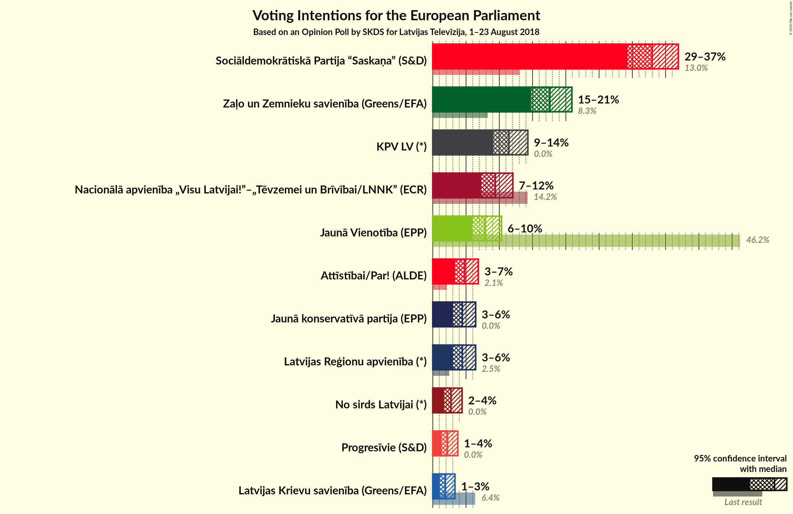
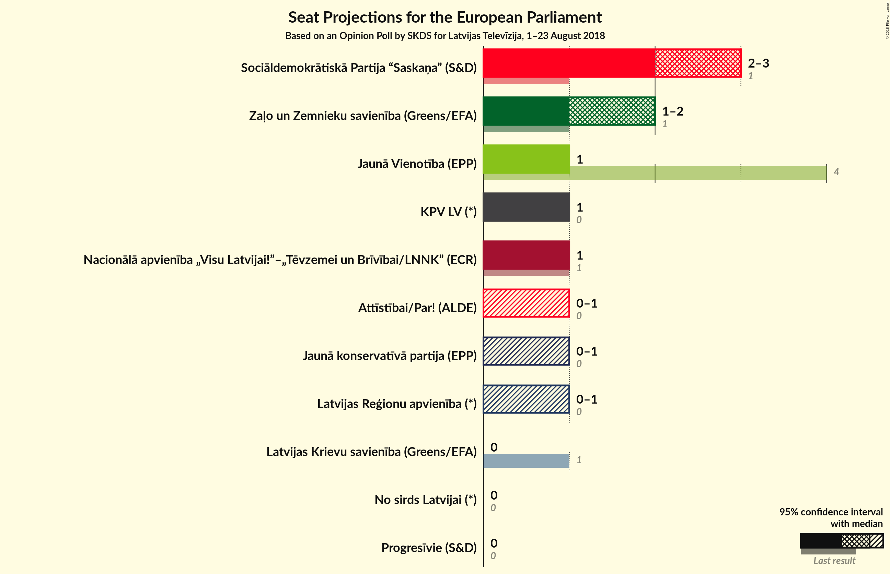

# Opinion Poll by SKDS for Latvijas Televīzija, 1–23 August 2018

<a href="#voting-intentions">Voting Intentions</a> | <a href="#seats">Seats</a> | <a href="#coalitions">Coalitions</a> | <a href="#technical-information">Technical Information</a>

## Voting Intentions

### Confidence Intervals

| Party | Last Result | Poll Result | 80% Confidence Interval | 90% Confidence Interval | 95% Confidence Interval | 99% Confidence Interval |
|:-----:|:-----------:|:-----------:|:-----------------------:|:-----------------------:|:-----------------------:|:-----------------------:|
| Sociāldemokrātiskā Partija “Saskaņa” (S&D) | 13.0% | 33.0% | 30.7–35.7% |30.1–36.5% |29.5–37.1% |28.3–38.3% |
| Zaļo un Zemnieku savienība (Greens/EFA) | 8.3% | 17.6% | 15.9–19.9% |15.3–20.6% |14.9–21.1% |14.0–22.2% |
| KPV LV (*) | 0.0% | 11.5% | 10.1–13.5% |9.6–14.0% |9.3–14.5% |8.6–15.4% |
| Nacionālā apvienība „Visu Latvijai!”–„Tēvzemei un Brīvībai/LNNK” (ECR) | 14.2% | 9.4% | 8.0–11.1% |7.6–11.6% |7.3–12.0% |6.7–12.9% |
| Jaunā Vienotība (EPP) | 46.2% | 7.9% | 6.6–9.5% |6.2–9.9% |5.9–10.3% |5.4–11.2% |
| Attīstībai/Par! (ALDE) | 2.1% | 4.8% | N/A |N/A |N/A |N/A |
| Latvijas Reģionu apvienība (*) | 2.5% | 4.4% | 3.5–5.7% |3.3–6.1% |3.0–6.4% |2.7–7.1% |
| Jaunā konservatīvā partija (EPP) | 0.0% | 4.4% | 3.5–5.7% |3.3–6.1% |3.0–6.4% |2.7–7.1% |
| No sirds Latvijai (*) | 0.0% | 2.7% | 2.0–3.8% |1.8–4.1% |1.7–4.4% |1.4–5.0% |
| Progresīvie (S&D) | 0.0% | 2.2% | N/A |N/A |N/A |N/A |
| Latvijas Krievu savienība (Greens/EFA) | 6.4% | 1.9% | 1.3–2.8% |1.2–3.1% |1.1–3.3% |0.8–3.9% |

*Note:* The poll result column reflects the actual value used in the calculations. Published results may vary slightly, and in addition be rounded to fewer digits.

## Seats

### Confidence Intervals

| Party | Last Result | Median | 80% Confidence Interval | 90% Confidence Interval | 95% Confidence Interval | 99% Confidence Interval |
|:-----:|:-----------:|:------:|:-----------------------:|:-----------------------:|:-----------------------:|:-----------------------:|
| <a href="#sociāldemokrātiskā-partija-“saskaņa”-(s&d)">Sociāldemokrātiskā Partija “Saskaņa” (S&D)</a> | 1 | 3 | 3 |2–3 |2–3 |2–4 |
| <a href="#zaļo-un-zemnieku-savienība-(greens/efa)">Zaļo un Zemnieku savienība (Greens/EFA)</a> | 1 | 2 | 1–2 |1–2 |1–2 |1–2 |
| <a href="#kpv-lv-(*)">KPV LV (*)</a> | 0 | 1 | 1 |1 |1 |1 |
| <a href="#nacionālā-apvienība-„visu-latvijai!”–„tēvzemei-un-brīvībai/lnnk”-(ecr)">Nacionālā apvienība „Visu Latvijai!”–„Tēvzemei un Brīvībai/LNNK” (ECR)</a> | 1 | 1 | 1 |1 |1 |1 |
| <a href="#jaunā-vienotība-(epp)">Jaunā Vienotība (EPP)</a> | 4 | 1 | 1 |1 |1 |0–1 |
| <a href="#attīstībai/par!-(alde)">Attīstībai/Par! (ALDE)</a> | 0 | N/A | N/A |N/A |N/A |N/A |
| <a href="#latvijas-reģionu-apvienība-(*)">Latvijas Reģionu apvienība (*)</a> | 0 | 0 | 0–1 |0–1 |0–1 |0–1 |
| <a href="#jaunā-konservatīvā-partija-(epp)">Jaunā konservatīvā partija (EPP)</a> | 0 | 0 | 0–1 |0–1 |0–1 |0–1 |
| <a href="#no-sirds-latvijai-(*)">No sirds Latvijai (*)</a> | 0 | 0 | 0 |0 |0 |0 |
| <a href="#progresīvie-(s&d)">Progresīvie (S&D)</a> | 0 | N/A | N/A |N/A |N/A |N/A |
| <a href="#latvijas-krievu-savienība-(greens/efa)">Latvijas Krievu savienība (Greens/EFA)</a> | 1 | 0 | 0 |0 |0 |0 |

