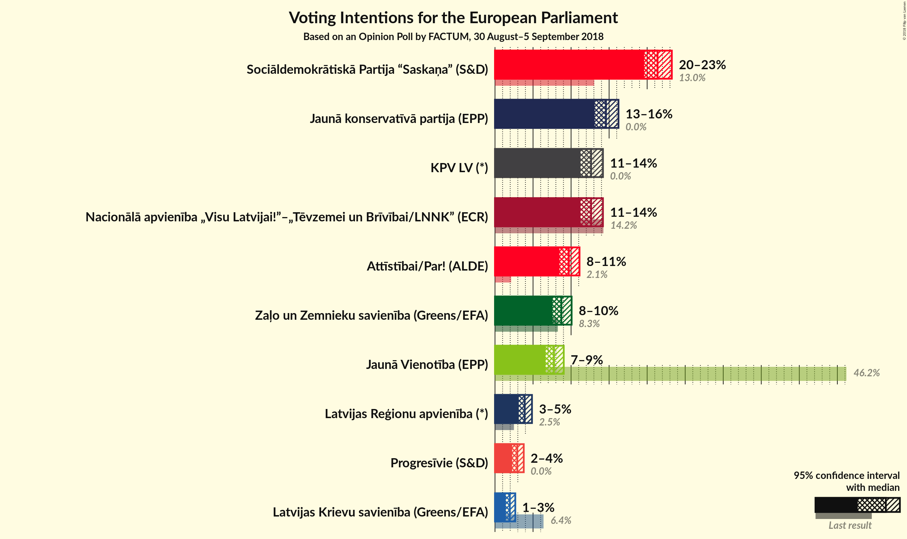
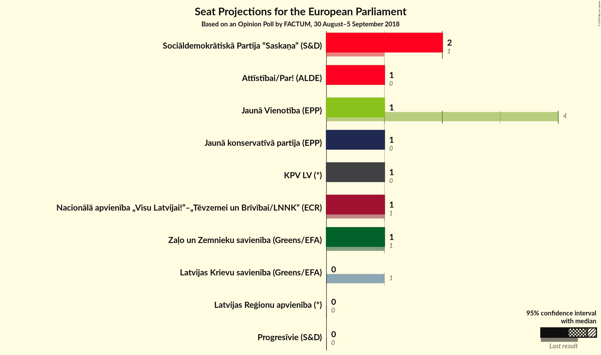

# Opinion Poll by FACTUM, 30 August–5 September 2018

<a href="#voting-intentions">Voting Intentions</a> | <a href="#seats">Seats</a> | <a href="#coalitions">Coalitions</a> | <a href="#technical-information">Technical Information</a>

## Voting Intentions

### Confidence Intervals

| Party | Last Result | Poll Result | 80% Confidence Interval | 90% Confidence Interval | 95% Confidence Interval | 99% Confidence Interval |
|:-----:|:-----------:|:-----------:|:-----------------------:|:-----------------------:|:-----------------------:|:-----------------------:|
| Sociāldemokrātiskā Partija “Saskaņa” (S&D) | 13.0% | 21.4% | 20.8–23.2% |20.5–23.6% |20.2–23.9% |19.6–24.5% |
| Jaunā konservatīvā partija (EPP) | 0.0% | 14.6% | 14.0–16.1% |13.7–16.4% |13.5–16.7% |13.0–17.2% |
| Nacionālā apvienība „Visu Latvijai!”–„Tēvzemei un Brīvībai/LNNK” (ECR) | 14.2% | 12.6% | 12.1–14.0% |11.8–14.3% |11.6–14.6% |11.1–15.1% |
| KPV LV (*) | 0.0% | 12.6% | 12.1–14.0% |11.8–14.3% |11.6–14.6% |11.1–15.1% |
| Attīstībai/Par! (ALDE) | 2.1% | 9.7% | N/A |N/A |N/A |N/A |
| Zaļo un Zemnieku savienība (Greens/EFA) | 8.3% | 8.7% | 8.2–9.9% |8.0–10.1% |7.8–10.3% |7.4–10.8% |
| Jaunā Vienotība (EPP) | 46.2% | 7.8% | 7.3–8.9% |7.1–9.1% |6.9–9.3% |6.5–9.7% |
| Latvijas Reģionu apvienība (*) | 2.5% | 3.9% | 3.5–4.6% |3.3–4.8% |3.2–5.0% |3.0–5.3% |
| Progresīvie (S&D) | 0.0% | 2.9% | N/A |N/A |N/A |N/A |
| Latvijas Krievu savienība (Greens/EFA) | 6.4% | 2.0% | 1.6–2.5% |1.6–2.6% |1.5–2.7% |1.3–3.0% |

*Note:* The poll result column reflects the actual value used in the calculations. Published results may vary slightly, and in addition be rounded to fewer digits.

## Seats

### Confidence Intervals

| Party | Last Result | Median | 80% Confidence Interval | 90% Confidence Interval | 95% Confidence Interval | 99% Confidence Interval |
|:-----:|:-----------:|:------:|:-----------------------:|:-----------------------:|:-----------------------:|:-----------------------:|
| <a href="#sociāldemokrātiskā-partija-“saskaņa”-(s&d)">Sociāldemokrātiskā Partija “Saskaņa” (S&D)</a> | 1 | 2 | 2 |2 |2 |2 |
| <a href="#jaunā-konservatīvā-partija-(epp)">Jaunā konservatīvā partija (EPP)</a> | 0 | 1 | 1 |1 |1 |1 |
| <a href="#nacionālā-apvienība-„visu-latvijai!”–„tēvzemei-un-brīvībai/lnnk”-(ecr)">Nacionālā apvienība „Visu Latvijai!”–„Tēvzemei un Brīvībai/LNNK” (ECR)</a> | 1 | 1 | 1 |1 |1 |1 |
| <a href="#kpv-lv-(*)">KPV LV (*)</a> | 0 | 1 | 1 |1 |1 |1 |
| <a href="#attīstībai/par!-(alde)">Attīstībai/Par! (ALDE)</a> | 0 | N/A | N/A |N/A |N/A |N/A |
| <a href="#zaļo-un-zemnieku-savienība-(greens/efa)">Zaļo un Zemnieku savienība (Greens/EFA)</a> | 1 | 1 | 1 |1 |1 |1 |
| <a href="#jaunā-vienotība-(epp)">Jaunā Vienotība (EPP)</a> | 4 | 1 | 1 |1 |1 |1 |
| <a href="#latvijas-reģionu-apvienība-(*)">Latvijas Reģionu apvienība (*)</a> | 0 | 0 | 0 |0 |0 |0 |
| <a href="#progresīvie-(s&d)">Progresīvie (S&D)</a> | 0 | N/A | N/A |N/A |N/A |N/A |
| <a href="#latvijas-krievu-savienība-(greens/efa)">Latvijas Krievu savienība (Greens/EFA)</a> | 1 | 0 | 0 |0 |0 |0 |

