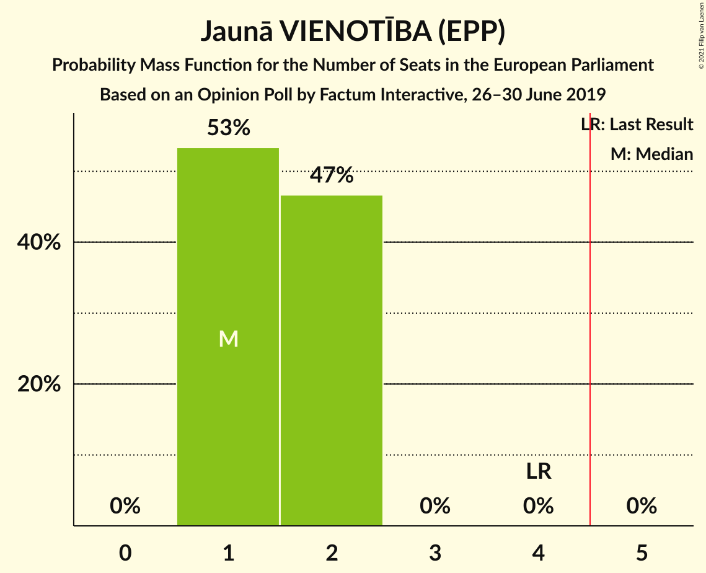
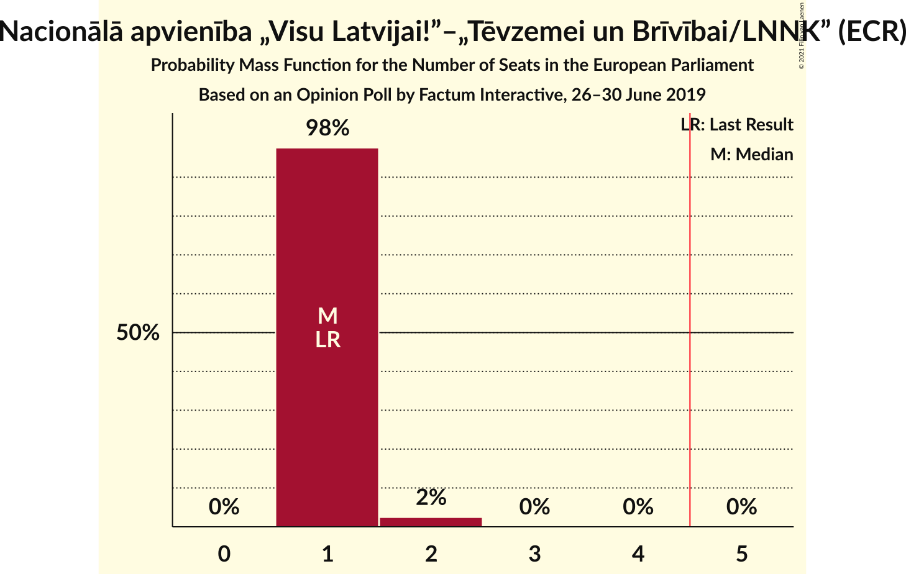
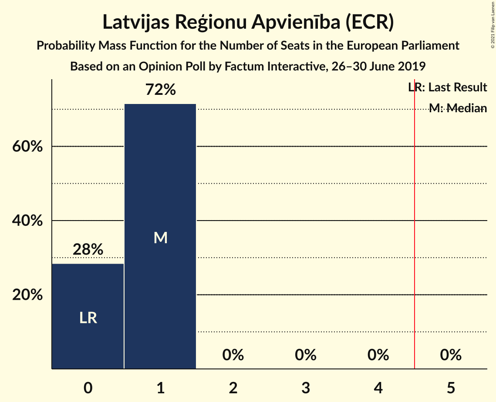
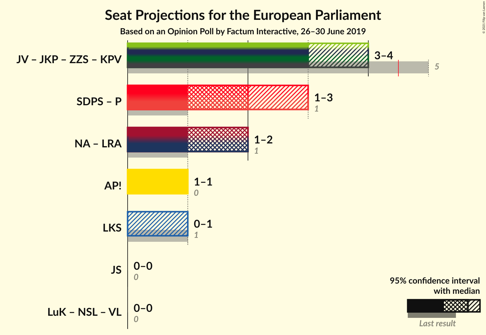
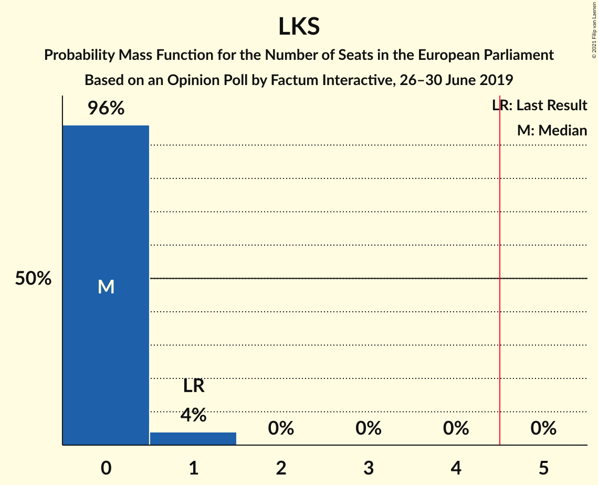

# Opinion Poll by Factum Interactive, 26–30 June 2019

<a href="#voting-intentions">Voting Intentions</a> | <a href="#seats">Seats</a> | <a href="#coalitions">Coalitions</a> | <a href="#technical-information">Technical Information</a>

## Voting Intentions

### Confidence Intervals

| Party | Last Result | Poll Result | 80% Confidence Interval | 90% Confidence Interval | 95% Confidence Interval | 99% Confidence Interval |
|:-----:|:-----------:|:-----------:|:-----------------------:|:-----------------------:|:-----------------------:|:-----------------------:|
| Sociāldemokrātiskā partija “Saskaņa” (S&D) | 13.0% | 16.9% | 15.3–18.6% |14.9–19.1% |14.5–19.5% |13.8–20.4% |
| Jaunā VIENOTĪBA (EPP) | 46.2% | 16.9% | 15.3–18.6% |14.9–19.1% |14.5–19.5% |13.8–20.4% |
| Nacionālā apvienība „Visu Latvijai!”–„Tēvzemei un Brīvībai/LNNK” (ECR) | 14.2% | 15.0% | 13.5–16.7% |13.1–17.1% |12.8–17.5% |12.1–18.4% |
| Attīstībai/Par! (RE) | 2.1% | 11.5% | 10.2–13.0% |9.8–13.4% |9.5–13.8% |9.0–14.6% |
| Jaunā konservatīvā partija (EPP) | 0.0% | 10.3% | 9.1–11.8% |8.8–12.2% |8.5–12.6% |7.9–13.3% |
| Zaļo un Zemnieku savienība (EPP) | 8.3% | 8.7% | 7.6–10.1% |7.3–10.5% |7.0–10.8% |6.5–11.5% |
| Latvijas Reģionu Apvienība (ECR) | 2.5% | 6.3% | 5.3–7.5% |5.1–7.8% |4.8–8.1% |4.4–8.7% |
| PROGRESĪVIE (S&D) | 0.0% | 5.3% | 4.5–6.5% |4.2–6.8% |4.0–7.1% |3.7–7.6% |
| Latvijas Krievu savienība (Greens/EFA) | 6.4% | 4.5% | 3.7–5.6% |3.5–5.9% |3.3–6.1% |3.0–6.7% |
| Politiskā partija „KPV LV” (EPP) | 0.0% | 4.1% | 3.3–5.1% |3.1–5.4% |2.9–5.6% |2.6–6.1% |

*Note:* The poll result column reflects the actual value used in the calculations. Published results may vary slightly, and in addition be rounded to fewer digits.

## Seats

### Confidence Intervals

| Party | Last Result | Median | 80% Confidence Interval | 90% Confidence Interval | 95% Confidence Interval | 99% Confidence Interval |
|:-----:|:-----------:|:------:|:-----------------------:|:-----------------------:|:-----------------------:|:-----------------------:|
| <a href="#sociāldemokrātiskā-partija-“saskaņa”-(s&d)">Sociāldemokrātiskā partija “Saskaņa” (S&D)</a> | 1 | 1 | 1–2 |1–2 |1–2 |1–2 |
| <a href="#jaunā-vienotība-(epp)">Jaunā VIENOTĪBA (EPP)</a> | 4 | 1 | 1–2 |1–2 |1–2 |1–2 |
| <a href="#nacionālā-apvienība-„visu-latvijai!”–„tēvzemei-un-brīvībai/lnnk”-(ecr)">Nacionālā apvienība „Visu Latvijai!”–„Tēvzemei un Brīvībai/LNNK” (ECR)</a> | 1 | 1 | 1 |1 |1 |1–2 |
| <a href="#attīstībai/par!-(re)">Attīstībai/Par! (RE)</a> | 0 | 1 | 1 |1 |1 |1 |
| <a href="#jaunā-konservatīvā-partija-(epp)">Jaunā konservatīvā partija (EPP)</a> | 0 | 1 | 1 |1 |1 |1 |
| <a href="#zaļo-un-zemnieku-savienība-(epp)">Zaļo un Zemnieku savienība (EPP)</a> | 1 | 1 | 1 |1 |1 |1 |
| <a href="#latvijas-reģionu-apvienība-(ecr)">Latvijas Reģionu Apvienība (ECR)</a> | 0 | 1 | 1 |0–1 |0–1 |0–1 |
| <a href="#progresīvie-(s&d)">PROGRESĪVIE (S&D)</a> | 0 | 0 | 0–1 |0–1 |0–1 |0–1 |
| <a href="#latvijas-krievu-savienība-(greens/efa)">Latvijas Krievu savienība (Greens/EFA)</a> | 1 | 0 | 0 |0–1 |0–1 |0–1 |
| <a href="#politiskā-partija-„kpv-lv”-(epp)">Politiskā partija „KPV LV” (EPP)</a> | 0 | 0 | 0 |0 |0 |0 |

### Sociāldemokrātiskā partija “Saskaņa” (S&D)

*For a full overview of the results for this party, see the [Sociāldemokrātiskā partija “Saskaņa” (S&D)](party-sociāldemokrātiskāpartija“saskaņa”sd.html) page.*

| Number of Seats | Probability | Accumulated | Special Marks |
|:---------------:|:-----------:|:-----------:|:-------------:|
| 1 | 67% | 100% | Last Result, Median |
| 2 | 33% | 33% |  |
| 3 | 0% | 0% |  |

### Jaunā VIENOTĪBA (EPP)

*For a full overview of the results for this party, see the [Jaunā VIENOTĪBA (EPP)](party-jaunāvienotībaepp.html) page.*

| Number of Seats | Probability | Accumulated | Special Marks |
|:---------------:|:-----------:|:-----------:|:-------------:|
| 1 | 58% | 100% | Median |
| 2 | 42% | 42% |  |
| 3 | 0% | 0% |  |
| 4 | 0% | 0% | Last Result |

### Nacionālā apvienība „Visu Latvijai!”–„Tēvzemei un Brīvībai/LNNK” (ECR)

*For a full overview of the results for this party, see the [Nacionālā apvienība „Visu Latvijai!”–„Tēvzemei un Brīvībai/LNNK” (ECR)](party-nacionālāapvienība„visulatvijai”–„tēvzemeiunbrīvībailnnk”ecr.html) page.*

| Number of Seats | Probability | Accumulated | Special Marks |
|:---------------:|:-----------:|:-----------:|:-------------:|
| 1 | 98.6% | 100% | Last Result, Median |
| 2 | 1.4% | 1.4% |  |
| 3 | 0% | 0% |  |

### Attīstībai/Par! (RE)

*For a full overview of the results for this party, see the [Attīstībai/Par! (RE)](party-attīstībaiparre.html) page.*

| Number of Seats | Probability | Accumulated | Special Marks |
|:---------------:|:-----------:|:-----------:|:-------------:|
| 0 | 0% | 100% | Last Result |
| 1 | 100% | 100% | Median |

### Jaunā konservatīvā partija (EPP)

*For a full overview of the results for this party, see the [Jaunā konservatīvā partija (EPP)](party-jaunākonservatīvāpartijaepp.html) page.*

| Number of Seats | Probability | Accumulated | Special Marks |
|:---------------:|:-----------:|:-----------:|:-------------:|
| 0 | 0% | 100% | Last Result |
| 1 | 100% | 100% | Median |

### Zaļo un Zemnieku savienība (EPP)

*For a full overview of the results for this party, see the [Zaļo un Zemnieku savienība (EPP)](party-zaļounzemniekusavienībaepp.html) page.*

| Number of Seats | Probability | Accumulated | Special Marks |
|:---------------:|:-----------:|:-----------:|:-------------:|
| 1 | 100% | 100% | Last Result, Median |

### Latvijas Reģionu Apvienība (ECR)

*For a full overview of the results for this party, see the [Latvijas Reģionu Apvienība (ECR)](party-latvijasreģionuapvienībaecr.html) page.*

| Number of Seats | Probability | Accumulated | Special Marks |
|:---------------:|:-----------:|:-----------:|:-------------:|
| 0 | 9% | 100% | Last Result |
| 1 | 91% | 91% | Median |
| 2 | 0% | 0% |  |

### PROGRESĪVIE (S&D)

*For a full overview of the results for this party, see the [PROGRESĪVIE (S&D)](party-progresīviesd.html) page.*

| Number of Seats | Probability | Accumulated | Special Marks |
|:---------------:|:-----------:|:-----------:|:-------------:|
| 0 | 73% | 100% | Last Result, Median |
| 1 | 27% | 27% |  |
| 2 | 0% | 0% |  |

### Latvijas Krievu savienība (Greens/EFA)

*For a full overview of the results for this party, see the [Latvijas Krievu savienība (Greens/EFA)](party-latvijaskrievusavienībagreensefa.html) page.*

| Number of Seats | Probability | Accumulated | Special Marks |
|:---------------:|:-----------:|:-----------:|:-------------:|
| 0 | 94% | 100% | Median |
| 1 | 6% | 6% | Last Result |
| 2 | 0% | 0% |  |

### Politiskā partija „KPV LV” (EPP)

*For a full overview of the results for this party, see the [Politiskā partija „KPV LV” (EPP)](party-politiskāpartija„kpvlv”epp.html) page.*

| Number of Seats | Probability | Accumulated | Special Marks |
|:---------------:|:-----------:|:-----------:|:-------------:|
| 0 | 99.8% | 100% | Last Result, Median |
| 1 | 0.2% | 0.2% |  |
| 2 | 0% | 0% |  |

## Coalitions

### Confidence Intervals

| Coalition | Last Result | Median | Majority? | 80% Confidence Interval | 90% Confidence Interval | 95% Confidence Interval | 99% Confidence Interval |
|:---------:|:-----------:|:------:|:---------:|:-----------------------:|:-----------------------:|:-----------------------:|:-----------------------:|
| Jaunā VIENOTĪBA (EPP) – Jaunā konservatīvā partija (EPP) – Zaļo un Zemnieku savienība (EPP) – Politiskā partija „KPV LV” (EPP) | 5 | 3 | 0% | 3–4 | 3–4 | 3–4 | 3–4 |
| Nacionālā apvienība „Visu Latvijai!”–„Tēvzemei un Brīvībai/LNNK” (ECR) – Latvijas Reģionu Apvienība (ECR) | 1 | 2 | 0% | 2 | 1–2 | 1–2 | 1–3 |
| Sociāldemokrātiskā partija “Saskaņa” (S&D) – PROGRESĪVIE (S&D) | 1 | 2 | 0% | 1–2 | 1–2 | 1–2 | 1–2 |
| Attīstībai/Par! (RE) | 0 | 1 | 0% | 1 | 1 | 1 | 1 |
| Latvijas Krievu savienība (Greens/EFA) | 1 | 0 | 0% | 0 | 0–1 | 0–1 | 0–1 |

### Jaunā VIENOTĪBA (EPP) – Jaunā konservatīvā partija (EPP) – Zaļo un Zemnieku savienība (EPP) – Politiskā partija „KPV LV” (EPP)

| Number of Seats | Probability | Accumulated | Special Marks |
|:---------------:|:-----------:|:-----------:|:-------------:|
| 3 | 58% | 100% | Median |
| 4 | 42% | 42% |  |
| 5 | 0% | 0% | Last Result, Majority |

### Nacionālā apvienība „Visu Latvijai!”–„Tēvzemei un Brīvībai/LNNK” (ECR) – Latvijas Reģionu Apvienība (ECR)

| Number of Seats | Probability | Accumulated | Special Marks |
|:---------------:|:-----------:|:-----------:|:-------------:|
| 1 | 8% | 100% | Last Result |
| 2 | 91% | 92% | Median |
| 3 | 0.8% | 0.8% |  |
| 4 | 0% | 0% |  |

### Sociāldemokrātiskā partija “Saskaņa” (S&D) – PROGRESĪVIE (S&D)

| Number of Seats | Probability | Accumulated | Special Marks |
|:---------------:|:-----------:|:-----------:|:-------------:|
| 1 | 41% | 100% | Last Result, Median |
| 2 | 59% | 59% |  |
| 3 | 0.3% | 0.3% |  |
| 4 | 0% | 0% |  |

### Attīstībai/Par! (RE)

| Number of Seats | Probability | Accumulated | Special Marks |
|:---------------:|:-----------:|:-----------:|:-------------:|
| 0 | 0% | 100% | Last Result |
| 1 | 100% | 100% | Median |

### Latvijas Krievu savienība (Greens/EFA)

| Number of Seats | Probability | Accumulated | Special Marks |
|:---------------:|:-----------:|:-----------:|:-------------:|
| 0 | 94% | 100% | Median |
| 1 | 6% | 6% | Last Result |
| 2 | 0% | 0% |  |

## Technical Information

### Opinion Poll

+ **Polling firm:** Factum Interactive
+ **Commissioner(s):** —
+ **Fieldwork period:** 26–30 June 2019

### Calculations

+ **Sample size:** 860
+ **Simulations done:** 131,072
+ **Error estimate:** 3.66%

