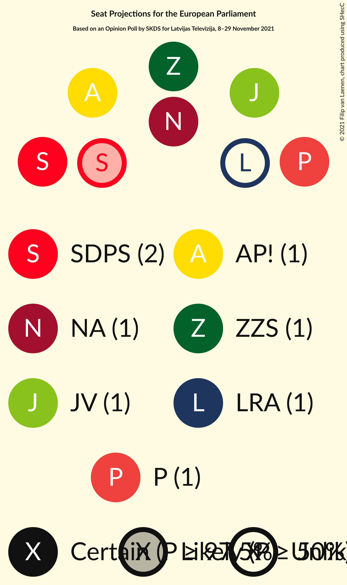

# Opinion Poll by SKDS for Latvijas Televīzija, 8–29 November 2021

<a href="#voting-intentions">Voting Intentions</a> | <a href="#seats">Seats</a> | <a href="#coalitions">Coalitions</a> | <a href="#technical-information">Technical Information</a>

## Voting Intentions

### Confidence Intervals

| Party | Last Result | Poll Result | 80% Confidence Interval | 90% Confidence Interval | 95% Confidence Interval | 99% Confidence Interval |
|:-----:|:-----------:|:-----------:|:-----------------------:|:-----------------------:|:-----------------------:|:-----------------------:|
| Sociāldemokrātiskā partija “Saskaņa” (S&D) | 13.0% | 17.8% | 16.7–19.0% |16.4–19.3% |16.1–19.6% |15.6–20.2% |
| Jaunā VIENOTĪBA (EPP) | 46.2% | 14.7% | 13.7–15.8% |13.4–16.1% |13.1–16.4% |12.7–16.9% |
| Zaļo un Zemnieku savienība (EPP) | 8.3% | 13.9% | 12.9–15.0% |12.6–15.3% |12.4–15.6% |11.9–16.1% |
| Nacionālā apvienība „Visu Latvijai!”–„Tēvzemei un Brīvībai/LNNK” (ECR) | 14.2% | 10.5% | 9.6–11.4% |9.3–11.7% |9.1–12.0% |8.7–12.5% |
| Attīstībai/Par! (RE) | 2.1% | 9.1% | 8.3–10.0% |8.0–10.3% |7.8–10.5% |7.5–11.0% |
| PROGRESĪVIE (Greens/EFA) | 0.0% | 6.9% | 6.2–7.7% |6.0–7.9% |5.8–8.1% |5.5–8.6% |
| Jaunā konservatīvā partija (EPP) | 0.0% | 5.2% | 4.6–5.9% |4.4–6.2% |4.3–6.3% |4.0–6.7% |
| Latvijas Krievu savienība (Greens/EFA) | 6.4% | 5.2% | 4.6–5.9% |4.4–6.2% |4.3–6.3% |4.0–6.7% |
| Latvijas Reģionu Apvienība (ECR) | 2.5% | 5.0% | 4.4–5.7% |4.2–5.9% |4.1–6.1% |3.8–6.5% |
| Latvija pirmajā vietā (*) | N/A | 4.0% | 3.4–4.6% |3.3–4.8% |3.2–5.0% |2.9–5.3% |
| Likums un kārtība (*) | 0.0% | 3.2% | 2.7–3.8% |2.6–4.0% |2.5–4.1% |2.3–4.5% |

*Note:* The poll result column reflects the actual value used in the calculations. Published results may vary slightly, and in addition be rounded to fewer digits.

## Seats

### Confidence Intervals

| Party | Last Result | Median | 80% Confidence Interval | 90% Confidence Interval | 95% Confidence Interval | 99% Confidence Interval |
|:-----:|:-----------:|:------:|:-----------------------:|:-----------------------:|:-----------------------:|:-----------------------:|
| <a href="#sociāldemokrātiskā-partija-“saskaņa”-(s&d)">Sociāldemokrātiskā partija “Saskaņa” (S&D)</a> | 1 | 2 | 2 |1–2 |1–2 |1–2 |
| <a href="#jaunā-vienotība-(epp)">Jaunā VIENOTĪBA (EPP)</a> | 4 | 1 | 1–2 |1–2 |1–2 |1–2 |
| <a href="#zaļo-un-zemnieku-savienība-(epp)">Zaļo un Zemnieku savienība (EPP)</a> | 1 | 1 | 1 |1 |1–2 |1–2 |
| <a href="#nacionālā-apvienība-„visu-latvijai!”–„tēvzemei-un-brīvībai/lnnk”-(ecr)">Nacionālā apvienība „Visu Latvijai!”–„Tēvzemei un Brīvībai/LNNK” (ECR)</a> | 1 | 1 | 1 |1 |1 |1 |
| <a href="#attīstībai/par!-(re)">Attīstībai/Par! (RE)</a> | 0 | 1 | 1 |1 |1 |1 |
| <a href="#progresīvie-(greens/efa)">PROGRESĪVIE (Greens/EFA)</a> | 0 | 1 | 1 |1 |1 |0–1 |
| <a href="#jaunā-konservatīvā-partija-(epp)">Jaunā konservatīvā partija (EPP)</a> | 0 | 0 | 0–1 |0–1 |0–1 |0–1 |
| <a href="#latvijas-krievu-savienība-(greens/efa)">Latvijas Krievu savienība (Greens/EFA)</a> | 1 | 0 | 0–1 |0–1 |0–1 |0–1 |
| <a href="#latvijas-reģionu-apvienība-(ecr)">Latvijas Reģionu Apvienība (ECR)</a> | 0 | 0 | 0–1 |0–1 |0–1 |0–1 |
| <a href="#latvija-pirmajā-vietā-(*)">Latvija pirmajā vietā (*)</a> | N/A | 0 | 0 |0 |0 |0 |
| <a href="#likums-un-kārtība-(*)">Likums un kārtība (*)</a> | 0 | 0 | 0 |0 |0 |0 |

