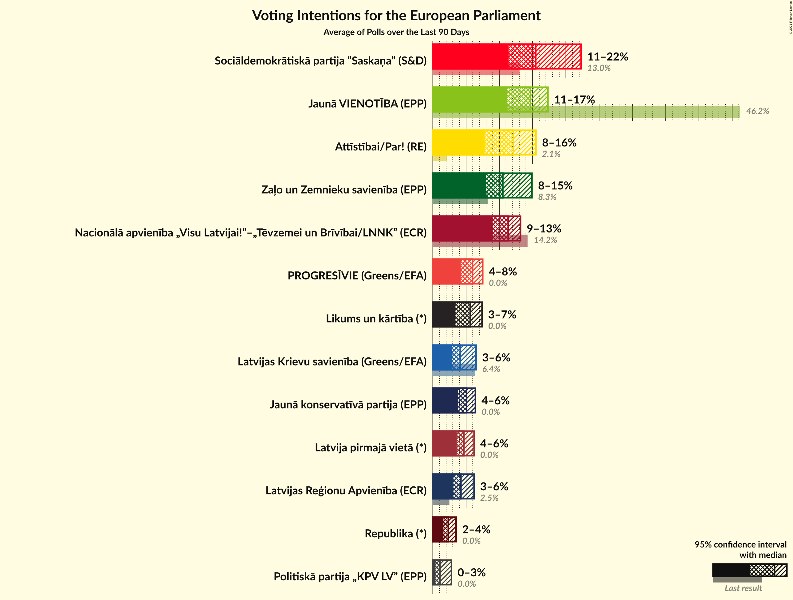

# Poll Average

<a href="#voting-intentions">Voting Intentions</a> | <a href="#seats">Seats</a> | <a href="#coalitions">Coalitions</a> | <a href="#technical-information">Technical Information</a>

## Summary

The table below lists the polls on which the average is based. They are the most recent polls (less than 90 days old) registered and analyzed so far.

| Period     | Polling firm/Commissioner(s) | JV | NA | SDPS | ZZS | LKS | LRA | AP! | NSL | VL | JKP | KPV | P | JS | LuK |
|:----------:|:----------------------------:|:--:|:--:|:--:|:--:|:--:|:--:|:--:|:--:|:--:|:--:|:--:|:--:|:--:|:--:|
| 25 May 2019 | General Election | 46.2%   4 | 14.2%   1 | 13.0%   1 | 8.3%   1 | 6.4%   1 | 2.5%   0 | 2.1%   0 | 0.0%   0 | 0.0%   0 | 0.0%   0 | 0.0%   0 | 0.0%   0 | 0.0%   0 | 0.0%   0 |
| N/A | Poll Average | 13–20%   1–2 | 9–14%   1 | 12–19%   1–2 | 5–15%   0–1 | 2–6%   0–1 | 4–6%   0–1 | 8–15%   1 | N/A   N/A | N/A   N/A | 4–7%   0–1 | 0–2%   0 | 5–8%   0–1 | N/A   N/A | 3–7%   0–1 |
| [1–30 November 2021](2021-11-30-FactumInteractive.html) | Factum Interactive | 15–20%   1–2 | 10–14%   1 | 11–16%   1 | 5–8%   0–1 | 2–5%   0 | 4–7%   0–1 | 11–15%   1 | N/A   N/A | N/A   N/A | 4–7%   0–1 | 0–2%   0 | 5–8%   0–1 | N/A   N/A | 4–7%   0–1 |
| [8–29 November 2021](2021-11-29-SKDS.html) | SKDS   Latvijas Televīzija | 13–16%   1–2 | 9–12%   1 | 16–20%   1–2 | 12–16%   1–2 | 4–6%   0–1 | 4–6%   0–1 | 8–11%   1 | N/A   N/A | N/A   N/A | 4–6%   0–1 | N/A   N/A | 6–8%   1 | N/A   N/A | 2–4%   0 |
| 25 May 2019 | General Election | 46.2%   4 | 14.2%   1 | 13.0%   1 | 8.3%   1 | 6.4%   1 | 2.5%   0 | 2.1%   0 | 0.0%   0 | 0.0%   0 | 0.0%   0 | 0.0%   0 | 0.0%   0 | 0.0%   0 | 0.0%   0 |

Only polls for which at least the sample size has been published are included in the table above.

**Legend:**
+ **Top half of each row:** Voting intentions (95% confidence interval)
+ **Bottom half of each row:** Seat projections for the European Parliament (95% confidence interval)
+ **JV:** Jaunā VIENOTĪBA (EPP)
+ **NA:** Nacionālā apvienība „Visu Latvijai!”–„Tēvzemei un Brīvībai/LNNK” (ECR)
+ **SDPS:** Sociāldemokrātiskā partija “Saskaņa” (S&D)
+ **ZZS:** Zaļo un Zemnieku savienība (EPP)
+ **LKS:** Latvijas Krievu savienība (Greens/EFA)
+ **LRA:** Latvijas Reģionu Apvienība (ECR)
+ **AP!:** Attīstībai/Par! (RE)
+ **NSL:** No sirds Latvijai (*)
+ **VL:** Vienoti Latvijai (*)
+ **JKP:** Jaunā konservatīvā partija (EPP)
+ **KPV:** Politiskā partija „KPV LV” (EPP)
+ **P:** PROGRESĪVIE (Greens/EFA)
+ **JS:** Jaunā Saskaņa (GUE/NGL)
+ **LuK:** Likums un kārtība (*)
+ **N/A (single party):** Party not included the published results
+ **N/A (entire row):** Calculation for this opinion poll not started yet

## Voting Intentions

### Confidence Intervals

| Party | Last Result | Median | 80% Confidence Interval | 90% Confidence Interval | 95% Confidence Interval | 99% Confidence Interval |
|:-----:|:-----------:|:------:|:-----------------------:|:-----------------------:|:-----------------------:|:-----------------------:|
| <a href="#jaunā-vienotība-(epp)">Jaunā VIENOTĪBA (EPP)</a> | 46.2% | 15.8% | 14.0–18.6% |13.7–19.2% | 13.4–19.7% | 12.8–20.6% |
| <a href="#nacionālā-apvienība-„visu-latvijai!”–„tēvzemei-un-brīvībai/lnnk”-(ecr)">Nacionālā apvienība „Visu Latvijai!”–„Tēvzemei un Brīvībai/LNNK” (ECR)</a> | 14.2% | 11.0% | 9.8–12.8% |9.5–13.3% | 9.3–13.7% | 8.9–14.5% |
| <a href="#sociāldemokrātiskā-partija-“saskaņa”-(s&d)">Sociāldemokrātiskā partija “Saskaņa” (S&D)</a> | 13.0% | 16.0% | 12.5–18.6% |12.0–19.0% | 11.6–19.3% | 10.9–20.0% |
| <a href="#zaļo-un-zemnieku-savienība-(epp)">Zaļo un Zemnieku savienība (EPP)</a> | 8.3% | 10.7% | 5.7–14.6% |5.4–15.0% | 5.1–15.3% | 4.7–15.9% |
| <a href="#latvijas-krievu-savienība-(greens/efa)">Latvijas Krievu savienība (Greens/EFA)</a> | 6.4% | 4.4% | 2.7–5.7% |2.5–5.9% | 2.3–6.1% | 2.0–6.5% |
| <a href="#latvijas-reģionu-apvienība-(ecr)">Latvijas Reģionu Apvienība (ECR)</a> | 2.5% | 5.1% | 4.3–5.9% |4.1–6.2% | 3.9–6.5% | 3.6–7.1% |
| <a href="#attīstībai/par!-(re)">Attīstībai/Par! (RE)</a> | 2.1% | 10.6% | 8.6–14.0% |8.3–14.5% | 8.0–14.9% | 7.6–15.8% |
| <a href="#no-sirds-latvijai-(*)">No sirds Latvijai (*)</a> | 0.0% | N/A | N/A |N/A | N/A | N/A |
| <a href="#vienoti-latvijai-(*)">Vienoti Latvijai (*)</a> | 0.0% | N/A | N/A |N/A | N/A | N/A |
| <a href="#jaunā-konservatīvā-partija-(epp)">Jaunā konservatīvā partija (EPP)</a> | 0.0% | 5.4% | 4.7–6.5% |4.5–6.8% | 4.3–7.1% | 4.0–7.8% |
| <a href="#politiskā-partija-„kpv-lv”-(epp)">Politiskā partija „KPV LV” (EPP)</a> | 0.0% | 0.9% | 0.5–1.3% |0.5–1.5% | 0.4–1.7% | 0.3–2.0% |
| <a href="#progresīvie-(greens/efa)">PROGRESĪVIE (Greens/EFA)</a> | 0.0% | 6.6% | 5.5–7.6% |5.2–7.8% | 4.9–8.1% | 4.5–8.5% |
| <a href="#jaunā-saskaņa-(gue/ngl)">Jaunā Saskaņa (GUE/NGL)</a> | 0.0% | N/A | N/A |N/A | N/A | N/A |
| <a href="#likums-un-kārtība-(*)">Likums un kārtība (*)</a> | 0.0% | 4.2% | 2.9–6.3% |2.7–6.7% | 2.6–7.0% | 2.4–7.6% |

