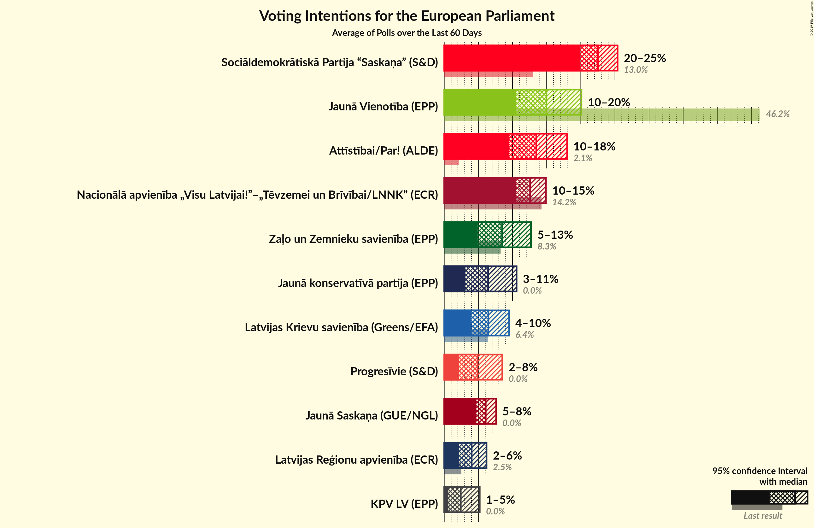

# Poll Average

<a href="#voting-intentions">Voting Intentions</a> | <a href="#seats">Seats</a> | <a href="#coalitions">Coalitions</a> | <a href="#technical-information">Technical Information</a>

## Summary

The table below lists the polls on which the average is based. They are the most recent polls (less than 60 days old) registered and analyzed so far.

| Period     | Polling firm/Commissioner(s) | JV | NA | SDPS | ZZS | LKS | LRA | AP! | NSL | VL | JKP | KPV | P | JS |
|:----------:|:----------------------------:|:--:|:--:|:--:|:--:|:--:|:--:|:--:|:--:|:--:|:--:|:--:|:--:|:--:|
| 24 May 2014 | General Election | 46.2%   4 | 14.2%   1 | 13.0%   1 | 8.3%   1 | 6.4%   1 | 2.5%   0 | 2.1%   0 | 0.0%   0 | 0.0%   0 | 0.0%   0 | 0.0%   0 | 0.0%   0 | 0.0%   0 |
| N/A | Poll Average | 11–20%   1–2 | 11–17%   1–2 | 16–25%   1–2 | N/A   N/A | 3–9%   0–1 | 2–6%   0–1 | 10–18%   1 | N/A   N/A | N/A   N/A | 3–13%   0–1 | 1–5%   0 | 2–8%   0–1 | 1–7%   0–1 |
| [24–28 April 2019](2019-04-28-Factum.html) | Factum | 11–15%   1 | 13–17%   1–2 | 16–21%   1–2 | N/A   N/A | 3–6%   0 | 4–7%   0–1 | 10–14%   1 | N/A   N/A | N/A   N/A | 9–13%   1 | 2–4%   0 | 5–8%   0–1 | 1–2%   0 |
| [12–22 April 2019](2019-04-22-LatvijasFakti.html) | Latvijas Fakti | 10–14%   1 | 10–14%   1 | 20–25%   2 | N/A   N/A | 4–6%   0–1 | 4–6%   0–1 | 9–13%   1 | N/A   N/A | N/A   N/A | 7–11%   1 | 3–5%   0 | 2–4%   0 | 5–8%   0–1 |
| [1–19 April 2019](2019-04-19-SKDS.html) | SKDS   Latvijas Televīzija | 16–21%   1–2 | 11–15%   1 | 20–26%   2 | N/A   N/A | 6–10%   1 | 2–4%   0 | 14–18%   1–2 | N/A   N/A | N/A   N/A | 3–5%   0 | 1–2%   0 | 6–9%   0–1 | N/A   N/A |
| 24 May 2014 | General Election | 46.2%   4 | 14.2%   1 | 13.0%   1 | 8.3%   1 | 6.4%   1 | 2.5%   0 | 2.1%   0 | 0.0%   0 | 0.0%   0 | 0.0%   0 | 0.0%   0 | 0.0%   0 | 0.0%   0 |

Only polls for which at least the sample size has been published are included in the table above.

**Legend:**
+ **Top half of each row:** Voting intentions (95% confidence interval)
+ **Bottom half of each row:** Seat projections for the European Parliament (95% confidence interval)
+ **JV:** Jaunā Vienotība (EPP)
+ **NA:** Nacionālā apvienība „Visu Latvijai!”–„Tēvzemei un Brīvībai/LNNK” (ECR)
+ **SDPS:** Sociāldemokrātiskā Partija “Saskaņa” (S&D)
+ **ZZS:** Zaļo un Zemnieku savienība (EPP)
+ **LKS:** Latvijas Krievu savienība (Greens/EFA)
+ **LRA:** Latvijas Reģionu apvienība (ECR)
+ **AP!:** Attīstībai/Par! (ALDE)
+ **NSL:** No sirds Latvijai (*)
+ **VL:** Vienoti Latvijai (*)
+ **JKP:** Jaunā konservatīvā partija (EPP)
+ **KPV:** KPV LV (EPP)
+ **P:** Progresīvie (S&D)
+ **JS:** Jaunā Saskaņa (GUE/NGL)
+ **N/A (single party):** Party not included the published results
+ **N/A (entire row):** Calculation for this opinion poll not started yet

## Voting Intentions

### Confidence Intervals

| Party | Last Result | Median | 80% Confidence Interval | 90% Confidence Interval | 95% Confidence Interval | 99% Confidence Interval |
|:-----:|:-----------:|:------:|:-----------------------:|:-----------------------:|:-----------------------:|:-----------------------:|
| <a href="#jaunā-vienotība-(epp)">Jaunā Vienotība (EPP)</a> | 46.2% | 13.3% | 11.4–18.7% |11.0–19.3% | 10.6–19.8% | 10.0–20.8% |
| <a href="#nacionālā-apvienība-„visu-latvijai!”–„tēvzemei-un-brīvībai/lnnk”-(ecr)">Nacionālā apvienība „Visu Latvijai!”–„Tēvzemei un Brīvībai/LNNK” (ECR)</a> | 14.2% | 13.2% | 11.4–15.7% |11.0–16.3% | 10.6–16.8% | 10.0–17.7% |
| <a href="#sociāldemokrātiskā-partija-“saskaņa”-(s&d)">Sociāldemokrātiskā Partija “Saskaņa” (S&D)</a> | 13.0% | 21.6% | 17.4–24.0% |16.7–24.6% | 16.2–25.1% | 15.4–26.1% |
| <a href="#zaļo-un-zemnieku-savienība-(epp)">Zaļo un Zemnieku savienība (EPP)</a> | 8.3% | N/A | N/A |N/A | N/A | N/A |
| <a href="#latvijas-krievu-savienība-(greens/efa)">Latvijas Krievu savienība (Greens/EFA)</a> | 6.4% | 5.1% | 3.7–8.5% |3.4–9.0% | 3.2–9.4% | 2.8–10.1% |
| <a href="#latvijas-reģionu-apvienība-(ecr)">Latvijas Reģionu apvienība (ECR)</a> | 2.5% | 4.6% | 2.8–5.8% |2.5–6.1% | 2.3–6.4% | 2.0–7.0% |
| <a href="#attīstībai/par!-(alde)">Attīstībai/Par! (ALDE)</a> | 2.1% | 12.3% | 10.4–16.7% |10.0–17.3% | 9.6–17.8% | 9.0–18.7% |
| <a href="#no-sirds-latvijai-(*)">No sirds Latvijai (*)</a> | 0.0% | N/A | N/A |N/A | N/A | N/A |
| <a href="#vienoti-latvijai-(*)">Vienoti Latvijai (*)</a> | 0.0% | N/A | N/A |N/A | N/A | N/A |
| <a href="#jaunā-konservatīvā-partija-(epp)">Jaunā konservatīvā partija (EPP)</a> | 0.0% | 9.0% | 3.7–11.6% |3.5–12.1% | 3.2–12.6% | 2.9–13.4% |
| <a href="#kpv-lv-(epp)">KPV LV (EPP)</a> | 0.0% | 3.0% | 0.9–4.4% |0.8–4.7% | 0.7–5.0% | 0.5–5.5% |
| <a href="#progresīvie-(s&d)">Progresīvie (S&D)</a> | 0.0% | 6.0% | 2.8–7.6% |2.5–8.0% | 2.3–8.3% | 2.0–9.0% |
| <a href="#jaunā-saskaņa-(gue/ngl)">Jaunā Saskaņa (GUE/NGL)</a> | 0.0% | 3.4% | 0.8–6.7% |0.7–7.1% | 0.6–7.4% | 0.5–7.9% |

