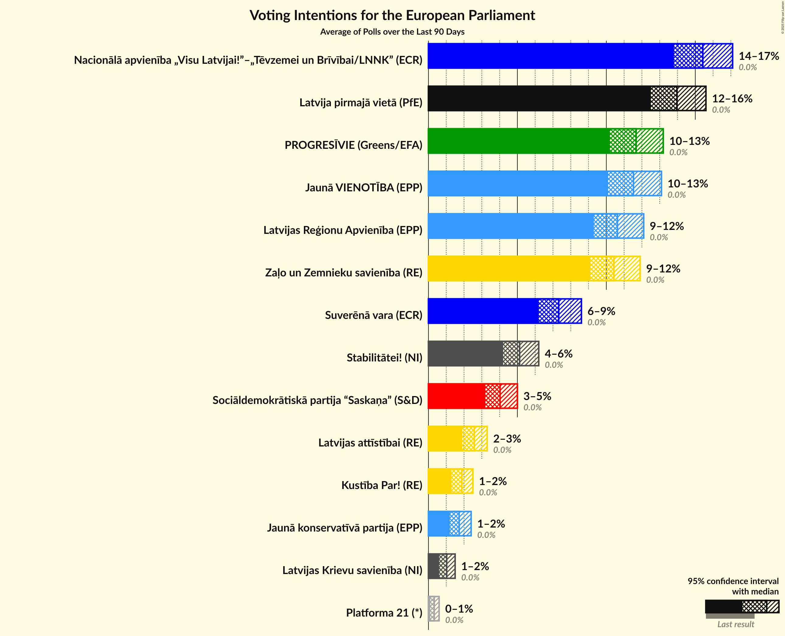

# Poll Average

<a href="#voting-intentions">Voting Intentions</a> | <a href="#seats">Seats</a> | <a href="#coalitions">Coalitions</a> | <a href="#technical-information">Technical Information</a>

## Summary

The table below lists the polls on which the average is based. They are the most recent polls (less than 90 days old) registered and analyzed so far.

| Period     | Polling firm/Commissioner(s) | JV | NA | SDPS | ZZS | LKS | LRA | LA | NSL | VL | JKP | KPV | PAR | P |
|:----------:|:----------------------------:|:--:|:--:|:--:|:--:|:--:|:--:|:--:|:--:|:--:|:--:|:--:|:--:|:--:|
| 24 May 2014 | General Election | 46.2%   4 | 14.2%   1 | 13.0%   1 | 8.3%   1 | 6.4%   1 | 2.5%   0 | 2.1%   0 | 0.0%   0 | 0.0%   0 | 0.0%   0 | 0.0%   0 | 0.0%   0 | 0.0%   0 |
| N/A | Poll Average | 4–10%   0–1 | 6–13%   1 | 18–30%   1–2 | N/A   N/A | 0–5%   0 | 0–5%   0 | N/A   N/A | 0–4%   0 | N/A   N/A | 7–17%   1 | 9–18%   1 | 6–12%   1 | 1–3%   0 |
| [17–23 September 2018](2018-09-23-FACTUM.html) | FACTUM | 8–10%   1 | 11–14%   1 | 18–21%   2 | N/A   N/A | 2–3%   0 | 2–4%   0 | N/A   N/A | N/A   N/A | N/A   N/A | 15–18%   1 | 10–12%   1 | 10–12%   1 | 2–3%   0 |
| [8–18 September 2018](2018-09-18-SKDS.html) | SKDS   Latvijas Televīzija | 5–8%   0–1 | 9–14%   1 | 24–32%   2 | N/A   N/A | 2–4%   0 | 2–5%   0 | N/A   N/A | 1–4%   0 | N/A   N/A | 6–11%   1 | 8–13%   1 | 6–11%   1 | 1–3%   0 |
| [10–14 September 2018](2018-09-14-Norstat.html) | Norstat | 3–9%   0–1 | 6–13%   1 | 18–28%   1–2 | N/A   N/A | 2–6%   0 | 1–5%   0 | N/A   N/A | N/A   N/A | N/A   N/A | 7–14%   1 | 10–17%   1 | 5–11%   1 | 1–4%   0 |
| [8 August–12 September 2018](2018-09-12-KantarTNS.html) | Kantar TNS   Delfi | 4–8%   0 | 6–10%   1 | 23–29%   2 | N/A   N/A | 0–2%   0 | 0–2%   0 | N/A   N/A | 0–1%   0 | N/A   N/A | 7–12%   1 | 14–19%   1 | 5–9%   1 | 1–2%   0 |
| 24 May 2014 | General Election | 46.2%   4 | 14.2%   1 | 13.0%   1 | 8.3%   1 | 6.4%   1 | 2.5%   0 | 2.1%   0 | 0.0%   0 | 0.0%   0 | 0.0%   0 | 0.0%   0 | 0.0%   0 | 0.0%   0 |

Only polls for which at least the sample size has been published are included in the table above.

**Legend:**
+ **Top half of each row:** Voting intentions (95% confidence interval)
+ **Bottom half of each row:** Seat projections for the European Parliament (95% confidence interval)
+ **JV:** Vienotība (EPP)
+ **NA:** Nacionālā apvienība „Visu Latvijai!”–„Tēvzemei un Brīvībai/LNNK” (ECR)
+ **SDPS:** Sociāldemokrātiskā Partija “Saskaņa” (S&D)
+ **ZZS:** Zaļo un Zemnieku savienība (ALDE)
+ **LKS:** Latvijas Krievu savienība (Greens/EFA)
+ **LRA:** Latvijas Reģionu apvienība (*)
+ **LA:** Latvijas attīstībai (ALDE)
+ **NSL:** No sirds Latvijai (*)
+ **VL:** Vienoti Latvijai (*)
+ **JKP:** Jaunā konservatīvā partija (*)
+ **KPV:** KPV LV (*)
+ **PAR:** Kustība Par! (*)
+ **P:** Progresīvie (*)
+ **N/A (single party):** Party not included the published results
+ **N/A (entire row):** Calculation for this opinion poll not started yet

## Voting Intentions

### Confidence Intervals

| Party | Last Result | Median | 80% Confidence Interval | 90% Confidence Interval | 95% Confidence Interval | 99% Confidence Interval |
|:-----:|:-----------:|:------:|:-----------------------:|:-----------------------:|:-----------------------:|:-----------------------:|
| <a href="#vienotība-(epp)">Vienotība (EPP)</a> | 46.2% | 6.3% | 4.6–9.3% |4.2–9.6% | 3.8–9.9% | 3.1–10.4% |
| <a href="#nacionālā-apvienība-„visu-latvijai!”–„tēvzemei-un-brīvībai/lnnk”-(ecr)">Nacionālā apvienība „Visu Latvijai!”–„Tēvzemei un Brīvībai/LNNK” (ECR)</a> | 14.2% | 10.3% | 7.0–12.7% |6.5–13.0% | 6.1–13.4% | 5.5–14.2% |
| <a href="#sociāldemokrātiskā-partija-“saskaņa”-(s&d)">Sociāldemokrātiskā Partija “Saskaņa” (S&D)</a> | 13.0% | 24.6% | 18.9–28.6% |18.4–29.5% | 18.1–30.3% | 17.4–31.7% |
| <a href="#zaļo-un-zemnieku-savienība-(alde)">Zaļo un Zemnieku savienība (ALDE)</a> | 8.3% | N/A | N/A |N/A | N/A | N/A |
| <a href="#latvijas-krievu-savienība-(greens/efa)">Latvijas Krievu savienība (Greens/EFA)</a> | 6.4% | 2.2% | 0.7–3.9% |0.6–4.4% | 0.5–5.0% | 0.3–6.0% |
| <a href="#latvijas-reģionu-apvienība-(*)">Latvijas Reģionu apvienība (*)</a> | 2.5% | 2.9% | 0.7–4.1% |0.6–4.5% | 0.5–4.9% | 0.3–5.6% |
| <a href="#latvijas-attīstībai-(alde)">Latvijas attīstībai (ALDE)</a> | 2.1% | N/A | N/A |N/A | N/A | N/A |
| <a href="#no-sirds-latvijai-(*)">No sirds Latvijai (*)</a> | 0.0% | 1.5% | 0.4–3.1% |0.4–3.4% | 0.3–3.7% | 0.2–4.3% |
| <a href="#vienoti-latvijai-(*)">Vienoti Latvijai (*)</a> | 0.0% | N/A | N/A |N/A | N/A | N/A |
| <a href="#jaunā-konservatīvā-partija-(*)">Jaunā konservatīvā partija (*)</a> | 0.0% | 9.9% | 7.8–16.4% |7.3–16.8% | 7.0–17.2% | 6.3–17.8% |
| <a href="#kpv-lv-(*)">KPV LV (*)</a> | 0.0% | 11.8% | 9.7–16.7% |9.1–17.5% | 8.6–18.1% | 7.8–19.3% |
| <a href="#kustība-par!-(*)">Kustība Par! (*)</a> | 0.0% | 8.2% | 6.3–11.4% |5.8–11.7% | 5.5–12.0% | 4.8–12.6% |
| <a href="#progresīvie-(*)">Progresīvie (*)</a> | 0.0% | 1.9% | 1.1–2.7% |1.0–3.0% | 0.8–3.4% | 0.6–4.2% |

