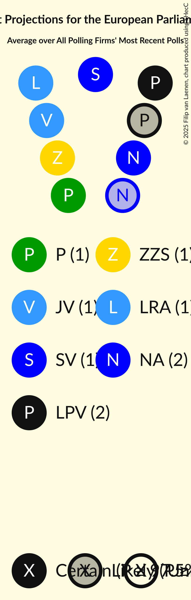
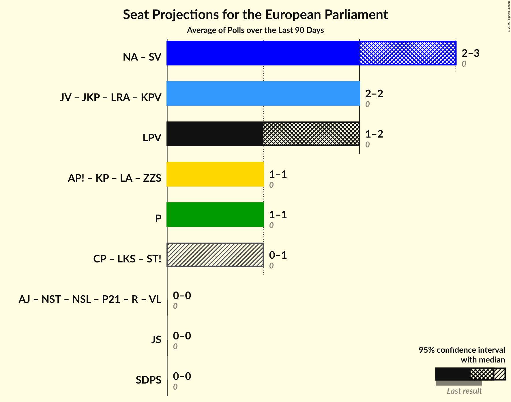

# Overview

The table below lists the most recent polls (less than 90 days old) registered and analyzed so far.

| Period     | Polling firm/Commissioner(s) | JV | NA | SDPS | ZZS | LKS | LRA | AP! | NSL | VL | JKP | KPV | P | JS | LuK |
|:----------:|:----------------------------:|:--:|:--:|:--:|:--:|:--:|:--:|:--:|:--:|:--:|:--:|:--:|:--:|:--:|:--:|
| 25 May 2019 | General Election | 46.2%   4 | 14.2%   1 | 13.0%   1 | 8.3%   1 | 6.4%   1 | 2.5%   0 | 2.1%   0 | 0.0%   0 | 0.0%   0 | 0.0%   0 | 0.0%   0 | 0.0%   0 | 0.0%   0 | 0.0%   0 |
| N/A | [Poll Average](average.html) | 13–20%   1–2 | 9–14%   1 | 12–19%   1–2 | 5–15%   0–1 | 2–6%   0–1 | 4–6%   0–1 | 8–15%   1 | N/A   N/A | N/A   N/A | 4–7%   0–1 | 0–2%   0 | 5–8%   0–1 | N/A   N/A | 3–7%   0–1 |
| [1–30 November 2021](2021-11-30-FactumInteractive.html) | Factum Interactive | 15–20%   1–2 | 10–14%   1 | 11–16%   1 | 5–8%   0–1 | 2–5%   0 | 4–7%   0–1 | 11–15%   1 | N/A   N/A | N/A   N/A | 4–7%   0–1 | 0–2%   0 | 5–8%   0–1 | N/A   N/A | 4–7%   0–1 |
| [8–29 November 2021](2021-11-29-SKDS.html) | SKDS   Latvijas Televīzija | 13–16%   1–2 | 9–12%   1 | 16–20%   1–2 | 12–16%   1–2 | 4–6%   0–1 | 4–6%   0–1 | 8–11%   1 | N/A   N/A | N/A   N/A | 4–6%   0–1 | N/A   N/A | 6–8%   1 | N/A   N/A | 2–4%   0 |
| 25 May 2019 | General Election | 46.2%   4 | 14.2%   1 | 13.0%   1 | 8.3%   1 | 6.4%   1 | 2.5%   0 | 2.1%   0 | 0.0%   0 | 0.0%   0 | 0.0%   0 | 0.0%   0 | 0.0%   0 | 0.0%   0 | 0.0%   0 |

Only polls for which at least the sample size has been published are included in the table above.

**Legend:**
+ **Top half of each row:** Voting intentions (95% confidence interval)
+ **Bottom half of each row:** Seat projections for the European Parliament (95% confidence interval)
+ **JV:** Jaunā VIENOTĪBA (EPP)
+ **NA:** Nacionālā apvienība „Visu Latvijai!”–„Tēvzemei un Brīvībai/LNNK” (ECR)
+ **SDPS:** Sociāldemokrātiskā partija “Saskaņa” (S&D)
+ **ZZS:** Zaļo un Zemnieku savienība (EPP)
+ **LKS:** Latvijas Krievu savienība (Greens/EFA)
+ **LRA:** Latvijas Reģionu Apvienība (ECR)
+ **AP!:** Attīstībai/Par! (RE)
+ **NSL:** No sirds Latvijai (*)
+ **VL:** Vienoti Latvijai (*)
+ **JKP:** Jaunā konservatīvā partija (EPP)
+ **KPV:** Politiskā partija „KPV LV” (EPP)
+ **P:** PROGRESĪVIE (Greens/EFA)
+ **JS:** Jaunā Saskaņa (GUE/NGL)
+ **LuK:** Likums un kārtība (*)
+ **N/A (single party):** Party not included the published results
+ **N/A (entire row):** Calculation for this opinion poll not started yet

