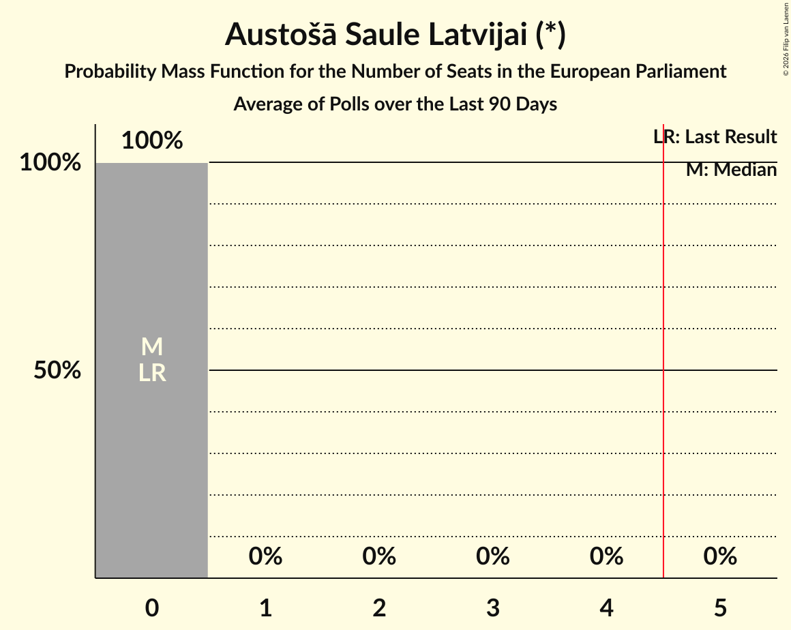

# Austošā Saule Latvijai (*)

<a href="#voting-intentions">Voting Intentions</a> | <a href="#seats">Seats</a>

## Voting Intentions

Last result: **0.0%** (General Election of 8 June 2024)

### Confidence Intervals

| Period     | Polling firm/Commissioner(s) | Median | 80% Confidence Interval | 90% Confidence Interval | 95% Confidence Interval | 99% Confidence Interval |
|:----------:|:----------------:|:-----------:|:-----------------------:|:-----------------------:|:-----------------------:|:-----------------------:|
| N/A | [Poll Average](average.html) | 2.7% | 0.9–4.7% | 0.8–5.0% | 0.7–5.2% | 0.5–5.6% |
| [16–26 December 2025](2025-12-26-Gemius.html) | Gemius | 4.2% | 3.6–5.0% | 3.4–5.2% | 3.3–5.4% | 3.0–5.8% |
| [21 November–4 December 2025](2025-12-04-SKDS.html) | SKDS   Latvijas Televīzija | 1.1% | 0.7–1.6% | 0.7–1.8% | 0.6–1.9% | 0.5–2.2% |
| [31 October–6 November 2025](2025-11-06-Gemius.html) | Gemius | 0.0% | N/A | N/A | N/A | N/A |
| [25 October–4 November 2025](2025-11-04-SKDS.html) | SKDS   Latvijas Televīzija | 1.4% | N/A | N/A | N/A | N/A |
| [1–31 July 2025](2025-07-31-SKDS.html) | SKDS   Latvijas Televīzija | 0.0% | N/A | N/A | N/A | N/A |
| [1–30 April 2025](2025-04-30-SKDS.html) | SKDS   Latvijas Televīzija | 0.0% | N/A | N/A | N/A | N/A |
| [14–24 March 2025](2025-03-24-LatvijasFakti.html) | Latvijas Fakti | 0.0% | N/A | N/A | N/A | N/A |
| [1–31 January 2025](2025-01-31-SKDS.html) | SKDS   Latvijas Televīzija | 0.0% | N/A | N/A | N/A | N/A |
| [30 November–9 December 2024](2024-12-09-SKDS.html) | SKDS   Latvijas Televīzija | 0.0% | N/A | N/A | N/A | N/A |
| [1–30 November 2024](2024-11-30-SKDS.html) | SKDS   Latvijas Televīzija | 0.0% | N/A | N/A | N/A | N/A |
| [1–31 October 2024](2024-10-31-SKDS.html) | SKDS   Latvijas Televīzija | 0.0% | N/A | N/A | N/A | N/A |
| [1–31 August 2024](2024-08-31-SKDS.html) | SKDS   Latvijas Televīzija | 0.0% | N/A | N/A | N/A | N/A |
| [1–30 June 2024](2024-06-30-SKDS.html) | SKDS   Latvijas Televīzija | 0.0% | N/A | N/A | N/A | N/A |

### Probability Mass Function

The following table shows the probability mass function per percentage block of voting intentions for the [poll average](average.html) for Austošā Saule Latvijai (*).

| Voting Intentions | Probability | Accumulated | Special Marks |
|:-----------------:|:-----------:|:-----------:|:-------------:|
| 0.0–0.5% | 0.7% | 100% | Last Result |
| 0.5–1.5% | 43% | 99.3% |  |
| 1.5–2.5% | 6% | 56% |  |
| 2.5–3.5% | 4% | 50% | Median |
| 3.5–4.5% | 31% | 46% |  |
| 4.5–5.5% | 14% | 15% |  |
| 5.5–6.5% | 0.7% | 0.7% |  |
| 6.5–7.5% | 0% | 0% |  |

## Seats

Last result: **0** seats (General Election of 8 June 2024)

### Confidence Intervals

| Period     | Polling firm/Commissioner(s) | Median | 80% Confidence Interval | 90% Confidence Interval | 95% Confidence Interval | 99% Confidence Interval |
|:----------:|:----------------:|:------:|:-----------------------:|:-----------------------:|:-----------------------:|:-----------------------:|
| N/A | [Poll Average](average.html) | 0 | 0 | 0 | 0 | 0–1 |
| [16–26 December 2025](2025-12-26-Gemius.html) | Gemius | 0 | 0 | 0 | 0–1 | 0–1 |
| [21 November–4 December 2025](2025-12-04-SKDS.html) | SKDS   Latvijas Televīzija | 0 | 0 | 0 | 0 | 0 |
| [31 October–6 November 2025](2025-11-06-Gemius.html) | Gemius |  |  |  |  |  |
| [25 October–4 November 2025](2025-11-04-SKDS.html) | SKDS   Latvijas Televīzija |  |  |  |  |  |
| [1–31 July 2025](2025-07-31-SKDS.html) | SKDS   Latvijas Televīzija |  |  |  |  |  |
| [1–30 April 2025](2025-04-30-SKDS.html) | SKDS   Latvijas Televīzija |  |  |  |  |  |
| [14–24 March 2025](2025-03-24-LatvijasFakti.html) | Latvijas Fakti |  |  |  |  |  |
| [1–31 January 2025](2025-01-31-SKDS.html) | SKDS   Latvijas Televīzija |  |  |  |  |  |
| [30 November–9 December 2024](2024-12-09-SKDS.html) | SKDS   Latvijas Televīzija |  |  |  |  |  |
| [1–30 November 2024](2024-11-30-SKDS.html) | SKDS   Latvijas Televīzija |  |  |  |  |  |
| [1–31 October 2024](2024-10-31-SKDS.html) | SKDS   Latvijas Televīzija |  |  |  |  |  |
| [1–31 August 2024](2024-08-31-SKDS.html) | SKDS   Latvijas Televīzija |  |  |  |  |  |
| [1–30 June 2024](2024-06-30-SKDS.html) | SKDS   Latvijas Televīzija |  |  |  |  |  |

### Probability Mass Function

The following table shows the probability mass function per seat for the [poll average](average.html) for Austošā Saule Latvijai (*).

| Number of Seats | Probability | Accumulated | Special Marks |
|:---------------:|:-----------:|:-----------:|:-------------:|
| 0 | 98% | 100% | Last Result, Median |
| 1 | 2% | 2% |  |
| 2 | 0% | 0% |  |

