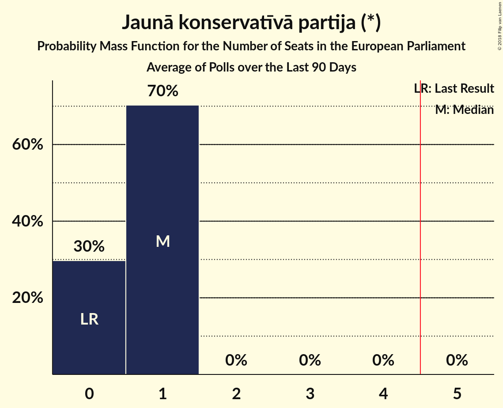

# Jaunā konservatīvā partija (*)

<a href="#voting-intentions">Voting Intentions</a> | <a href="#seats">Seats</a>

## Voting Intentions

Last result: **0.0%** (General Election of 24 May 2014)

### Confidence Intervals

| Period     | Polling firm/Commissioner(s) | Median | 80% Confidence Interval | 90% Confidence Interval | 95% Confidence Interval | 99% Confidence Interval |
|:----------:|:----------------:|:-----------:|:-----------------------:|:-----------------------:|:-----------------------:|:-----------------------:|
| N/A | [Poll Average](average.html) | 10.6% | 3.9–15.4% | 3.5–15.8% | 3.3–16.1% | 2.8–16.7% |
| [10–14 September 2018](2018-09-14-Norstat.html) | Norstat | 10.2% | 8.2–12.8% | 7.7–13.6% | 7.2–14.3% | 6.3–15.6% |
| [31 August–9 September 2018](2018-09-09-FACTUM.html) | FACTUM | 15.0% | 13.8–16.4% | 13.4–16.7% | 13.2–17.1% | 12.6–17.7% |
| [30 August–5 September 2018](2018-09-05-FACTUM.html) | FACTUM | 15.0% | 14.0–16.1% | 13.7–16.4% | 13.5–16.7% | 13.0–17.2% |
| [27 August–2 September 2018](2018-09-02-FACTUM.html) | FACTUM | 15.0% | 14.0–16.1% | 13.7–16.4% | 13.5–16.7% | 13.0–17.2% |
| [25–31 August 2018](2018-08-31-FACTUM.html) | FACTUM | 14.7% | 13.6–15.8% | 13.4–16.1% | 13.1–16.4% | 12.6–17.0% |
| [22–28 August 2018](2018-08-28-FACTUM.html) | FACTUM | 13.0% | 11.9–14.3% | 11.6–14.6% | 11.3–14.9% | 10.8–15.5% |
| [20–26 August 2018](2018-08-26-FACTUM.html) | FACTUM | 11.8% | 10.7–13.0% | 10.4–13.3% | 10.2–13.6% | 9.7–14.2% |
| [1–23 August 2018](2018-08-23-SKDS.html) | SKDS   Latvijas Televīzija | 4.4% | 3.5–5.7% | 3.3–6.1% | 3.0–6.4% | 2.7–7.1% |
| [13–19 August 2018](2018-08-19-FACTUM.html) | FACTUM | 10.0% | 9.0–11.1% | 8.8–11.4% | 8.5–11.6% | 8.1–12.2% |
| [17–23 July 2018](2018-07-23-FACTUM.html) | FACTUM | 10.5% | 9.6–11.6% | 9.3–11.9% | 9.1–12.2% | 8.6–12.7% |
| [1–30 June 2018](2018-06-30-SKDS.html) | SKDS   Latvijas Televīzija | 6.3% | 5.2–7.8% | 4.9–8.2% | 4.7–8.5% | 4.2–9.3% |
| [1–31 May 2018](2018-05-31-SKDS.html) | SKDS   Latvijas Televīzija | 4.1% | 3.2–5.3% | 3.0–5.7% | 2.8–6.0% | 2.4–6.7% |
| [1–31 May 2018](2018-05-31-Norstat.html) | Norstat   TV3 Latvija | 8.5% | 7.3–10.0% | 7.0–10.4% | 6.7–10.8% | 6.2–11.6% |
| [1–30 April 2018](2018-04-30-SKDS.html) | SKDS   Latvijas Televīzija | 5.9% | 4.8–7.2% | 4.5–7.6% | 4.3–8.0% | 3.8–8.7% |
| [1–31 March 2018](2018-03-31-SKDS.html) | SKDS   Latvijas Televīzija | 6.3% | 5.2–7.8% | 4.8–8.2% | 4.6–8.6% | 4.1–9.4% |
| [1–28 February 2018](2018-02-28-SKDS.html) | SKDS   Latvijas Televīzija | 6.6% | 5.5–8.1% | 5.2–8.5% | 4.9–8.9% | 4.4–9.6% |
| [1–31 January 2018](2018-01-31-SKDS.html) | SKDS   Latvijas Televīzija | 7.1% | 5.9–8.7% | 5.6–9.1% | 5.3–9.5% | 4.8–10.3% |

### Probability Mass Function

The following table shows the probability mass function per percentage block of voting intentions for the [poll average](average.html) for Jaunā konservatīvā partija (*).

| Voting Intentions | Probability | Accumulated | Special Marks |
|:-----------------:|:-----------:|:-----------:|:-------------:|
| 0.0–0.5% | 0% | 100% | Last Result |
| 0.5–1.5% | 0% | 100% |  |
| 1.5–2.5% | 0.1% | 100% |  |
| 2.5–3.5% | 5% | 99.9% |  |
| 3.5–4.5% | 20% | 95% |  |
| 4.5–5.5% | 18% | 75% |  |
| 5.5–6.5% | 6% | 57% |  |
| 6.5–7.5% | 0.9% | 51% |  |
| 7.5–8.5% | 0.1% | 50% |  |
| 8.5–9.5% | 0% | 50% |  |
| 9.5–10.5% | 0% | 50% |  |
| 10.5–11.5% | 0% | 50% | Median |
| 11.5–12.5% | 0.2% | 50% |  |
| 12.5–13.5% | 4% | 50% |  |
| 13.5–14.5% | 17% | 46% |  |
| 14.5–15.5% | 20% | 29% |  |
| 15.5–16.5% | 7% | 8% |  |
| 16.5–17.5% | 0.8% | 0.9% |  |
| 17.5–18.5% | 0% | 0% |  |

## Seats

Last result: **0** seats (General Election of 24 May 2014)

### Confidence Intervals

| Period     | Polling firm/Commissioner(s) | Median | 80% Confidence Interval | 90% Confidence Interval | 95% Confidence Interval | 99% Confidence Interval |
|:----------:|:----------------:|:------:|:-----------------------:|:-----------------------:|:-----------------------:|:-----------------------:|
| N/A | [Poll Average](average.html) | 1 | 0–1 | 0–1 | 0–1 | 0–1 |
| [10–14 September 2018](2018-09-14-Norstat.html) | Norstat | 1 | 1 | 1 | 1 | 0–1 |
| [31 August–9 September 2018](2018-09-09-FACTUM.html) | FACTUM | 1 | 1 | 1 | 1 | 1 |
| [30 August–5 September 2018](2018-09-05-FACTUM.html) | FACTUM | 1 | 1 | 1 | 1 | 1 |
| [27 August–2 September 2018](2018-09-02-FACTUM.html) | FACTUM | 1 | 1 | 1 | 1 | 1 |
| [25–31 August 2018](2018-08-31-FACTUM.html) | FACTUM | 1 | 1 | 1 | 1 | 1 |
| [22–28 August 2018](2018-08-28-FACTUM.html) | FACTUM | 1 | 1 | 1 | 1 | 1 |
| [20–26 August 2018](2018-08-26-FACTUM.html) | FACTUM | 1 | 1 | 1 | 1 | 1 |
| [1–23 August 2018](2018-08-23-SKDS.html) | SKDS   Latvijas Televīzija | 0 | 0–1 | 0–1 | 0–1 | 0–1 |
| [13–19 August 2018](2018-08-19-FACTUM.html) | FACTUM | 1 | 1 | 1 | 1 | 1 |
| [17–23 July 2018](2018-07-23-FACTUM.html) | FACTUM | 1 | 1 | 1 | 1 | 1 |
| [1–30 June 2018](2018-06-30-SKDS.html) | SKDS   Latvijas Televīzija | 1 | 0–1 | 0–1 | 0–1 | 0–1 |
| [1–31 May 2018](2018-05-31-SKDS.html) | SKDS   Latvijas Televīzija | 0 | 0 | 0–1 | 0–1 | 0–1 |
| [1–31 May 2018](2018-05-31-Norstat.html) | Norstat   TV3 Latvija | 1 | 1 | 1 | 1 | 1 |
| [1–30 April 2018](2018-04-30-SKDS.html) | SKDS   Latvijas Televīzija | 1 | 0–1 | 0–1 | 0–1 | 0–1 |
| [1–31 March 2018](2018-03-31-SKDS.html) | SKDS   Latvijas Televīzija | 1 | 1 | 0–1 | 0–1 | 0–1 |
| [1–28 February 2018](2018-02-28-SKDS.html) | SKDS   Latvijas Televīzija | 1 | 0–1 | 0–1 | 0–1 | 0–1 |
| [1–31 January 2018](2018-01-31-SKDS.html) | SKDS   Latvijas Televīzija | 1 | 1 | 1 | 0–1 | 0–1 |

### Probability Mass Function

The following table shows the probability mass function per seat for the [poll average](average.html) for Jaunā konservatīvā partija (*).

| Number of Seats | Probability | Accumulated | Special Marks |
|:---------------:|:-----------:|:-----------:|:-------------:|
| 0 | 45% | 100% | Last Result |
| 1 | 55% | 55% | Median |
| 2 | 0.1% | 0.1% |  |
| 3 | 0% | 0% |  |

