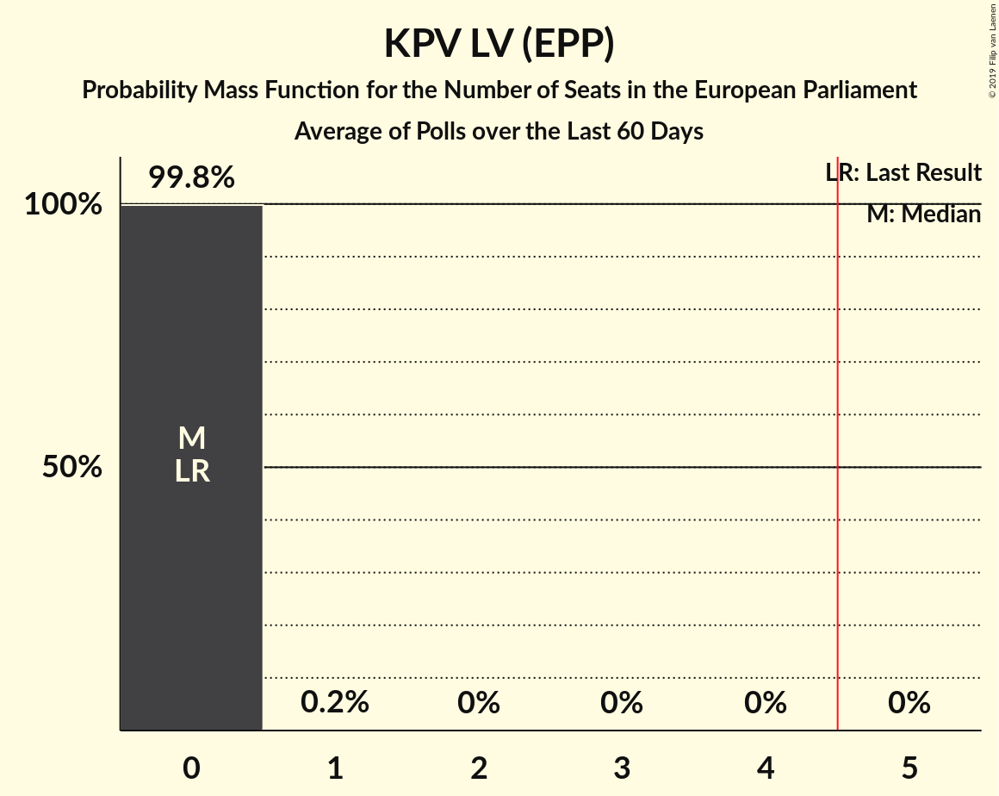

# KPV LV (EPP)

<a href="#voting-intentions">Voting Intentions</a> | <a href="#seats">Seats</a>

## Voting Intentions

Last result: **0.0%** (General Election of 24 May 2014)

### Confidence Intervals

| Period     | Polling firm/Commissioner(s) | Median | 80% Confidence Interval | 90% Confidence Interval | 95% Confidence Interval | 99% Confidence Interval |
|:----------:|:----------------:|:-----------:|:-----------------------:|:-----------------------:|:-----------------------:|:-----------------------:|
| N/A | [Poll Average](average.html) | 2.6% | 1.2–4.3% | 1.0–4.6% | 0.9–4.9% | 0.7–5.4% |
| [1–21 May 2019](2019-05-21-BergResearch.html) | Berg Research   jauns.lv | 1.2% | 0.9–1.9% | 0.8–2.1% | 0.7–2.3% | 0.5–2.6% |
| [14–20 May 2019](2019-05-20-Factum.html) | Factum | 3.1% | 2.4–3.9% | 2.3–4.2% | 2.1–4.4% | 1.9–4.8% |
| [2–9 May 2019](2019-05-09-Factum.html) | Factum | 3.1% | N/A | N/A | N/A | N/A |
| [1–8 May 2019](2019-05-08-SKDS.html) | SKDS   Latvijas Televīzija | 1.9% | 1.4–2.7% | 1.3–2.9% | 1.2–3.1% | 1.0–3.5% |
| [24–28 April 2019](2019-04-28-Factum.html) | Factum | 3.0% | N/A | N/A | N/A | N/A |
| [12–22 April 2019](2019-04-22-LatvijasFakti.html) | Latvijas Fakti | 4.0% | 3.3–4.9% | 3.1–5.2% | 3.0–5.4% | 2.7–5.9% |
| [17–21 April 2019](2019-04-21-Factum.html) | Factum | 2.9% | 2.2–4.1% | 2.0–4.5% | 1.8–4.8% | 1.5–5.4% |
| [1–19 April 2019](2019-04-19-SKDS.html) | SKDS   Latvijas Televīzija | 1.0% | 0.7–1.5% | 0.6–1.7% | 0.5–1.8% | 0.4–2.1% |
| [10–14 April 2019](2019-04-14-Factum.html) | Factum | 3.1% | 2.3–4.4% | 2.0–4.8% | 1.9–5.1% | 1.5–5.9% |
| [26 March–5 April 2019](2019-04-05-Factum.html) | Factum | 3.0% | 2.4–3.7% | 2.3–4.0% | 2.2–4.1% | 1.9–4.5% |
| [1–31 March 2019](2019-03-31-SKDS.html) | SKDS   Latvijas Televīzija | 7.0% | 6.0–8.2% | 5.7–8.6% | 5.5–8.9% | 5.0–9.5% |
| [1–31 March 2019](2019-03-31-Factum.html) | Factum | 4.0% | 3.3–5.0% | 3.1–5.3% | 2.9–5.6% | 2.6–6.1% |
| [3–18 March 2019](2019-03-18-LatvijasFakti.html) | Latvijas Fakti | 0.0% | N/A | N/A | N/A | N/A |
| [1–28 February 2019](2019-02-28-SKDS.html) | SKDS   Latvijas Televīzija | 6.0% | 5.0–7.1% | 4.8–7.5% | 4.6–7.7% | 4.2–8.3% |
| [11–23 January 2019](2019-01-23-SKDS.html) | SKDS   Latvijas Televīzija | 10.0% | 8.9–11.4% | 8.5–11.8% | 8.2–12.2% | 7.7–12.9% |
| [1–12 December 2018](2018-12-12-SKDS.html) | SKDS   Latvijas Televīzija | 14.7% | 13.0–16.6% | 12.5–17.1% | 12.1–17.6% | 11.4–18.6% |
| [3–15 November 2018](2018-11-15-SKDS.html) | SKDS   Latvijas Televīzija | 14.5% | 12.7–16.5% | 12.2–17.1% | 11.8–17.6% | 11.0–18.7% |
| [13–23 October 2018](2018-10-23-SKDS.html) | SKDS   Latvijas Televīzija | 15.3% | 13.7–17.2% | 13.2–17.8% | 12.8–18.2% | 12.0–19.2% |
| [24–30 September 2018](2018-09-30-FACTUM.html) | FACTUM | 11.9% | 11.1–12.8% | 10.9–13.0% | 10.7–13.2% | 10.3–13.6% |
| [17–23 September 2018](2018-09-23-FACTUM.html) | FACTUM | 11.1% | 10.3–12.0% | 10.1–12.2% | 9.9–12.5% | 9.6–12.9% |
| [8–18 September 2018](2018-09-18-SKDS.html) | SKDS   Latvijas Televīzija | 10.0% | 8.6–11.8% | 8.2–12.2% | 7.9–12.7% | 7.3–13.5% |
| [10–16 September 2018](2018-09-16-FACTUM.html) | FACTUM | 10.8% | 9.7–12.1% | 9.4–12.4% | 9.2–12.7% | 8.7–13.4% |
| [10–14 September 2018](2018-09-14-Norstat.html) | Norstat | 13.0% | 10.7–15.9% | 10.1–16.7% | 9.6–17.4% | 8.6–18.9% |
| [8 August–12 September 2018](2018-09-12-KantarTNS.html) | Kantar TNS   Delfi | 16.1% | 14.4–18.0% | 13.9–18.5% | 13.5–19.0% | 12.7–20.0% |
| [31 August–9 September 2018](2018-09-09-FACTUM.html) | FACTUM | 12.8% | 11.6–14.0% | 11.3–14.4% | 11.1–14.7% | 10.5–15.3% |
| [30 August–5 September 2018](2018-09-05-FACTUM.html) | FACTUM | 12.6% | 11.7–13.7% | 11.4–13.9% | 11.2–14.2% | 10.8–14.7% |
| [27 August–2 September 2018](2018-09-02-FACTUM.html) | FACTUM | 11.6% | 10.7–12.6% | 10.5–12.9% | 10.3–13.2% | 9.9–13.7% |
| [25–31 August 2018](2018-08-31-FACTUM.html) | FACTUM | 12.4% | 11.4–13.5% | 11.2–13.8% | 10.9–14.0% | 10.5–14.6% |
| [22–28 August 2018](2018-08-28-FACTUM.html) | FACTUM | 14.6% | 13.4–15.9% | 13.1–16.3% | 12.8–16.6% | 12.3–17.2% |
| [20–26 August 2018](2018-08-26-FACTUM.html) | FACTUM | 16.2% | 15.0–17.5% | 14.6–17.9% | 14.3–18.3% | 13.7–18.9% |
| [1–23 August 2018](2018-08-23-SKDS.html) | SKDS   Latvijas Televīzija | 11.5% | 9.9–13.3% | 9.5–13.8% | 9.1–14.3% | 8.4–15.2% |
| [13–19 August 2018](2018-08-19-FACTUM.html) | FACTUM | 15.6% | 14.4–16.9% | 14.1–17.2% | 13.8–17.5% | 13.2–18.2% |
| [17–23 July 2018](2018-07-23-FACTUM.html) | FACTUM | 14.3% | 13.2–15.5% | 12.8–15.8% | 12.6–16.1% | 12.1–16.7% |
| [1–30 June 2018](2018-06-30-SKDS.html) | SKDS   Latvijas Televīzija | 7.0% | 5.8–8.4% | 5.5–8.9% | 5.2–9.2% | 4.7–10.0% |
| [1–31 May 2018](2018-05-31-SKDS.html) | SKDS   Latvijas Televīzija | 5.1% | 4.1–6.5% | 3.8–6.9% | 3.6–7.2% | 3.2–7.9% |
| [1–31 May 2018](2018-05-31-Norstat.html) | Norstat   TV3 Latvija | 4.9% | 4.0–6.1% | 3.7–6.4% | 3.5–6.7% | 3.2–7.4% |
| [1–30 April 2018](2018-04-30-SKDS.html) | SKDS   Latvijas Televīzija | 3.8% | 3.0–5.0% | 2.8–5.3% | 2.6–5.6% | 2.2–6.2% |
| [1–31 March 2018](2018-03-31-SKDS.html) | SKDS   Latvijas Televīzija | 3.3% | 2.5–4.5% | 2.3–4.8% | 2.1–5.2% | 1.8–5.8% |
| [1–28 February 2018](2018-02-28-SKDS.html) | SKDS   Latvijas Televīzija | 3.1% | 2.3–4.2% | 2.1–4.5% | 2.0–4.8% | 1.7–5.3% |
| [1–31 January 2018](2018-01-31-SKDS.html) | SKDS   Latvijas Televīzija | 3.5% | 2.7–4.7% | 2.5–5.0% | 2.3–5.3% | 1.9–5.9% |

### Probability Mass Function

The following table shows the probability mass function per percentage block of voting intentions for the [poll average](average.html) for KPV LV (EPP).

| Voting Intentions | Probability | Accumulated | Special Marks |
|:-----------------:|:-----------:|:-----------:|:-------------:|
| 0.0–0.5% | 0.1% | 100% | Last Result |
| 0.5–1.5% | 22% | 99.9% |  |
| 1.5–2.5% | 28% | 78% |  |
| 2.5–3.5% | 24% | 50% | Median |
| 3.5–4.5% | 21% | 26% |  |
| 4.5–5.5% | 6% | 6% |  |
| 5.5–6.5% | 0.4% | 0.4% |  |
| 6.5–7.5% | 0% | 0% |  |

## Seats

Last result: **0** seats (General Election of 24 May 2014)

### Confidence Intervals

| Period     | Polling firm/Commissioner(s) | Median | 80% Confidence Interval | 90% Confidence Interval | 95% Confidence Interval | 99% Confidence Interval |
|:----------:|:----------------:|:------:|:-----------------------:|:-----------------------:|:-----------------------:|:-----------------------:|
| N/A | [Poll Average](average.html) | 0 | 0 | 0 | 0 | 0 |
| [1–21 May 2019](2019-05-21-BergResearch.html) | Berg Research   jauns.lv | 0 | 0 | 0 | 0 | 0 |
| [14–20 May 2019](2019-05-20-Factum.html) | Factum | 0 | 0 | 0 | 0 | 0 |
| [2–9 May 2019](2019-05-09-Factum.html) | Factum |  |  |  |  |  |
| [1–8 May 2019](2019-05-08-SKDS.html) | SKDS   Latvijas Televīzija | 0 | 0 | 0 | 0 | 0 |
| [24–28 April 2019](2019-04-28-Factum.html) | Factum |  |  |  |  |  |
| [12–22 April 2019](2019-04-22-LatvijasFakti.html) | Latvijas Fakti | 0 | 0 | 0 | 0 | 0–1 |
| [17–21 April 2019](2019-04-21-Factum.html) | Factum | 0 | 0 | 0 | 0 | 0 |
| [1–19 April 2019](2019-04-19-SKDS.html) | SKDS   Latvijas Televīzija | 0 | 0 | 0 | 0 | 0 |
| [10–14 April 2019](2019-04-14-Factum.html) | Factum | 0 | 0 | 0 | 0 | 0–1 |
| [26 March–5 April 2019](2019-04-05-Factum.html) | Factum | 0 | 0 | 0 | 0 | 0 |
| [1–31 March 2019](2019-03-31-SKDS.html) | SKDS   Latvijas Televīzija | 1 | 0–1 | 0–1 | 0–1 | 0–1 |
| [1–31 March 2019](2019-03-31-Factum.html) | Factum | 0 | 0 | 0 | 0 | 0–1 |
| [3–18 March 2019](2019-03-18-LatvijasFakti.html) | Latvijas Fakti |  |  |  |  |  |
| [1–28 February 2019](2019-02-28-SKDS.html) | SKDS   Latvijas Televīzija | 0 | 0–1 | 0–1 | 0–1 | 0–1 |
| [11–23 January 2019](2019-01-23-SKDS.html) | SKDS   Latvijas Televīzija | 1 | 1 | 1 | 1 | 1 |
| [1–12 December 2018](2018-12-12-SKDS.html) | SKDS   Latvijas Televīzija | 1 | 1 | 1 | 1 | 1–2 |
| [3–15 November 2018](2018-11-15-SKDS.html) | SKDS   Latvijas Televīzija | 1 | 1 | 1 | 1 | 1–2 |
| [13–23 October 2018](2018-10-23-SKDS.html) | SKDS   Latvijas Televīzija | 1 | 1 | 1 | 1 | 1–2 |
| [24–30 September 2018](2018-09-30-FACTUM.html) | FACTUM | 1 | 1 | 1 | 1 | 1 |
| [17–23 September 2018](2018-09-23-FACTUM.html) | FACTUM | 1 | 1 | 1 | 1 | 1 |
| [8–18 September 2018](2018-09-18-SKDS.html) | SKDS   Latvijas Televīzija | 1 | 1 | 1 | 1 | 1 |
| [10–16 September 2018](2018-09-16-FACTUM.html) | FACTUM | 1 | 1 | 1 | 1 | 1 |
| [10–14 September 2018](2018-09-14-Norstat.html) | Norstat | 1 | 1 | 1 | 1 | 1–2 |
| [8 August–12 September 2018](2018-09-12-KantarTNS.html) | Kantar TNS   Delfi | 1 | 1 | 1 | 1 | 1–2 |
| [31 August–9 September 2018](2018-09-09-FACTUM.html) | FACTUM | 1 | 1 | 1 | 1 | 1 |
| [30 August–5 September 2018](2018-09-05-FACTUM.html) | FACTUM | 1 | 1 | 1 | 1 | 1 |
| [27 August–2 September 2018](2018-09-02-FACTUM.html) | FACTUM | 1 | 1 | 1 | 1 | 1 |
| [25–31 August 2018](2018-08-31-FACTUM.html) | FACTUM | 1 | 1 | 1 | 1 | 1 |
| [22–28 August 2018](2018-08-28-FACTUM.html) | FACTUM | 1 | 1 | 1 | 1 | 1 |
| [20–26 August 2018](2018-08-26-FACTUM.html) | FACTUM | 1 | 1 | 1 | 1 | 1–2 |
| [1–23 August 2018](2018-08-23-SKDS.html) | SKDS   Latvijas Televīzija | 1 | 1 | 1 | 1 | 1 |
| [13–19 August 2018](2018-08-19-FACTUM.html) | FACTUM | 1 | 1–2 | 1–2 | 1–2 | 1–2 |
| [17–23 July 2018](2018-07-23-FACTUM.html) | FACTUM | 1 | 1–2 | 1–2 | 1–2 | 1–2 |
| [1–30 June 2018](2018-06-30-SKDS.html) | SKDS   Latvijas Televīzija | 1 | 0–1 | 0–1 | 0–1 | 0–1 |
| [1–31 May 2018](2018-05-31-SKDS.html) | SKDS   Latvijas Televīzija | 1 | 0–1 | 0–1 | 0–1 | 0–1 |
| [1–31 May 2018](2018-05-31-Norstat.html) | Norstat   TV3 Latvija | 0 | 0 | 0 | 0–1 | 0–1 |
| [1–30 April 2018](2018-04-30-SKDS.html) | SKDS   Latvijas Televīzija | 0 | 0 | 0 | 0–1 | 0–1 |
| [1–31 March 2018](2018-03-31-SKDS.html) | SKDS   Latvijas Televīzija | 0 | 0 | 0 | 0 | 0–1 |
| [1–28 February 2018](2018-02-28-SKDS.html) | SKDS   Latvijas Televīzija | 0 | 0 | 0 | 0 | 0 |
| [1–31 January 2018](2018-01-31-SKDS.html) | SKDS   Latvijas Televīzija | 0 | 0 | 0 | 0 | 0–1 |

### Probability Mass Function

The following table shows the probability mass function per seat for the [poll average](average.html) for KPV LV (EPP).

| Number of Seats | Probability | Accumulated | Special Marks |
|:---------------:|:-----------:|:-----------:|:-------------:|
| 0 | 99.8% | 100% | Last Result, Median |
| 1 | 0.2% | 0.2% |  |
| 2 | 0% | 0% |  |

