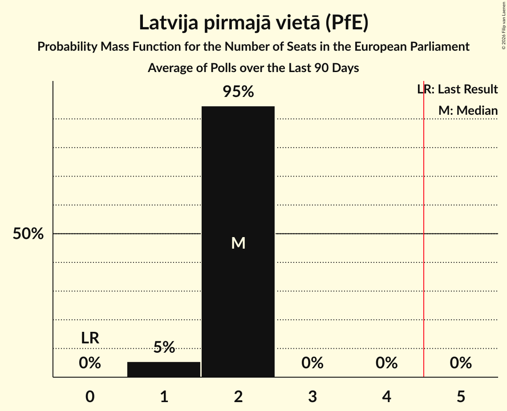

# Latvija pirmajā vietā (PfE)

<a href="#voting-intentions">Voting Intentions</a> | <a href="#seats">Seats</a>

## Voting Intentions

Last result: **0.0%** (General Election of 8 June 2024)

### Confidence Intervals

| Period     | Polling firm/Commissioner(s) | Median | 80% Confidence Interval | 90% Confidence Interval | 95% Confidence Interval | 99% Confidence Interval |
|:----------:|:----------------:|:-----------:|:-----------------------:|:-----------------------:|:-----------------------:|:-----------------------:|
| N/A | [Poll Average](average.html) | 14.6% | 13.6–15.7% | 13.3–16.1% | 13.0–16.3% | 12.6–16.9% |
| [30 November–9 December 2024](2024-12-09-SKDS.html) | SKDS   Latvijas Televīzija | 14.6% | 13.6–15.7% | 13.3–16.1% | 13.0–16.4% | 12.5–16.9% |
| [1–30 November 2024](2024-11-30-SKDS.html) | SKDS   Latvijas Televīzija | 14.2% | 13.2–15.3% | 12.9–15.6% | 12.7–15.9% | 12.2–16.4% |
| [1–31 October 2024](2024-10-31-SKDS.html) | SKDS   Latvijas Televīzija | 11.5% | 10.6–12.5% | 10.3–12.8% | 10.1–13.1% | 9.7–13.6% |
| [1–31 August 2024](2024-08-31-SKDS.html) | SKDS   Latvijas Televīzija | 11.8% | 10.9–12.8% | 10.6–13.1% | 10.4–13.4% | 10.0–13.9% |
| [1–30 June 2024](2024-06-30-SKDS.html) | SKDS   Latvijas Televīzija | 10.7% | 9.8–11.7% | 9.5–11.9% | 9.3–12.2% | 8.9–12.7% |

### Probability Mass Function

The following table shows the probability mass function per percentage block of voting intentions for the [poll average](average.html) for Latvija pirmajā vietā (PfE).

| Voting Intentions | Probability | Accumulated | Special Marks |
|:-----------------:|:-----------:|:-----------:|:-------------:|
| 0.0–0.5% | 0% | 100% | Last Result |
| 0.5–1.5% | 0% | 100% |  |
| 1.5–2.5% | 0% | 100% |  |
| 2.5–3.5% | 0% | 100% |  |
| 3.5–4.5% | 0% | 100% |  |
| 4.5–5.5% | 0% | 100% |  |
| 5.5–6.5% | 0% | 100% |  |
| 6.5–7.5% | 0% | 100% |  |
| 7.5–8.5% | 0% | 100% |  |
| 8.5–9.5% | 0% | 100% |  |
| 9.5–10.5% | 0% | 100% |  |
| 10.5–11.5% | 0% | 100% |  |
| 11.5–12.5% | 0.5% | 100% |  |
| 12.5–13.5% | 9% | 99.5% |  |
| 13.5–14.5% | 37% | 90% |  |
| 14.5–15.5% | 39% | 54% | Median |
| 15.5–16.5% | 13% | 14% |  |
| 16.5–17.5% | 1.4% | 1.4% |  |
| 17.5–18.5% | 0.1% | 0.1% |  |
| 18.5–19.5% | 0% | 0% |  |

## Seats

Last result: **0** seats (General Election of 8 June 2024)

### Confidence Intervals

| Period     | Polling firm/Commissioner(s) | Median | 80% Confidence Interval | 90% Confidence Interval | 95% Confidence Interval | 99% Confidence Interval |
|:----------:|:----------------:|:------:|:-----------------------:|:-----------------------:|:-----------------------:|:-----------------------:|
| N/A | [Poll Average](average.html) | 1 | 1 | 1 | 1–2 | 1–2 |
| [30 November–9 December 2024](2024-12-09-SKDS.html) | SKDS   Latvijas Televīzija | 1 | 1 | 1 | 1–2 | 1–2 |
| [1–30 November 2024](2024-11-30-SKDS.html) | SKDS   Latvijas Televīzija | 1 | 1 | 1 | 1–2 | 1–2 |
| [1–31 October 2024](2024-10-31-SKDS.html) | SKDS   Latvijas Televīzija | 1 | 1 | 1 | 1 | 1 |
| [1–31 August 2024](2024-08-31-SKDS.html) | SKDS   Latvijas Televīzija | 1 | 1 | 1 | 1 | 1 |
| [1–30 June 2024](2024-06-30-SKDS.html) | SKDS   Latvijas Televīzija | 1 | 1 | 1 | 1 | 1 |

### Probability Mass Function

The following table shows the probability mass function per seat for the [poll average](average.html) for Latvija pirmajā vietā (PfE).

| Number of Seats | Probability | Accumulated | Special Marks |
|:---------------:|:-----------:|:-----------:|:-------------:|
| 0 | 0% | 100% | Last Result |
| 1 | 97% | 100% | Median |
| 2 | 3% | 3% |  |
| 3 | 0% | 0% |  |

