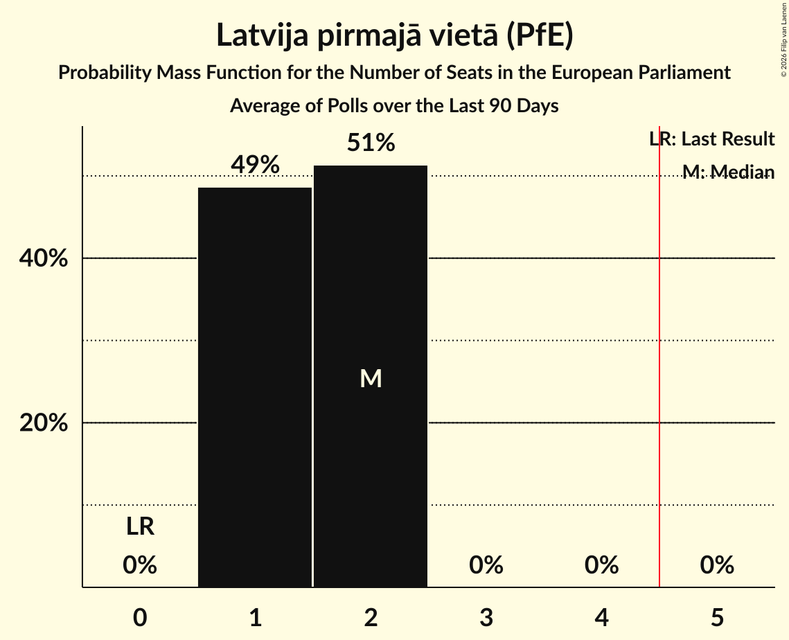

# Latvija pirmajā vietā (PfE)

<a href="#voting-intentions">Voting Intentions</a> | <a href="#seats">Seats</a>

## Voting Intentions

Last result: **0.0%** (General Election of 8 June 2024)

### Confidence Intervals

| Period     | Polling firm/Commissioner(s) | Median | 80% Confidence Interval | 90% Confidence Interval | 95% Confidence Interval | 99% Confidence Interval |
|:----------:|:----------------:|:-----------:|:-----------------------:|:-----------------------:|:-----------------------:|:-----------------------:|
| N/A | [Poll Average](average.html) | 14.5% | 13.4–15.6% | 13.1–15.9% | 12.8–16.2% | 12.3–16.8% |
| [31 March–7 April 2026](2026-04-07-Gemius.html) | Gemius | 14.3% | 13.2–15.5% | 12.9–15.9% | 12.6–16.2% | 12.1–16.7% |
| [1–31 March 2026](2026-03-31-SKDS.html) | SKDS   Latvijas Televīzija | 14.6% | 13.6–15.7% | 13.3–16.0% | 13.0–16.3% | 12.6–16.8% |
| [24 February–2 March 2026](2026-03-02-Gemius.html) | Gemius | 8.4% | 7.4–9.5% | 7.2–9.8% | 6.9–10.1% | 6.5–10.7% |
| [16–26 December 2025](2025-12-26-Gemius.html) | Gemius | 15.5% | N/A | N/A | N/A | N/A |
| [21 November–4 December 2025](2025-12-04-SKDS.html) | SKDS   Latvijas Televīzija | 15.2% | N/A | N/A | N/A | N/A |
| [31 October–6 November 2025](2025-11-06-Gemius.html) | Gemius | 10.7% | N/A | N/A | N/A | N/A |
| [25 October–4 November 2025](2025-11-04-SKDS.html) | SKDS   Latvijas Televīzija | 15.4% | N/A | N/A | N/A | N/A |
| [1–31 July 2025](2025-07-31-SKDS.html) | SKDS   Latvijas Televīzija | 14.0% | N/A | N/A | N/A | N/A |
| [1–30 April 2025](2025-04-30-SKDS.html) | SKDS   Latvijas Televīzija | 16.5% | N/A | N/A | N/A | N/A |
| [14–24 March 2025](2025-03-24-LatvijasFakti.html) | Latvijas Fakti | 18.9% | N/A | N/A | N/A | N/A |
| [1–31 January 2025](2025-01-31-SKDS.html) | SKDS   Latvijas Televīzija | 14.2% | N/A | N/A | N/A | N/A |
| [30 November–9 December 2024](2024-12-09-SKDS.html) | SKDS   Latvijas Televīzija | 14.6% | N/A | N/A | N/A | N/A |
| [1–30 November 2024](2024-11-30-SKDS.html) | SKDS   Latvijas Televīzija | 14.2% | N/A | N/A | N/A | N/A |
| [1–31 October 2024](2024-10-31-SKDS.html) | SKDS   Latvijas Televīzija | 11.5% | N/A | N/A | N/A | N/A |
| [1–31 August 2024](2024-08-31-SKDS.html) | SKDS   Latvijas Televīzija | 11.8% | N/A | N/A | N/A | N/A |
| [1–30 June 2024](2024-06-30-SKDS.html) | SKDS   Latvijas Televīzija | 10.7% | N/A | N/A | N/A | N/A |

### Probability Mass Function

The following table shows the probability mass function per percentage block of voting intentions for the [poll average](average.html) for Latvija pirmajā vietā (PfE).

| Voting Intentions | Probability | Accumulated | Special Marks |
|:-----------------:|:-----------:|:-----------:|:-------------:|
| 0.0–0.5% | 0% | 100% | Last Result |
| 0.5–1.5% | 0% | 100% |  |
| 1.5–2.5% | 0% | 100% |  |
| 2.5–3.5% | 0% | 100% |  |
| 3.5–4.5% | 0% | 100% |  |
| 4.5–5.5% | 0% | 100% |  |
| 5.5–6.5% | 0% | 100% |  |
| 6.5–7.5% | 0% | 100% |  |
| 7.5–8.5% | 0% | 100% |  |
| 8.5–9.5% | 0% | 100% |  |
| 9.5–10.5% | 0% | 100% |  |
| 10.5–11.5% | 0% | 100% |  |
| 11.5–12.5% | 1.1% | 100% |  |
| 12.5–13.5% | 13% | 98.8% |  |
| 13.5–14.5% | 39% | 86% | Median |
| 14.5–15.5% | 35% | 47% |  |
| 15.5–16.5% | 10% | 11% |  |
| 16.5–17.5% | 1.0% | 1.0% |  |
| 17.5–18.5% | 0% | 0% |  |

## Seats

Last result: **0** seats (General Election of 8 June 2024)

### Confidence Intervals

| Period     | Polling firm/Commissioner(s) | Median | 80% Confidence Interval | 90% Confidence Interval | 95% Confidence Interval | 99% Confidence Interval |
|:----------:|:----------------:|:------:|:-----------------------:|:-----------------------:|:-----------------------:|:-----------------------:|
| N/A | [Poll Average](average.html) | 2 | 1–2 | 1–2 | 1–2 | 1–2 |
| [31 March–7 April 2026](2026-04-07-Gemius.html) | Gemius | 1 | 1–2 | 1–2 | 1–2 | 1–2 |
| [1–31 March 2026](2026-03-31-SKDS.html) | SKDS   Latvijas Televīzija | 2 | 2 | 1–2 | 1–2 | 1–2 |
| [24 February–2 March 2026](2026-03-02-Gemius.html) | Gemius | 1 | 1 | 1 | 1 | 1 |
| [16–26 December 2025](2025-12-26-Gemius.html) | Gemius |  |  |  |  |  |
| [21 November–4 December 2025](2025-12-04-SKDS.html) | SKDS   Latvijas Televīzija |  |  |  |  |  |
| [31 October–6 November 2025](2025-11-06-Gemius.html) | Gemius |  |  |  |  |  |
| [25 October–4 November 2025](2025-11-04-SKDS.html) | SKDS   Latvijas Televīzija |  |  |  |  |  |
| [1–31 July 2025](2025-07-31-SKDS.html) | SKDS   Latvijas Televīzija |  |  |  |  |  |
| [1–30 April 2025](2025-04-30-SKDS.html) | SKDS   Latvijas Televīzija |  |  |  |  |  |
| [14–24 March 2025](2025-03-24-LatvijasFakti.html) | Latvijas Fakti |  |  |  |  |  |
| [1–31 January 2025](2025-01-31-SKDS.html) | SKDS   Latvijas Televīzija |  |  |  |  |  |
| [30 November–9 December 2024](2024-12-09-SKDS.html) | SKDS   Latvijas Televīzija |  |  |  |  |  |
| [1–30 November 2024](2024-11-30-SKDS.html) | SKDS   Latvijas Televīzija |  |  |  |  |  |
| [1–31 October 2024](2024-10-31-SKDS.html) | SKDS   Latvijas Televīzija |  |  |  |  |  |
| [1–31 August 2024](2024-08-31-SKDS.html) | SKDS   Latvijas Televīzija |  |  |  |  |  |
| [1–30 June 2024](2024-06-30-SKDS.html) | SKDS   Latvijas Televīzija |  |  |  |  |  |

### Probability Mass Function

The following table shows the probability mass function per seat for the [poll average](average.html) for Latvija pirmajā vietā (PfE).

| Number of Seats | Probability | Accumulated | Special Marks |
|:---------------:|:-----------:|:-----------:|:-------------:|
| 0 | 0% | 100% | Last Result |
| 1 | 47% | 100% |  |
| 2 | 53% | 53% | Median |
| 3 | 0% | 0% |  |

