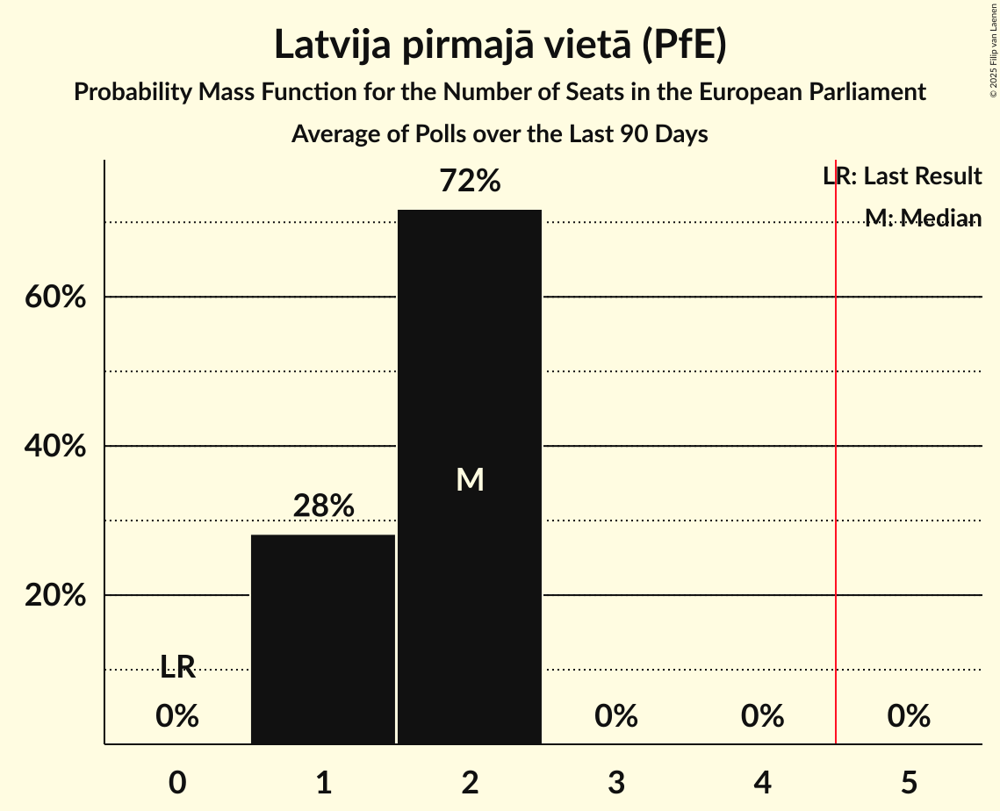

# Latvija pirmajā vietā (PfE)

<a href="#voting-intentions">Voting Intentions</a> | <a href="#seats">Seats</a>

## Voting Intentions

Last result: **0.0%** (General Election of 8 June 2024)

### Confidence Intervals

| Period     | Polling firm/Commissioner(s) | Median | 80% Confidence Interval | 90% Confidence Interval | 95% Confidence Interval | 99% Confidence Interval |
|:----------:|:----------------:|:-----------:|:-----------------------:|:-----------------------:|:-----------------------:|:-----------------------:|
| N/A | [Poll Average](average.html) | 15.4% | 14.1–16.7% | 13.7–17.1% | 13.3–17.5% | 12.7–18.2% |
| [16–26 December 2025](2025-12-26-Gemius.html) | Gemius | 15.5% | 14.4–16.8% | 14.0–17.2% | 13.7–17.5% | 13.2–18.2% |
| [21 November–4 December 2025](2025-12-04-SKDS.html) | SKDS   Latvijas Televīzija | 15.2% | 13.8–16.7% | 13.4–17.1% | 13.1–17.5% | 12.5–18.2% |
| [31 October–6 November 2025](2025-11-06-Gemius.html) | Gemius | 10.7% | 9.7–11.8% | 9.4–12.2% | 9.2–12.4% | 8.7–13.0% |
| [25 October–4 November 2025](2025-11-04-SKDS.html) | SKDS   Latvijas Televīzija | 15.4% | N/A | N/A | N/A | N/A |
| [1–31 July 2025](2025-07-31-SKDS.html) | SKDS   Latvijas Televīzija | 14.0% | N/A | N/A | N/A | N/A |
| [1–30 April 2025](2025-04-30-SKDS.html) | SKDS   Latvijas Televīzija | 16.5% | N/A | N/A | N/A | N/A |
| [14–24 March 2025](2025-03-24-LatvijasFakti.html) | Latvijas Fakti | 18.9% | N/A | N/A | N/A | N/A |
| [1–31 January 2025](2025-01-31-SKDS.html) | SKDS   Latvijas Televīzija | 14.2% | N/A | N/A | N/A | N/A |
| [30 November–9 December 2024](2024-12-09-SKDS.html) | SKDS   Latvijas Televīzija | 14.6% | N/A | N/A | N/A | N/A |
| [1–30 November 2024](2024-11-30-SKDS.html) | SKDS   Latvijas Televīzija | 14.2% | N/A | N/A | N/A | N/A |
| [1–31 October 2024](2024-10-31-SKDS.html) | SKDS   Latvijas Televīzija | 11.5% | N/A | N/A | N/A | N/A |
| [1–31 August 2024](2024-08-31-SKDS.html) | SKDS   Latvijas Televīzija | 11.8% | N/A | N/A | N/A | N/A |
| [1–30 June 2024](2024-06-30-SKDS.html) | SKDS   Latvijas Televīzija | 10.7% | N/A | N/A | N/A | N/A |

### Probability Mass Function

The following table shows the probability mass function per percentage block of voting intentions for the [poll average](average.html) for Latvija pirmajā vietā (PfE).

| Voting Intentions | Probability | Accumulated | Special Marks |
|:-----------------:|:-----------:|:-----------:|:-------------:|
| 0.0–0.5% | 0% | 100% | Last Result |
| 0.5–1.5% | 0% | 100% |  |
| 1.5–2.5% | 0% | 100% |  |
| 2.5–3.5% | 0% | 100% |  |
| 3.5–4.5% | 0% | 100% |  |
| 4.5–5.5% | 0% | 100% |  |
| 5.5–6.5% | 0% | 100% |  |
| 6.5–7.5% | 0% | 100% |  |
| 7.5–8.5% | 0% | 100% |  |
| 8.5–9.5% | 0% | 100% |  |
| 9.5–10.5% | 0% | 100% |  |
| 10.5–11.5% | 0% | 100% |  |
| 11.5–12.5% | 0.3% | 100% |  |
| 12.5–13.5% | 4% | 99.7% |  |
| 13.5–14.5% | 17% | 96% |  |
| 14.5–15.5% | 35% | 79% | Median |
| 15.5–16.5% | 31% | 44% |  |
| 16.5–17.5% | 11% | 14% |  |
| 17.5–18.5% | 2% | 2% |  |
| 18.5–19.5% | 0.2% | 0.2% |  |
| 19.5–20.5% | 0% | 0% |  |

## Seats

Last result: **0** seats (General Election of 8 June 2024)

### Confidence Intervals

| Period     | Polling firm/Commissioner(s) | Median | 80% Confidence Interval | 90% Confidence Interval | 95% Confidence Interval | 99% Confidence Interval |
|:----------:|:----------------:|:------:|:-----------------------:|:-----------------------:|:-----------------------:|:-----------------------:|
| N/A | [Poll Average](average.html) | 2 | 1–2 | 1–2 | 1–2 | 1–2 |
| [16–26 December 2025](2025-12-26-Gemius.html) | Gemius | 2 | 2 | 2 | 1–2 | 1–2 |
| [21 November–4 December 2025](2025-12-04-SKDS.html) | SKDS   Latvijas Televīzija | 1 | 1–2 | 1–2 | 1–2 | 1–2 |
| [31 October–6 November 2025](2025-11-06-Gemius.html) | Gemius | 1 | 1 | 1 | 1 | 1 |
| [25 October–4 November 2025](2025-11-04-SKDS.html) | SKDS   Latvijas Televīzija |  |  |  |  |  |
| [1–31 July 2025](2025-07-31-SKDS.html) | SKDS   Latvijas Televīzija |  |  |  |  |  |
| [1–30 April 2025](2025-04-30-SKDS.html) | SKDS   Latvijas Televīzija |  |  |  |  |  |
| [14–24 March 2025](2025-03-24-LatvijasFakti.html) | Latvijas Fakti |  |  |  |  |  |
| [1–31 January 2025](2025-01-31-SKDS.html) | SKDS   Latvijas Televīzija |  |  |  |  |  |
| [30 November–9 December 2024](2024-12-09-SKDS.html) | SKDS   Latvijas Televīzija |  |  |  |  |  |
| [1–30 November 2024](2024-11-30-SKDS.html) | SKDS   Latvijas Televīzija |  |  |  |  |  |
| [1–31 October 2024](2024-10-31-SKDS.html) | SKDS   Latvijas Televīzija |  |  |  |  |  |
| [1–31 August 2024](2024-08-31-SKDS.html) | SKDS   Latvijas Televīzija |  |  |  |  |  |
| [1–30 June 2024](2024-06-30-SKDS.html) | SKDS   Latvijas Televīzija |  |  |  |  |  |

### Probability Mass Function

The following table shows the probability mass function per seat for the [poll average](average.html) for Latvija pirmajā vietā (PfE).

| Number of Seats | Probability | Accumulated | Special Marks |
|:---------------:|:-----------:|:-----------:|:-------------:|
| 0 | 0% | 100% | Last Result |
| 1 | 33% | 100% |  |
| 2 | 67% | 67% | Median |
| 3 | 0% | 0% |  |

