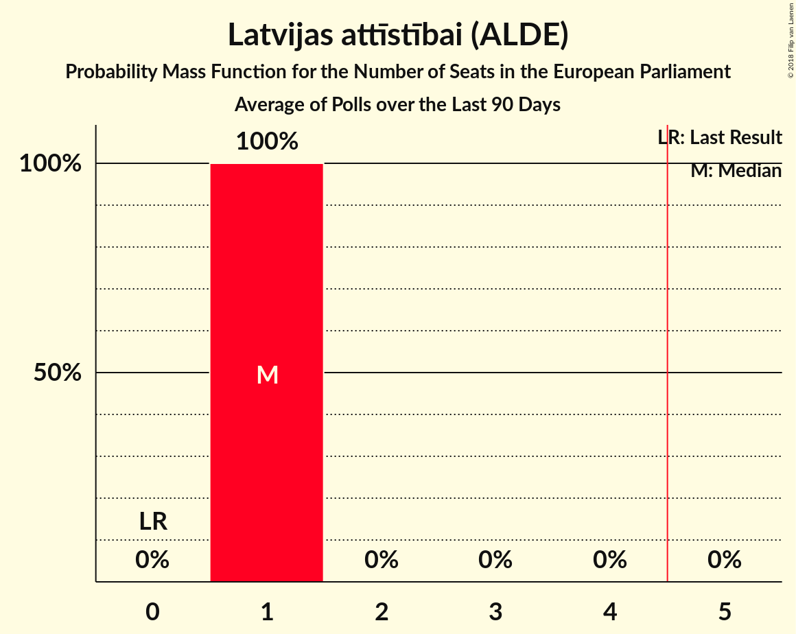

# Latvijas attīstībai (ALDE)

<a href="#voting-intentions">Voting Intentions</a> | <a href="#seats">Seats</a>

## Voting Intentions

Last result: **2.1%** (General Election of 24 May 2014)

### Confidence Intervals

| Period     | Polling firm/Commissioner(s) | Median | 80% Confidence Interval | 90% Confidence Interval | 95% Confidence Interval | 99% Confidence Interval |
|:----------:|:----------------:|:-----------:|:-----------------------:|:-----------------------:|:-----------------------:|:-----------------------:|
| N/A | [Poll Average](average.html) | 12.1% | 10.7–13.5% | 10.4–13.9% | 10.0–14.3% | 9.5–15.0% |
| [13–23 October 2018](2018-10-23-SKDS.html) | SKDS   Latvijas Televīzija | 12.0% | 10.7–13.5% | 10.3–13.9% | 10.0–14.3% | 9.4–15.0% |
| [24–30 September 2018](2018-09-30-FACTUM.html) | FACTUM | 0.0% | N/A | N/A | N/A | N/A |
| [17–23 September 2018](2018-09-23-FACTUM.html) | FACTUM | 0.0% | N/A | N/A | N/A | N/A |
| [8–18 September 2018](2018-09-18-SKDS.html) | SKDS   Latvijas Televīzija | 0.0% | N/A | N/A | N/A | N/A |
| [10–16 September 2018](2018-09-16-FACTUM.html) | FACTUM | 0.0% | N/A | N/A | N/A | N/A |
| [10–14 September 2018](2018-09-14-Norstat.html) | Norstat | 0.0% | N/A | N/A | N/A | N/A |
| [8 August–12 September 2018](2018-09-12-KantarTNS.html) | Kantar TNS   Delfi | 0.0% | N/A | N/A | N/A | N/A |
| [31 August–9 September 2018](2018-09-09-FACTUM.html) | FACTUM | 0.0% | N/A | N/A | N/A | N/A |
| [30 August–5 September 2018](2018-09-05-FACTUM.html) | FACTUM | 0.0% | N/A | N/A | N/A | N/A |
| [27 August–2 September 2018](2018-09-02-FACTUM.html) | FACTUM | 0.0% | N/A | N/A | N/A | N/A |
| [25–31 August 2018](2018-08-31-FACTUM.html) | FACTUM | 0.0% | N/A | N/A | N/A | N/A |
| [22–28 August 2018](2018-08-28-FACTUM.html) | FACTUM | 0.0% | N/A | N/A | N/A | N/A |
| [20–26 August 2018](2018-08-26-FACTUM.html) | FACTUM | 0.0% | N/A | N/A | N/A | N/A |
| [1–23 August 2018](2018-08-23-SKDS.html) | SKDS   Latvijas Televīzija | 0.0% | N/A | N/A | N/A | N/A |
| [13–19 August 2018](2018-08-19-FACTUM.html) | FACTUM | 0.0% | N/A | N/A | N/A | N/A |
| [17–23 July 2018](2018-07-23-FACTUM.html) | FACTUM | 0.0% | N/A | N/A | N/A | N/A |
| [1–30 June 2018](2018-06-30-SKDS.html) | SKDS   Latvijas Televīzija | 0.0% | N/A | N/A | N/A | N/A |
| [1–31 May 2018](2018-05-31-SKDS.html) | SKDS   Latvijas Televīzija | 0.0% | N/A | N/A | N/A | N/A |
| [1–31 May 2018](2018-05-31-Norstat.html) | Norstat   TV3 Latvija | 2.5% | 1.9–3.4% | 1.7–3.7% | 1.6–3.9% | 1.3–4.5% |
| [1–30 April 2018](2018-04-30-SKDS.html) | SKDS   Latvijas Televīzija | 0.0% | N/A | N/A | N/A | N/A |
| [1–31 March 2018](2018-03-31-SKDS.html) | SKDS   Latvijas Televīzija | 1.2% | 0.8–2.1% | 0.7–2.3% | 0.6–2.5% | 0.4–3.0% |
| [1–28 February 2018](2018-02-28-SKDS.html) | SKDS   Latvijas Televīzija | 0.0% | N/A | N/A | N/A | N/A |
| [1–31 January 2018](2018-01-31-SKDS.html) | SKDS   Latvijas Televīzija | 0.0% | N/A | N/A | N/A | N/A |

### Probability Mass Function

The following table shows the probability mass function per percentage block of voting intentions for the [poll average](average.html) for Latvijas attīstībai (ALDE).

| Voting Intentions | Probability | Accumulated | Special Marks |
|:-----------------:|:-----------:|:-----------:|:-------------:|
| 1.5–2.5% | 0% | 100% | Last Result |
| 2.5–3.5% | 0% | 100% |  |
| 3.5–4.5% | 0% | 100% |  |
| 4.5–5.5% | 0% | 100% |  |
| 5.5–6.5% | 0% | 100% |  |
| 6.5–7.5% | 0% | 100% |  |
| 7.5–8.5% | 0% | 100% |  |
| 8.5–9.5% | 0.7% | 100% |  |
| 9.5–10.5% | 7% | 99.3% |  |
| 10.5–11.5% | 25% | 93% |  |
| 11.5–12.5% | 35% | 68% | Median |
| 12.5–13.5% | 24% | 33% |  |
| 13.5–14.5% | 8% | 9% |  |
| 14.5–15.5% | 1.3% | 1.4% |  |
| 15.5–16.5% | 0.1% | 0.1% |  |
| 16.5–17.5% | 0% | 0% |  |

## Seats

Last result: **0** seats (General Election of 24 May 2014)

### Confidence Intervals

| Period     | Polling firm/Commissioner(s) | Median | 80% Confidence Interval | 90% Confidence Interval | 95% Confidence Interval | 99% Confidence Interval |
|:----------:|:----------------:|:------:|:-----------------------:|:-----------------------:|:-----------------------:|:-----------------------:|
| N/A | [Poll Average](average.html) | 1 | 1 | 1 | 1 | 1 |
| [13–23 October 2018](2018-10-23-SKDS.html) | SKDS   Latvijas Televīzija | 1 | 1 | 1 | 1 | 1 |
| [24–30 September 2018](2018-09-30-FACTUM.html) | FACTUM |  |  |  |  |  |
| [17–23 September 2018](2018-09-23-FACTUM.html) | FACTUM |  |  |  |  |  |
| [8–18 September 2018](2018-09-18-SKDS.html) | SKDS   Latvijas Televīzija |  |  |  |  |  |
| [10–16 September 2018](2018-09-16-FACTUM.html) | FACTUM |  |  |  |  |  |
| [10–14 September 2018](2018-09-14-Norstat.html) | Norstat |  |  |  |  |  |
| [8 August–12 September 2018](2018-09-12-KantarTNS.html) | Kantar TNS   Delfi |  |  |  |  |  |
| [31 August–9 September 2018](2018-09-09-FACTUM.html) | FACTUM |  |  |  |  |  |
| [30 August–5 September 2018](2018-09-05-FACTUM.html) | FACTUM |  |  |  |  |  |
| [27 August–2 September 2018](2018-09-02-FACTUM.html) | FACTUM |  |  |  |  |  |
| [25–31 August 2018](2018-08-31-FACTUM.html) | FACTUM |  |  |  |  |  |
| [22–28 August 2018](2018-08-28-FACTUM.html) | FACTUM |  |  |  |  |  |
| [20–26 August 2018](2018-08-26-FACTUM.html) | FACTUM |  |  |  |  |  |
| [1–23 August 2018](2018-08-23-SKDS.html) | SKDS   Latvijas Televīzija |  |  |  |  |  |
| [13–19 August 2018](2018-08-19-FACTUM.html) | FACTUM |  |  |  |  |  |
| [17–23 July 2018](2018-07-23-FACTUM.html) | FACTUM |  |  |  |  |  |
| [1–30 June 2018](2018-06-30-SKDS.html) | SKDS   Latvijas Televīzija |  |  |  |  |  |
| [1–31 May 2018](2018-05-31-SKDS.html) | SKDS   Latvijas Televīzija |  |  |  |  |  |
| [1–31 May 2018](2018-05-31-Norstat.html) | Norstat   TV3 Latvija | 0 | 0 | 0 | 0 | 0 |
| [1–30 April 2018](2018-04-30-SKDS.html) | SKDS   Latvijas Televīzija |  |  |  |  |  |
| [1–31 March 2018](2018-03-31-SKDS.html) | SKDS   Latvijas Televīzija | 0 | 0 | 0 | 0 | 0 |
| [1–28 February 2018](2018-02-28-SKDS.html) | SKDS   Latvijas Televīzija |  |  |  |  |  |
| [1–31 January 2018](2018-01-31-SKDS.html) | SKDS   Latvijas Televīzija |  |  |  |  |  |

### Probability Mass Function

The following table shows the probability mass function per seat for the [poll average](average.html) for Latvijas attīstībai (ALDE).

| Number of Seats | Probability | Accumulated | Special Marks |
|:---------------:|:-----------:|:-----------:|:-------------:|
| 0 | 0% | 100% | Last Result |
| 1 | 100% | 100% | Median |

