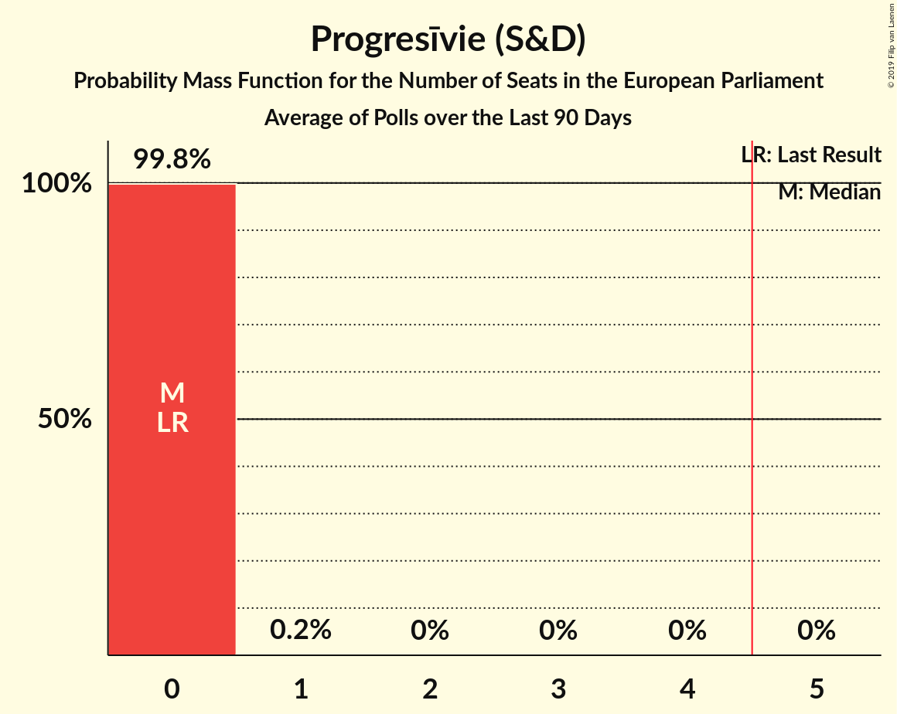

# Progresīvie (S&D)

<a href="#voting-intentions">Voting Intentions</a> | <a href="#seats">Seats</a>

## Voting Intentions

Last result: **0.0%** (General Election of 24 May 2014)

### Confidence Intervals

| Period     | Polling firm/Commissioner(s) | Median | 80% Confidence Interval | 90% Confidence Interval | 95% Confidence Interval | 99% Confidence Interval |
|:----------:|:----------------:|:-----------:|:-----------------------:|:-----------------------:|:-----------------------:|:-----------------------:|
| N/A | [Poll Average](average.html) | 6.0% | 2.8–7.6% | 2.5–8.0% | 2.3–8.3% | 2.0–9.0% |
| [2–9 May 2019](2019-05-09-Factum.html) | Factum | 6.0% | 5.1–7.1% | 4.9–7.4% | 4.7–7.7% | 4.3–8.3% |
| [1–8 May 2019](2019-05-08-SKDS.html) | SKDS   Latvijas Televīzija | 6.0% | 5.1–7.2% | 4.8–7.5% | 4.6–7.8% | 4.2–8.4% |
| [24–28 April 2019](2019-04-28-Factum.html) | Factum | 6.0% | 5.1–7.2% | 4.9–7.5% | 4.6–7.8% | 4.3–8.4% |
| [12–22 April 2019](2019-04-22-LatvijasFakti.html) | Latvijas Fakti | 3.0% | 2.4–3.8% | 2.2–4.0% | 2.1–4.2% | 1.8–4.6% |
| [17–21 April 2019](2019-04-21-Factum.html) | Factum | 7.0% | 5.8–8.7% | 5.4–9.2% | 5.1–9.6% | 4.6–10.4% |
| [1–19 April 2019](2019-04-19-SKDS.html) | SKDS   Latvijas Televīzija | 7.0% | 6.1–8.2% | 5.8–8.5% | 5.6–8.8% | 5.2–9.3% |
| [10–14 April 2019](2019-04-14-Factum.html) | Factum | 6.0% | 4.8–7.7% | 4.4–8.1% | 4.1–8.6% | 3.6–9.4% |
| [26 March–5 April 2019](2019-04-05-Factum.html) | Factum | 6.0% | 5.2–7.0% | 5.0–7.3% | 4.8–7.5% | 4.4–8.0% |
| [1–31 March 2019](2019-03-31-SKDS.html) | SKDS   Latvijas Televīzija | 4.0% | 3.3–5.0% | 3.1–5.3% | 2.9–5.5% | 2.6–6.0% |
| [1–31 March 2019](2019-03-31-Factum.html) | Factum | 6.1% | 5.2–7.3% | 4.9–7.6% | 4.7–7.9% | 4.3–8.5% |
| [3–18 March 2019](2019-03-18-LatvijasFakti.html) | Latvijas Fakti | 0.0% | N/A | N/A | N/A | N/A |
| [1–28 February 2019](2019-02-28-SKDS.html) | SKDS   Latvijas Televīzija | 4.0% | 3.3–5.0% | 3.1–5.3% | 2.9–5.5% | 2.6–6.1% |
| [11–23 January 2019](2019-01-23-SKDS.html) | SKDS   Latvijas Televīzija | 0.0% | N/A | N/A | N/A | N/A |
| [1–12 December 2018](2018-12-12-SKDS.html) | SKDS   Latvijas Televīzija | 3.3% | 2.5–4.4% | 2.3–4.7% | 2.1–5.0% | 1.8–5.5% |
| [3–15 November 2018](2018-11-15-SKDS.html) | SKDS   Latvijas Televīzija | 2.7% | 2.0–3.7% | 1.8–4.1% | 1.6–4.3% | 1.3–4.9% |
| [13–23 October 2018](2018-10-23-SKDS.html) | SKDS   Latvijas Televīzija | 2.2% | 1.6–3.1% | 1.5–3.4% | 1.3–3.6% | 1.1–4.1% |
| [24–30 September 2018](2018-09-30-FACTUM.html) | FACTUM | 3.0% | 2.6–3.4% | 2.5–3.6% | 2.4–3.7% | 2.2–3.9% |
| [17–23 September 2018](2018-09-23-FACTUM.html) | FACTUM | 2.0% | 1.7–2.4% | 1.6–2.6% | 1.5–2.7% | 1.4–2.9% |
| [8–18 September 2018](2018-09-18-SKDS.html) | SKDS   Latvijas Televīzija | 1.9% | 1.4–2.9% | 1.2–3.1% | 1.1–3.4% | 0.9–3.9% |
| [10–16 September 2018](2018-09-16-FACTUM.html) | FACTUM | 2.0% | 1.5–2.6% | 1.4–2.8% | 1.3–3.0% | 1.1–3.3% |
| [10–14 September 2018](2018-09-14-Norstat.html) | Norstat | 1.8% | 1.1–3.2% | 0.9–3.6% | 0.8–4.0% | 0.5–4.9% |
| [8 August–12 September 2018](2018-09-12-KantarTNS.html) | Kantar TNS   Delfi | 1.3% | 0.9–2.1% | 0.8–2.3% | 0.7–2.5% | 0.5–2.9% |
| [31 August–9 September 2018](2018-09-09-FACTUM.html) | FACTUM | 1.9% | 1.5–2.5% | 1.4–2.7% | 1.3–2.8% | 1.1–3.2% |
| [30 August–5 September 2018](2018-09-05-FACTUM.html) | FACTUM | 2.9% | 2.5–3.5% | 2.4–3.6% | 2.3–3.8% | 2.1–4.1% |
| [27 August–2 September 2018](2018-09-02-FACTUM.html) | FACTUM | 2.9% | 2.5–3.5% | 2.4–3.6% | 2.3–3.8% | 2.1–4.1% |
| [25–31 August 2018](2018-08-31-FACTUM.html) | FACTUM | 2.9% | 2.4–3.4% | 2.3–3.6% | 2.2–3.7% | 2.0–4.1% |
| [22–28 August 2018](2018-08-28-FACTUM.html) | FACTUM | 2.9% | 2.4–3.6% | 2.3–3.8% | 2.1–4.0% | 1.9–4.3% |
| [20–26 August 2018](2018-08-26-FACTUM.html) | FACTUM | 2.8% | 2.3–3.5% | 2.2–3.7% | 2.1–3.9% | 1.8–4.2% |
| [1–23 August 2018](2018-08-23-SKDS.html) | SKDS   Latvijas Televīzija | 2.2% | 1.6–3.2% | 1.4–3.5% | 1.3–3.8% | 1.1–4.3% |
| [13–19 August 2018](2018-08-19-FACTUM.html) | FACTUM | 2.9% | 2.4–3.6% | 2.3–3.8% | 2.2–3.9% | 2.0–4.3% |
| [17–23 July 2018](2018-07-23-FACTUM.html) | FACTUM | 3.1% | 2.6–3.7% | 2.4–3.9% | 2.3–4.1% | 2.1–4.4% |
| [1–30 June 2018](2018-06-30-SKDS.html) | SKDS   Latvijas Televīzija | 1.7% | 1.2–2.6% | 1.1–2.9% | 1.0–3.1% | 0.8–3.6% |
| [1–31 May 2018](2018-05-31-SKDS.html) | SKDS   Latvijas Televīzija | 1.0% | 0.7–1.8% | 0.5–2.0% | 0.5–2.2% | 0.3–2.6% |
| [1–31 May 2018](2018-05-31-Norstat.html) | Norstat   TV3 Latvija | 0.0% | N/A | N/A | N/A | N/A |
| [1–30 April 2018](2018-04-30-SKDS.html) | SKDS   Latvijas Televīzija | 0.0% | N/A | N/A | N/A | N/A |
| [1–31 March 2018](2018-03-31-SKDS.html) | SKDS   Latvijas Televīzija | 0.5% | 0.3–1.2% | 0.2–1.4% | 0.2–1.5% | 0.1–1.9% |
| [1–28 February 2018](2018-02-28-SKDS.html) | SKDS   Latvijas Televīzija | 0.0% | N/A | N/A | N/A | N/A |
| [1–31 January 2018](2018-01-31-SKDS.html) | SKDS   Latvijas Televīzija | 0.0% | N/A | N/A | N/A | N/A |

### Probability Mass Function

The following table shows the probability mass function per percentage block of voting intentions for the [poll average](average.html) for Progresīvie (S&D).

| Voting Intentions | Probability | Accumulated | Special Marks |
|:-----------------:|:-----------:|:-----------:|:-------------:|
| 0.0–0.5% | 0% | 100% | Last Result |
| 0.5–1.5% | 0% | 100% |  |
| 1.5–2.5% | 6% | 100% |  |
| 2.5–3.5% | 22% | 94% |  |
| 3.5–4.5% | 6% | 72% |  |
| 4.5–5.5% | 8% | 66% |  |
| 5.5–6.5% | 24% | 58% | Median |
| 6.5–7.5% | 23% | 34% |  |
| 7.5–8.5% | 9% | 11% |  |
| 8.5–9.5% | 1.4% | 1.5% |  |
| 9.5–10.5% | 0.1% | 0.1% |  |
| 10.5–11.5% | 0% | 0% |  |

## Seats

Last result: **0** seats (General Election of 24 May 2014)

### Confidence Intervals

| Period     | Polling firm/Commissioner(s) | Median | 80% Confidence Interval | 90% Confidence Interval | 95% Confidence Interval | 99% Confidence Interval |
|:----------:|:----------------:|:------:|:-----------------------:|:-----------------------:|:-----------------------:|:-----------------------:|
| N/A | [Poll Average](average.html) | 1 | 0–1 | 0–1 | 0–1 | 0–1 |
| [2–9 May 2019](2019-05-09-Factum.html) | Factum | 1 | 0–1 | 0–1 | 0–1 | 0–1 |
| [1–8 May 2019](2019-05-08-SKDS.html) | SKDS   Latvijas Televīzija | 1 | 0–1 | 0–1 | 0–1 | 0–1 |
| [24–28 April 2019](2019-04-28-Factum.html) | Factum | 1 | 0–1 | 0–1 | 0–1 | 0–1 |
| [12–22 April 2019](2019-04-22-LatvijasFakti.html) | Latvijas Fakti | 0 | 0 | 0 | 0 | 0 |
| [17–21 April 2019](2019-04-21-Factum.html) | Factum | 1 | 1 | 0–1 | 0–1 | 0–1 |
| [1–19 April 2019](2019-04-19-SKDS.html) | SKDS   Latvijas Televīzija | 1 | 1 | 0–1 | 0–1 | 0–1 |
| [10–14 April 2019](2019-04-14-Factum.html) | Factum | 1 | 0–1 | 0–1 | 0–1 | 0–1 |
| [26 March–5 April 2019](2019-04-05-Factum.html) | Factum | 1 | 0–1 | 0–1 | 0–1 | 0–1 |
| [1–31 March 2019](2019-03-31-SKDS.html) | SKDS   Latvijas Televīzija | 0 | 0 | 0 | 0 | 0 |
| [1–31 March 2019](2019-03-31-Factum.html) | Factum | 1 | 0–1 | 0–1 | 0–1 | 0–1 |
| [3–18 March 2019](2019-03-18-LatvijasFakti.html) | Latvijas Fakti |  |  |  |  |  |
| [1–28 February 2019](2019-02-28-SKDS.html) | SKDS   Latvijas Televīzija | 0 | 0 | 0 | 0 | 0 |
| [11–23 January 2019](2019-01-23-SKDS.html) | SKDS   Latvijas Televīzija |  |  |  |  |  |
| [1–12 December 2018](2018-12-12-SKDS.html) | SKDS   Latvijas Televīzija | 0 | 0 | 0 | 0 | 0 |
| [3–15 November 2018](2018-11-15-SKDS.html) | SKDS   Latvijas Televīzija | 0 | 0 | 0 | 0 | 0 |
| [13–23 October 2018](2018-10-23-SKDS.html) | SKDS   Latvijas Televīzija | 0 | 0 | 0 | 0 | 0 |
| [24–30 September 2018](2018-09-30-FACTUM.html) | FACTUM | 0 | 0 | 0 | 0 | 0 |
| [17–23 September 2018](2018-09-23-FACTUM.html) | FACTUM | 0 | 0 | 0 | 0 | 0 |
| [8–18 September 2018](2018-09-18-SKDS.html) | SKDS   Latvijas Televīzija | 0 | 0 | 0 | 0 | 0 |
| [10–16 September 2018](2018-09-16-FACTUM.html) | FACTUM | 0 | 0 | 0 | 0 | 0 |
| [10–14 September 2018](2018-09-14-Norstat.html) | Norstat | 0 | 0 | 0 | 0 | 0 |
| [8 August–12 September 2018](2018-09-12-KantarTNS.html) | Kantar TNS   Delfi | 0 | 0 | 0 | 0 | 0 |
| [31 August–9 September 2018](2018-09-09-FACTUM.html) | FACTUM | 0 | 0 | 0 | 0 | 0 |
| [30 August–5 September 2018](2018-09-05-FACTUM.html) | FACTUM | 0 | 0 | 0 | 0 | 0 |
| [27 August–2 September 2018](2018-09-02-FACTUM.html) | FACTUM | 0 | 0 | 0 | 0 | 0 |
| [25–31 August 2018](2018-08-31-FACTUM.html) | FACTUM | 0 | 0 | 0 | 0 | 0 |
| [22–28 August 2018](2018-08-28-FACTUM.html) | FACTUM | 0 | 0 | 0 | 0 | 0 |
| [20–26 August 2018](2018-08-26-FACTUM.html) | FACTUM | 0 | 0 | 0 | 0 | 0 |
| [1–23 August 2018](2018-08-23-SKDS.html) | SKDS   Latvijas Televīzija | 0 | 0 | 0 | 0 | 0 |
| [13–19 August 2018](2018-08-19-FACTUM.html) | FACTUM | 0 | 0 | 0 | 0 | 0 |
| [17–23 July 2018](2018-07-23-FACTUM.html) | FACTUM | 0 | 0 | 0 | 0 | 0 |
| [1–30 June 2018](2018-06-30-SKDS.html) | SKDS   Latvijas Televīzija | 0 | 0 | 0 | 0 | 0 |
| [1–31 May 2018](2018-05-31-SKDS.html) | SKDS   Latvijas Televīzija | 0 | 0 | 0 | 0 | 0 |
| [1–31 May 2018](2018-05-31-Norstat.html) | Norstat   TV3 Latvija |  |  |  |  |  |
| [1–30 April 2018](2018-04-30-SKDS.html) | SKDS   Latvijas Televīzija |  |  |  |  |  |
| [1–31 March 2018](2018-03-31-SKDS.html) | SKDS   Latvijas Televīzija | 0 | 0 | 0 | 0 | 0 |
| [1–28 February 2018](2018-02-28-SKDS.html) | SKDS   Latvijas Televīzija |  |  |  |  |  |
| [1–31 January 2018](2018-01-31-SKDS.html) | SKDS   Latvijas Televīzija |  |  |  |  |  |

### Probability Mass Function

The following table shows the probability mass function per seat for the [poll average](average.html) for Progresīvie (S&D).

| Number of Seats | Probability | Accumulated | Special Marks |
|:---------------:|:-----------:|:-----------:|:-------------:|
| 0 | 46% | 100% | Last Result |
| 1 | 54% | 54% | Median |
| 2 | 0% | 0% |  |

